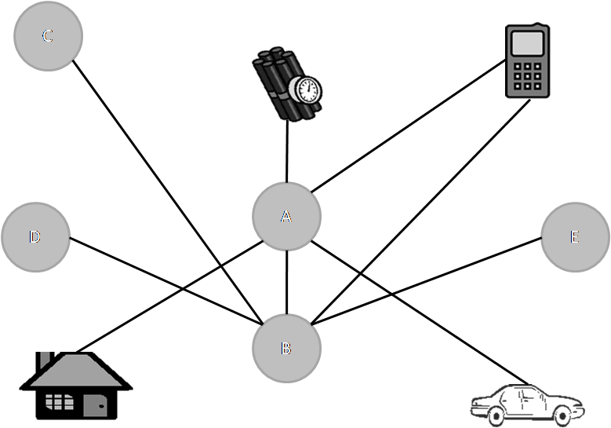

# (PART) ¿Qué es el ARSo? {-}

# ARSo: Una (Breve) Introducción {#introduction}

Georg Simmel [@Simmel1950] es visto generalmente como el precursor intelectual del análisis de redes sociales (ARSo). Argumentó que para comprender el comportamiento social, debemos estudiar los patrones de interacción, y sus estudios ofrecieron conocimientos penetrantes, por ejemplo, sobre la naturaleza de las sociedades secretas, la dinámica de las díadas y tríadas, y cómo la creciente complejidad social ha llevado a mayores niveles de individualismo. Los estudios de Simmel continúan influyendo la disciplina actualmente, sin embargo, podemos rastrear el surgimiento del análisis de redes sociales a dos corrientes principales de pensamiento: el trabajo de los psicólogos y los antropólogos sociales. La primera corriente enfatizó como los patrones organizados dan forma a como vemos e interpretamos el mundo, mientras que la segunda se centró en la relación entre los patrones y la estructura social. Ambas ayudaron a sentar la base para el desarrollo formal de ARSo en Harvard en las décadas de 1960 y 1970, dirigido por el sociólogo Harrison White [@White2008] y sus estudiantes (por ejemplo, Ronald Breiger, Kathleen Carley, Bonnie Erickson, Ivan Chase, Mark Granovetter, Michael Schwartz y Barry Wellman). White, quien obtuvo su doctorado en física teórica, argumentó que la sociología, a pesar de su pretensión de estudiar los fenómenos sociales, estaba en deuda con formas individualistas de análisis basadas en las características agregadas de los individuos, a menudo con la ayuda del análisis estadístico de los datos de encuestas. En respuesta, desarrolló un enfoque basado en estudios centrados en las relaciones sociales y los patrones que surgen de ellas. 

Los esfuerzos de White no ocurrieron en el vacío. Otras tradiciones teóricas también informaron el desarrollo del ARSo, como la teoría de grafos, la teoría del intercambio y la investigación sobre el reclutamiento de individuos para movimientos religiosos y sociales. En los últimos años, los economistas se han interesado cada vez más en las redes sociales, al igual que los físicos y otros científicos. Esto ha llevado a un mayor interés en el ARSo, atrayendo a investigadores de diversas disciplinas y generando varios estudios altamente creativos.

¿Qué es el análisis de redes sociales? En pocas palabras, es una colección de teorías y métodos que asume que el comportamiento de los actores se ve afectado por sus vínculos con los demás y las redes en las que están integrados. En lugar de asumir que los actores no son afectados por quienes los rodean, ARSo asume que los patrones de interacción afectan lo que dicen, hacen y creen los actores. Aunque algunas interacciones son al azar, muchas no lo son. Es decir, los actores tienden a interactuar con otros similares, y la interacción repetida puede conducir al surgimiento de la formación social a nivel micro (por ejemplo, individual), meso (por ejemplo, grupo) y macro (por ejemplo, instituciones, naciones) que pueden ser la unidad de análisis. El ARSo se diferencia de otros enfoques cuantitativos tradicionales, que tienden a centrarse en los atributos de los actores (por ejemplo, género, raza, educación), pues el ARSo se centra en como los patrones de interacción afectan el comportamiento. Debido a que los atributos no cambian en los contextos sociales, no pueden explicar ninguna variación en el comportamiento de un actor, lo que sugiere que los patrones de interacción son tan (o quizás más) importantes para comprender el comportamiento que los atributos:

> Una mujer que tiene un trabajo servil que requiere poca iniciativa en una oficina puede ser una líder dinámica de una asociación de vecinos y una participante asertiva de la asociación de padres de familia. Esas diferencias de comportamiento son difíciles de reconciliar con atributos inmutables de género, edad y estatus, pero son comprensibles al reconocer que las relaciones estructurales de las personas pueden variar notablemente en los contextos sociales -- [@Knoke2007, 5].

Consecuentemente, un objetivo principal del ARSo ha sido desarrollar métricas para ayudar a los analistas a comprender mejor las características estructurales de una red en particular. Esta metodología se ha utilizado con éxito para explicar variedades de comportamiento principalmente porque obliga a los investigadores a “pensar en términos de restricciones y opciones inherentes a la forma en que se organizan las relaciones sociales” [@Raab2003]. El resto de este capítulo presenta los términos, conceptos y suposiciones básicas de ARSo. Sin embargo, antes de hacerlo, señalamos brevemente algunos de los conceptos erróneos que rodean al ARSo.

## Conceptos Erróneos y Diferencias

El término análisis de redes sociales a veces se confunde con medios sociales y análisis de medios sociales. Es decir, cuando las personas escuchan que van a aprender el análisis de redes sociales, a menudo piensan que aprenderán a extraer datos de medio sociales como Facebook y Twitter. ARSo es una colección de teorías y métodos que se han desarrollado para comprender la estructura de las redes sociales. Por el contrario, los medios sociales constan de plataformas y contenido generado por el usuario que puede incluir texto, imágenes, videos, conexiones entre usuarios y enlaces a sitios web. El hecho de que el contenido de los medios sociales es a menudo relacional puede aumentar la confusión. Para clarificar, los analistas pueden extraer datos de los medios sociales y, posteriormente, utilizar ARSo para comprender ciertos aspectos de estas redes sociales (por ejemplo, seguidores en una red de Twitter de usuario a usuario). Sin embargo, es importante hacer la diferenciación.

La forma en que algunos usan el término "red" también puede resultar confusa. Algunos lo usan para referirse a tipos de organizaciones descentralizadas, informales y/u orgánicas [@Burns1961; @Podolny1998; @Powell1990; @Powell1994; @Ronfeldt2001]. Esta distinción puede ser útil, pero dentro del mundo del análisis de redes sociales, todas las organizaciones son redes. Algunas pueden ser más jerárquicas que otras, pero siguen siendo redes [@Nohria1992]. Es por ello que los analistas de redes sociales han desarrollado algoritmos que miden el grado en que una red en particular es jerárquica o no (ver, por ejemplo, @Davis1979; @deNooy2005; @Krackhardt1994).

Finalmente, el ARSo a veces se confunde con el análisis de enlaces, una metodología relacionada pero distinta que examina los patrones relacionales de varios objetos. Una diferencia fundamental entre los dos es que, si bien los diagramas de análisis de enlaces a menudo incluyen diferentes tipos de objetos (por ejemplo, individuos, automóviles, teléfonos celulares, etc.) y los vínculos entre ellos, los diagramas de redes sociales solo incluyen vínculos entre tipos similares de objetos. Tomemos, por ejemplo, un diagrama de análisis de vínculos en el que dos individuos (A y B) tienen vínculos con otros cinco objetos, pero los objetos con los que tienen vínculos difieren entre sí (Figura \@ref(fig:1-links)). En este ejemplo, la persona A está vinculada a la persona B, así como a una bomba, un teléfono celular, una casa y un automóvil, mientras que la persona B está vinculada a cuatro personas (A, C, D y E) y un teléfono celular. Si bien ambos tienen cinco vínculos (que es la definición de grado de centralidad; consulte la discusión sobre centralidad a continuación), no podemos comparar de manera significativa el número de vínculos de estos dos individuos porque son de diferentes tipos de objetos. Sería como comparar manzanas y naranjas.

\break

```{r 1-links, fig.cap = "Ejemplo de un análisis de enlaces"}

```

En el ARSo, los actores tienen vínculos con objetos similares, lo que hace significativa la comparación directa del número de vínculos. Esto se ilustra en la Figura \@ref(fig:1-arso) donde en el panel de la izquierda, los individuos A y B tienen cada uno cinco vínculos con otros cinco individuos, mientras que en el derecho, tienen cinco vínculos con cinco escuelas diferentes. En ambos casos, los lazos de A son comparables a los de B porque son del mismo tipo de objeto. Aunque los analistas de redes sociales están interesados en más que el recuento de los lazos de los actores, otros algoritmos de análisis de redes sociales generalmente asumen que los lazos se dan entre tipos similares de objetos.

```{r 1-arso, fig.cap = "Ejemplo de diagramas de red"}
knitr::include_graphics("images/01-arso.png")
```

## Suposiciones

La mayoría de las teorías y métodos de ARSo se basan en un conjunto común de suposiciones [@Wasserman1994; @Azarian2005; @Knoke2007]:

  - Los actores y sus acciones relacionadas son interdependientes, en lugar de independientes, con otros actores
  - Los vínculos entre actores son conductos para la transferencia o el flujo de diversos tipos de bienes o recursos materiales y/o no materiales (por ejemplo, fondos, creencias, confianza, etc.)
  - Las estructuras sociales son vistas en términos de patrones durables de vínculos entre actores
  - Las interacciones repetidas entre actores dan lugar a formaciones sociales que toman vida propia, siguen su propia lógica y no pueden reducirse a sus partes constituyentes aunque sigan dependiendo de estas
  - La ubicación de los actores en la estructura social (es decir, su ubicación estructural) impacta sus creencias, normas y comportamiento observado
  - Las redes sociales son entidades dinámicas que cambian a medida que los actores, subgrupos y vínculos entre actores entran, se forman, salen o se eliminan de la red

### Interdependencia de los Actores

El ARSo asume que los actores no toman decisiones de forma autónoma, sino que están sustancialmente influenciados por el comportamiento y las decisiones de otros actores. Esta suposición difiere de la perspectiva de elección racional "pura" en la que los actores actúan independientemente de aquellos con quienes interactúan. Estudios como los experimentos de conformidad social de Solomon Asch -@Asch1951, los experimentos de obediencia a la autoridad de Stanley Milgram -@Milgram1974 y el experimento de la prisión de Philip Zimbardo -@Zimbardo1972 destacan cómo las redes en las que están inmersos los actores pueden influir en su comportamiento. Estos estudios sugieren que, en lugar de actuar independientemente de quienes los rodean, las personas hacen lo contrario. Los sujetos en el experimento de Asch optaron por estar de acuerdo con la multitud frente a la presión de los compañeros, incluso cuando la respuesta correcta era obvia. Los sujetos de Milgram tomaron decisiones en presencia de autoridad que probablemente no habrían hecho en un contexto diferente. Y en solo unos días, los guardias de Zimbardo adquirieron un sorprendente nivel de brutalidad, que presagió las actividades que tomaron lugar en la prisión de Abu Ghraib y el debacle que consiguió treinta años después.

Los individuos no son los únicos actores influenciados por otros actores. Por ejemplo, John Meyer, Woody Powell y Paul DiMaggio (y numerosos colegas) han demostrado que los grupos, corporaciones y estados-nación no tienen más probabilidad de actuar de forma autónoma que los individuos (ver, por ejemplo, @DiMaggio1983; @Meyer1997; @Meyer1977). Cuanto más interactúan entre sí, más se parecen con el tiempo. Lo hacen no necesariamente por razones instrumentales, sino para mantener su legitimidad a los ojos de otros actores similares. 

> Cuando una práctica o estructura organizacional se entiende comúnmente como una característica definitoria de una organización 'legítima' de cierto tipo, los élites de la organización se sienten presionados para instituir esa práctica o estructura. Si hay una norma cultural que dice: "Para que una organización sea una buena organización, debe tener la característica X", las organizaciones se sienten presionadas para instituir la característica X -- [@Chavez1997, 32-33].

### Lazos como Conductos

Otra suposición es que los lazos (es decir, las relaciones) entre actores funcionan como conductos para el flujo de varios tipos de "bienes" materiales y no materiales, como información, sentimientos, recursos financieros, normas, enfermedades, opiniones y confianza. Quizás, el ejemplo más conocido de esto es el estudio de Granovetter -@Granovetter1973 sobre cómo las personas encuentran sus trabajos actuales. Granovetter descubrió que era mucho más probable que las personas utilizaran contactos personales en comparación a otros medios cuando se trataba de encontrar trabajo. De aquellos que encontraron su trabajo a través de contactos personales, la mayoría de esos contactos eran débiles (es decir, conocidos) en lugar de lazos fuertes (es decir, amigos cercanos). ¿Por qué? Porque es menos probable que nuestros lazos débiles se involucren socialmente entre sí que nuestros lazos fuertes. Por ello, el conjunto de personas que componen nuestra red de conocidos tiende a ser relativamente escaso, mientras que el grupo de personas que componen nuestra red de amigos cercanos tiende a ser denso. Considere el patrón de lazos sociales sugerido por este argumento (Figura \@ref(fig:1-strongweak)). La mayoría de las personas tendrán algunos amigos cercanos, la mayoría de los cuales se conocen entre sí. Probablemente también tengan varios conocidos, pocos de los cuales se conocen entre sí. Sin embargo, es probable que cada uno de estos conocidos tenga amigos cercanos propios, por lo que también es probable que estén integrados en sus propias redes altamente interconectadas, pero separadas de nuestro individuo original. Según Granovetter, los lazos débiles son importantes en términos de la estructura general de una red porque forman los puentes cruciales que unen a grupos de personas densamente unidas. De hecho, sin ellos, estos grupos no estarían conectados en absoluto.

```{r 1-strongweak, fig.cap = "Lazos fuertes y débiles"}
g <- data.frame(from = c("A", "A", "A", "A", "A", "B", "C", "D", "E", "F", "B",
                    "G", "G", "G", "G", "G", "H", "H", "I", "I", "I", "I", "J", "K", "K", "L", "L", "L", "M", "M",
                    "Q", "Q", "Q", "R", "S", "T"),
           to   = c("B", "C", "D", "E", "F", "C", "D", "E", "F", "B", "G",
                    "H", "I", "J", "K", "L", "M", "I", "K", "N", "L", "J", "O", "M", "N", "P", "O", "N", "N", "Q",
                    "R", "S", "T", "S", "T", "R"),
           type = c("S", "S", "S", "S", "S", "S", "S", "S", "S", "S", "W",
                    "S", "S", "S", "S", "S", "S", "S", "S", "S", "S", "S", "S", "S", "S", "S", "S", "S", "S", "W",
                    "S", "S", "S", "S", "S", "S")) %>%
  graph_from_data_frame(directed = FALSE) 
coords <- layout_with_fr(g)
g %>%
  plot.igraph(
    layout       = coords,
    vertex.label = NA,
    vertex.color = "lightblue",
    vertex.size  = 10,
    vertex.border.color = "black",
    edge.width   = 2,
    edge.color   = ifelse(E(.)$type %in% "W", "grey", "black"),
    edge.lty     = ifelse(E(.)$type %in% "W", 3, 1)
  )
```

Esto llevó a Granovetter a argumentar que "cualquier cosa que se difunda", ya sea información laboral, influencia, recursos, confianza, etc., "llegará a un mayor número de personas y viajará una mayor distancia […] cuando pasa por lazos débiles en lugar de fuertes ” [@Granovetter1973, 1366]. Debido a esto, es más probable que los actores con pocos lazos débiles “se limiten a las noticias provinciales y las opiniones de sus amigos cercanos” [@Granovetter1983, 2002]. Además, los grupos o comunidades cuyos miembros carecen de vínculos débiles encontrarán más dificultades para movilizarse por una causa. Por ejemplo, al comparar dos intentos de organización comunitaria, uno que tuvo éxito y otro que no, Granovetter [-@Granovetter1973, 1373-1376] argumentó que una diferencia crítica entre los dos era que el que no tuvo éxito carecía de los lazos débiles que necesitaba para unir sus diversos círculos sociales. 

Esto no significa que los lazos fuertes tienen poco o ningún valor. Es más probable que los sentimientos de confianza y solidaridad se compartan entre lazos fuertes que entre los débiles. Así, mientras que los vínculos débiles brindan a las personas acceso a información y recursos más allá de sus círculos sociales inmediatos, los vínculos fuertes suelen ser fuentes de apoyo en tiempos de incertidumbre. De hecho, es más probable que las personas con numerosos vínculos fuertes sean más felices y disfruten de una mejor salud.

### Estructura Social y Formaciones Sociales Emergentes

Los científicos sociales se refieren con frecuencia al concepto de estructura social. Con este término, generalmente tienen en mente los patrones durables de comportamiento y las relaciones dentro de los sistemas sociales (por ejemplo, los roles) o las instituciones y normas sociales que se han integrado en los sistemas sociales de tal manera que dan forma al comportamiento. Las estructuras sociales “restringen quién está presente, dónde se encuentran, qué pueden hacer y cómo se relacionan entre sí. Esta estructura es tan real como los edificios que ocupan las personas” [@Turner2006, 88]. Sin embargo, es notoriamente difícil de captar la estructura social empíricamente, por lo que muchos encuentran atractivo el ARSo. Esta metodología conceptualiza las estructuras sociales en términos de patrones perdurables de vínculos entre actores. Por lo tanto, proporciona un método para estudiar de forma sistemática y empírica las causas y consecuencias de la estructura social.

La mayoría de los analistas de redes sociales también sostienen que las interacciones repetidas entre actores (por ejemplo, individuos) pueden dar lugar a formaciones sociales emergentes (por ejemplo, grupos, organizaciones formales, naciones) que siguen su propia lógica y no pueden reducirse ni explicarse por sus partes constituyentes, incluso aunque siguen dependiendo de esas partes [@White2008]. Los ejemplos de emergencia abundan en el mundo físico, como la combinación de hidrógeno (H) y oxígeno (O) en agua (H20). Como el agua no puede reducirse o explicarse completamente por sus átomos subyacentes, las formaciones sociales emergentes son productos de interacciones entre actores que no pueden explicarse por completo únicamente por las características de esos actores [@Smith2010, 27]. En cambio, toman vida propia, lo que significa que los actores de todos los tipos y niveles ya sean individuos, grupos, organizaciones o naciones, pueden ser examinados utilizando el ARSo sin la necesidad de explorar los componentes subyacentes.

### Ubicación Estructural: Creencias, Normas, Intenciones, Comportamiento e Identidad

Las formaciones sociales emergentes pueden ejercer lo que se llama causalidad descendente, razón por la cual el ARSo asume que las actitudes, creencias, intenciones, comportamiento e incluso las identidades de los actores están determinadas principalmente por su ubicación en la estructura social. Por ejemplo, la investigación ha encontrado repetidamente que las personas ubicadas estructuralmente (es decir, socialmente) cerca de un movimiento particular, religioso o de otro tipo, tienen una mayor probabilidad de unirse a ese movimiento que aquellas que no lo están [@Lofland1965; @McAdam1986 ; @Snow1980; @Stark1980]. En otras palabras, las personas tienden a no unirse a grupos al azar. En cambio, es más probable que se unan a los grupos en los que conocen a alguien.

### Redes sociales dinámicas

Finalmente, el análisis de redes sociales asume que las redes son dinámicas. Siempre están cambiando a medida que los actores entran y salen de la red y a medida que se forman y se disuelven los lazos. Pueden crecer o encogerse de tamaño, volverse más o menos fragmentadas o aumentar o disminuir su nivel de centralización. Los grupos de actores pueden agruparse o disolverse iterativamente, y los actores centrales pueden convertirse en actores periféricos (y viceversa). Para complicar las cosas, los actores también se mueven de una ubicación geográfica a otra, lo que podría afectar las operaciones de una red. Históricamente, los datos de redes longitudinales han sido difíciles de obtener y los métodos para examinarlos no han sido desarrollados. De hecho, el texto clásico del ARSo de Wasserman y Faust hace poca mención a las redes longitudinales. Afortunadamente, eso está cambiando. Gran parte del análisis hasta la fecha ha sido principalmente descriptivo, pero en los últimos años los analistas de redes sociales han desarrollado numerosos enfoques para descubrir patrones y procesos a partir de datos longitudinales [@deNooy2011; @Doreian1997; @McCulloh2011; @Snijders2010]

### Resumen: Redes Sociales, Agencia Humana y Cultura

La prioridad que da el ARSo a las relaciones entre los actores sobre los atributos individuales conduce inevitablemente a preguntas sobre la agencia humana y la cultura. Específicamente, ¿el ARSo deja espacio para el libre albedrío de los actores y los efectos de la cultura? La respuesta corta es, sí y no. Algunas corrientes académicas dan espacio la cultura y la agencia de los actores, otras no. Emirbayer y Goodwin [-@Emirbayer1994, 1424-1436] han identificado tres paradigmas de redes sociales a los que se adhieren la mayoría de los analistas de redes sociales: determinismo estructural, instrumentalismo estructural y construccionismo estructural. El determinismo estructural ignora por completo (o descarta) el posible papel causal que juegan las creencias, valores y compromisos de los actores en términos de procesos sociales y cambio histórico. Los primeros escritos de Harrison White [@Boorman1976; @White1976] reflejan este punto de vista, al igual que los del primer teórico de redes, Bruce Mayhew [-@Mayhew1980; -@Mayhew1981]. Mayhew, de hecho, creía que la conciencia humana era irrelevante para comprender el mundo social.

Por el contrario, el instrumentalismo estructural deja espacio para la acción humana, pero lo enmarca únicamente en términos de elección racional, acción instrumental y maximización de la utilidad. El análisis de Roger Gould de la Comuna de París [-@Gould1991; -@Gould1993] y el trabajo de Nan Lin sobre capital social [@Lin2001] son ejemplos. Dado que existe una amplia evidencia que respalda la premisa de que los actores responden a los incentivos (ver, por ejemplo, @Becker1976; @Iannaccone1995; @Levitt2005), este enfoque es más comprensivo que el anterior. Sin embargo, esta teoría no es libre de críticas.

El construccionismo estructural, como el instrumentalismo estructural, toma en serio el papel de la agencia humana. Sin embargo, ve a los actores motivados por preocupaciones adicionales, tales como normas, valores, compromisos culturales e identidades colectivas e individuales. Por ejemplo, David Knoke argumenta, “una comprensión sofisticada de… acción requiere combinar restricciones culturales, racionales y estructurales en especificaciones complejas para problemas sustantivos dados" [@Knoke1990, 19]. Los estudios de Doug McAdam sobre Freedom Summer [@McAdam1986; @McAdam1988a; @McAdam1988b] ilustran este enfoque, al igual que los escritos posteriores de White [-@White1992; -@White2008], que enfatizan la importancia de las narrativas, historias y redes de significado.

Si bien las metodologías de redes sociales tienden a ser agnósticas en cuestiones de estructura, cultura y agencia humana, a menudo ayuda hacer distinciones analíticas entre las influencias culturales, los compromisos normativos y las preocupaciones instrumentales de los actores. Considere, por ejemplo, los problemas relacionados con la recopilación de datos de redes de parentesco. Lo que constituye una red de parentesco en el Occidente puede diferir considerablemente de lo que constituye una en algunas culturas en el Medio Oriente y Asia. Por lo tanto, si un analista codificara una red de parentesco del Medio Oriente guiada por supuestos occidentales, los datos resultantes podrían resultar completamente inútiles. Además, dado que los vínculos instrumentales pueden tener efectos diferentes a los vínculos culturales, tiene sentido metodológico explicarlos por separado.

## Términos y Conceptos Básicos

### Actores y Enlaces

Como se señaló anteriormente, los actores pueden tener diversas formas y tamaños (por ejemplo, individuos, grupos, organizaciones, denominaciones y naciones). Lo mismo puede decirse de los lazos. Pueden definirse en términos de tipo, fuerza y direccionalidad. Los tipos de vínculos incluyen, pero no se limitan a, vínculos de sentimiento (por ejemplo, amistad, conocido, agrado y desagrado), biología (por ejemplo, cónyuge, hermano, primo), afiliación compartida (por ejemplo, miembros de la misma iglesia, mezquita, sinagoga u organización ecuménica), comunicación (por ejemplo, llamadas telefónicas, correo electrónico, tweets), etc. Como se señaló previamente, los lazos pueden variar de fuertes a débiles. Sin embargo, la distinción entre un lazo fuerte y uno débil no siempre es obvio, ni tampoco lo es la distinción entre un lazo débil y los numerosos encuentros aleatorios y usualmente no repetidos que ocurren diariamente [@Azarian2005, 37]. Los lazos también pueden tener direccionalidad y capturar el flujo de recursos de un actor a otro, la comunicación entre actores (por ejemplo, el actor A puede enviar correos electrónicos repetidamente al actor B, pero B no corresponde), qué actores buscan consejo de otros actores [@Krackhardt1992], y así sucesivamente. Finalmente, la mayoría de los actores están conectados a otros por múltiples vínculos; de hecho, uno de los desafíos del ARSo es determinar qué vínculos deben modelarse.

### Redes Sociales

Una red social es simplemente "un conjunto finito o conjuntos de actores" ligados entre sí [@Wasserman1994, 20]. La Figura \@ref(fig:1-hypothetical) muestra una red social hipotética donde los círculos representan actores y las líneas representan vínculos o relaciones. Como ilustra, los actores a menudo se agrupan en subgrupos relativamente distintos. Además, algunos están incrustados en el centro de estos subgrupos, mientras que otros se encuentran más en la periferia, y a veces sirven como puentes entre subgrupos.

```{r 1-hypothetical, fig.cap = "Red social hipotética"}
plot.igraph(g,
    layout       = coords,
    vertex.label.cex    = 0.75,
    vertex.color = "lightblue",
    vertex.size  = 12,
    vertex.border.color = "black",
    edge.width   = 2,
    edge.color   = "grey"
  )
```


### Camino (y Distancia de Caminos)

Un camino se define como una caminata (es decir, una secuencia de actores y vínculos) en la que ningún actor entre el primer y el último actor de la caminata ocurre más de una vez, mientras que la distancia de la ruta entre dos actores es el número de pasos entre los dos. Por ejemplo, en la Figura \@ref(fig:1-hypothetical) puede trazar un camino desde los actores R, S, y T al actor M a través del actor Q. La distancia entre los actores es dos (es decir, dos pasos). 

Es bastante común que haya numerosos caminos entre actores. La ruta más corta entre dos actores se llama geodésica y la geodésica más larga de una red se considera el diámetro de la red. Se considera que los actores que pueden llegar entre sí a través de una ruta están en el mismo componente. Las redes pueden tener varios componentes y, en tales casos, se considera que están desconectados. El componente más pequeño que puede tener una red es un solo actor sin vínculos con otros actores, que se denominan aislados.


### Topología 

La topología de una red puede variar. Por ejemplo, los analistas pueden medir el tamaño de una red (la cantidad de actores en una red), su distancia promedio (la longitud promedio de las geodésicas entre todos los actores en una red) y su diámetro. Dos de las medidas topológicas más comunes son la densidad y la centralización. La densidad captura la interconexión de una red y es igual a la relación entre vínculos reales y vínculos posibles. Desafortunadamente, la medida formal de densidad está inversamente relacionada con el tamaño de la red (es decir, si todo lo demás es igual, la densidad de las redes más grandes tiende a ser menor que la densidad de las redes más pequeñas). Por lo tanto, los analistas de redes sociales a menudo recurren a medidas alternativas para capturar la interconexión de una red, como el grado de centralidad promedio, el coeficiente de agrupamiento y la cohesión/fragmentación. La centralización mide el grado en que una red está centralizada en torno a uno o un puñado de actores. Existen múltiples medidas de centralización, y varían en términos de qué medida de centralidad se utiliza. La métrica de centralización estándar calcula una puntuación de varianza basada en la diferencia entre la puntuación de centralidad de cada actor y la puntuación de centralidad más alta de la red. Una medida alternativa calcula una puntuación de varianza basada en la diferencia entre la puntuación de centralidad de cada actor y la puntuación de centralidad promedio en la red. Para ambas, cuanto mayor es el nivel de varianza, mayor es el grado de centralización.


Las redes densas suelen estar formadas por numerosos vínculos fuertes y muy pocos débiles, mientras que las redes dispersas son todo lo contrario. Las primeras a veces se denominan redes provinciales, mientras que las segundas se denominan cosmopolitas, y la evidencia sugiere que las redes con una densidad entre los dos extremos son más eficaces o resistentes [@Pescolindo1989; @Uzzi1996 ; @Uzzi2005]. De manera similar, los estudios académicos indican que las redes ni demasiado centralizadas o descentralizadas son más efectivas que las que se encuentran en los extremos. ¿Por qué? Por un lado, un alto nivel de centralización puede proporcionar a las organizaciones un comando y control sustancial, lo que las hace lentas para adaptarse a un entorno cambiante. Por otro lado, las organizaciones descentralizadas pueden cambiar de rumbo rápidamente, pero pueden carecer del comando y el control necesarios para que todos estén en la misma página.

### Subgrupos (Clúster, subredes)

Un enfoque significativo del ARSo es identificar subgrupos de actores “entre los cuales hay vínculos relativamente fuertes, directos, intensos y / o positivos” [@Wasserman1994, 249]. Al igual que la topología de la red, existen numerosos métodos para identificar grupos de actores. Sin embargo, todos asumen que los vínculos entre los miembros del subgrupo deberían ser más numerosos que los vínculos entre los miembros de otros grupos. La Figura \@ref(fig:1-subs) presenta un grafo donde usamos lo que se conoce como un algoritmo de detección de comunidad para identificar subgrupos dentro de la red. Aunque, aquí, probablemente no necesitábamos un algoritmo para identificar estos subgrupos, a menudo no es tan sencillo, por lo que los algoritmos de agrupación en clústeres pueden ser muy valiosos. Los algoritmos más comunes son componentes (débiles y fuertes), camarillas, núcleos k y algoritmos de detección de comunidades.

```{r 1-subs, fig.cap = "Red hipotética con comunidades demarcadas"}
gn <- cluster_edge_betweenness(g)
plot(gn, g, layout = coords)
```


### Centralidad

La mayoría de las redes sociales contienen personas u organizaciones que son más centrales que otras. Debido a esto, a menudo disfrutan de un mejor acceso a los recursos y están en mejores condiciones para difundir información. Los analistas de redes sociales han desarrollado varias medidas de centralidad, cada una basada en diferentes supuestos de lo que significa que un actor sea central. Cuatro de las medidas más comunes son:

  - Grado de centralidad, que es un recuento del número de vínculos de un actor.
  - Centralidad de cercanía, que mide, en promedio, qué tan cerca (en términos de distancia del camino) cada actor está de todos los demás actores en una red.
  - Centralidad de intermediación, que mide hasta qué punto cada actor se encuentra en el camino más corto entre todos los demás actores de una red.
  - Centralidad del eigenvector, que asume que los vínculos con actores muy centrales son más importantes que los vínculos con actores periféricos, por lo que pondera los vínculos de un actor por la centralidad de actores adyacentes.

### Puentes y Corredores

Los puentes son lazos que cubren las brechas en una red social, mientras que los corredores son actores que se sientan a un lado de esos puentes. En la Figura \@ref(fig:1-hypothetical) anterior, los bordes entre el actor Q y M o G y B podrían considerarse puentes, mientras que los cuatro actores serían considerados intermediarios. De hecho, si removemos uno o múltiples de los intermediarios de la red, esta se fragmentaría en redes separadas. En lugar de adivinar qué actores son intermediarios y qué vínculos son puentes, se han desarrollado numerosos algoritmos para detectarlos. En la Figura \@ref(fig:1-bb), el tamaño del nodo refleja la medida de huecos estructurales de Ron Burt [-@Burt1992], quizás la medida de intermediación más conocida, y el grosor de los lazos refleja la centralidad de intermediación de los bordes, que algunos utilizan para identificar puentes entre subgrupos. Cuanto más grande es el nodo, más potencial de intermediación posee, mientras que cuanto más grueso es el lazo, más probable es que sea un puente. Aquí podemos ver que los actores G y M tienen un potencial de intermediación considerable. El vínculo entre los actores B y G parece más crucial que entre M y Q. El actor L también está en una posición de intermediación, principalmente debido a su vínculo con el actor P.


```{r 1-bb, fig.cap = "Red hipotética, bordes ponderados por intermediación y nodos dimensionados por autonomía. "}
g %>% plot.igraph(
  layout              = coords,
  vertex.color        = "lightblue",
  vertex.label.cex    = 0.75,
  vertex.size         = (1.125 - constraint(.))*20,
  vertex.border.color = "black",
  edge.width          = edge_betweenness(.)/10,
  edge.color          = "grey"
  )
```


### Funciones y Posiciones

Los analistas de redes sociales generalmente analizan los datos de la red de una de dos maneras: 

1. Un enfoque de conectividad social o relacional o;
2. Un enfoque posicional. 

El primero se centra en los vínculos directos e indirectos entre actores y busca explicar el comportamiento y los procesos sociales a la luz de esos vínculos. De manera opuesta, el segundo enfoque tiene como objetivo identificar actores estructuralmente equivalentes, es decir, actores que pueden o no tener vínculos entre sí pero que ocupan posiciones similares dentro de una red (por ejemplo, comandantes de diferentes batallones). Este enfoque asume que es probable que los actores estructuralmente equivalentes se comporten de manera similar, independientemente de si existe un vínculo entre ellos. Los analistas han desarrollado varios algoritmos para identificar actores estructurales equivalentes (por ejemplo, equivalencia estructural, equivalencia automórfica, equivalencia regular), y existen múltiples variaciones de estos.

### Análisis Exploratorio y Explicativo de Redes Sociales

Podemos clasificar los métodos de redes sociales en dos amplias categorías: exploratorias y explicativas. Los métodos exploratorios pueden ayudar a los analistas a identificar actores centrales, resaltar aspectos sobre la estructura de una red, ubicar subgrupos, iluminar intermediarios y puentes, y encontrar actores estructuralmente equivalentes. Aunque estos métodos son bastante útiles, solo nos ayudan a describir los datos de la red. No nos permiten identificar las causas subyacentes de los patrones y tendencias observadas. Por el contrario, los métodos explicativos se centran más en verificar los hallazgos que surgen de los análisis exploratorios y cualitativos. Una forma de pensarlo es que los análisis exploratorios pueden ayudarnos a desarrollar hipótesis, mientras que los enfoques explicativos, como el procedimiento de asignación cuadrática (QAP en inglés), los modelos de gráficos aleatorios exponenciales (ERGM en inglés) y los modelos estocásticos orientados al actor (SAOM en inglés), pueden ayudarnos a probarlos.

Debido a que los datos de las redes sociales rara vez son aleatorios y “violan” (por definición) el supuesto de independencia observacional, los analistas de redes sociales han desarrollado varios modelos que toman en cuenta las características únicas de los datos de redes sociales. Los tres más comunes son QAP, ERGM y SAOM. QAP es similar a los modelos de regresión estándar, excepto que utiliza un método análogo al bootstrapping para estimar los errores estándar y la significancia estadística. Los ERGM y SAOM son únicos en el sentido de que examinan cómo una red social observada es una función de patrones subyacentes de vínculos (por ejemplo, díadas, triángulos abiertos y cerrados, etc.). Los ERGM se utilizan generalmente para una red social estática, mientras que los SAOM están diseñados para datos longitudinales.

### Atributos

Si bien el análisis de redes sociales se centra principalmente en el patrón de vínculos entre actores, la mayoría de los analistas de redes sociales no ignoran por completo los datos de atributos. Si los actores de una red son individuos, entonces los datos de atributos incluyen características como género, raza, etnia, años de educación, nivel de ingresos, edad, etc. Si son organizaciones, las variables de atributo pueden ser aquellas que indiquen el tamaño (por ejemplo, número de empleados), edad, tipo, etc. Y si los actores son países, las variables de atributo incluirían medidas como el PIB per cápita o el tamaño de la población. 

A veces, el límite entre atributos y afiliaciones puede ser algo difícil de identificar. Como regla general, algo es una afiliación si la participación compartida de dos actores indica una relación (por ejemplo, co-membresía en una organización voluntaria). Aun así, una afiliación también puede funcionar como un atributo.

## Resumen y Conclusiones

Este capítulo ha proporcionado una descripción general del ARSO, cómo se diferencia de otros enfoques analíticos, los términos y conceptos básicos que emplea y los supuestos fundamentales que subyacen en gran parte el trabajo de los analistas de redes. Este capítulo también exploró los problemas relacionados con la cultura y la agencia humana y el grado en que influyen en el comportamiento humano.
