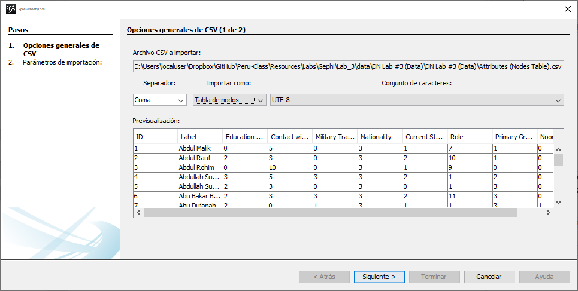
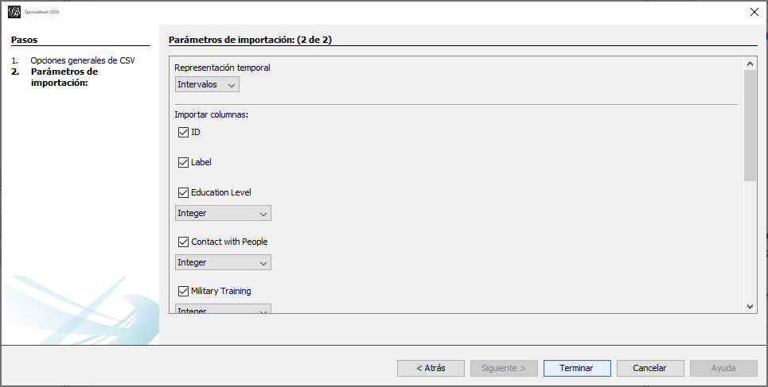
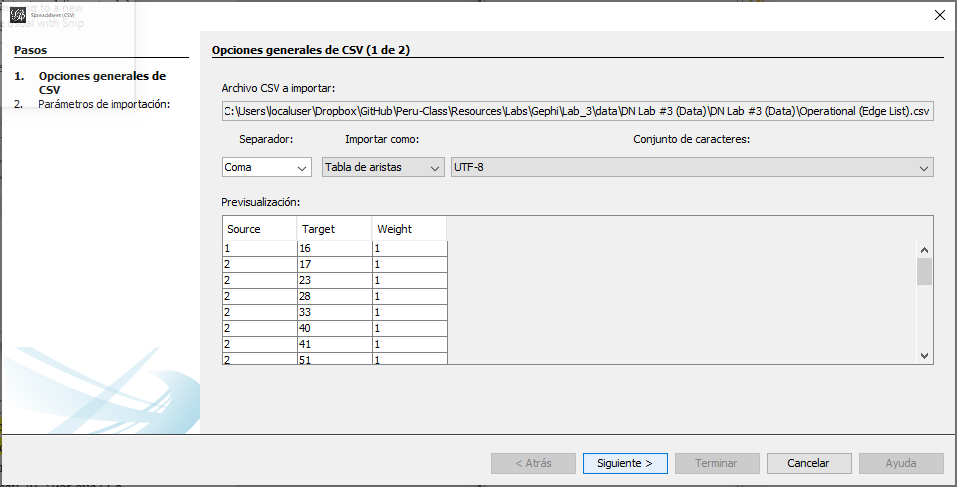
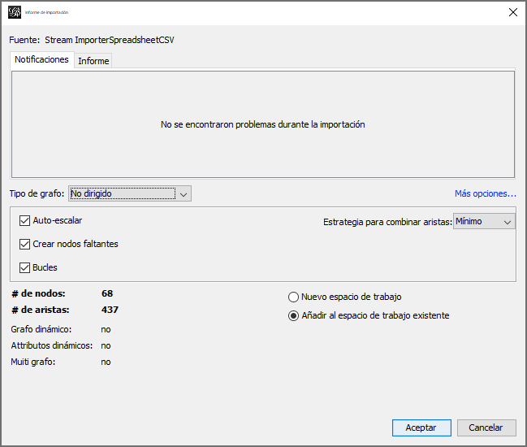
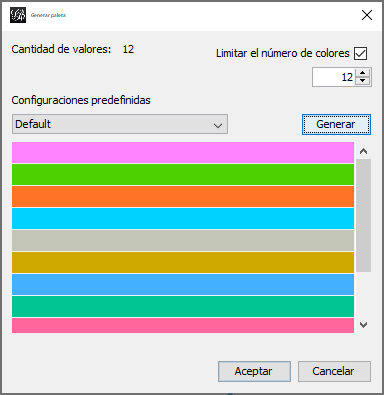
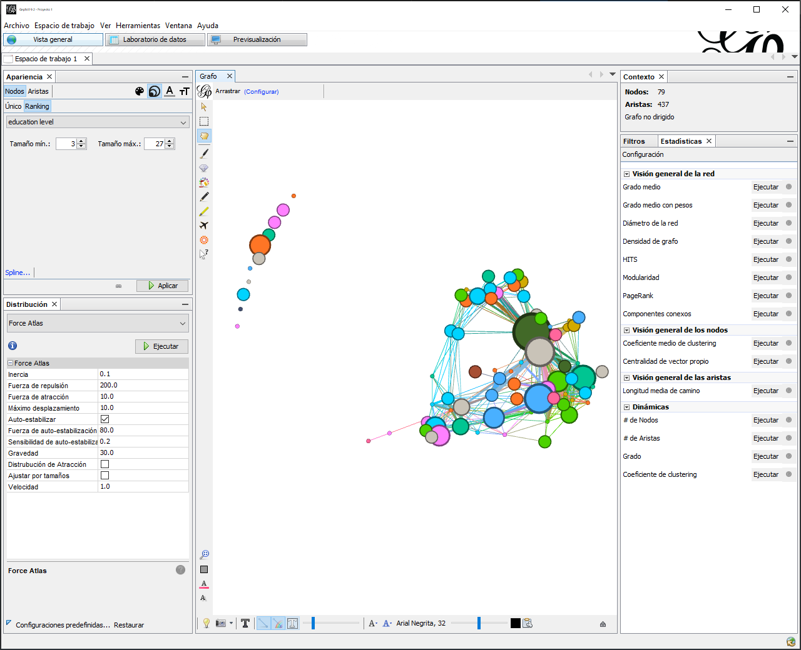
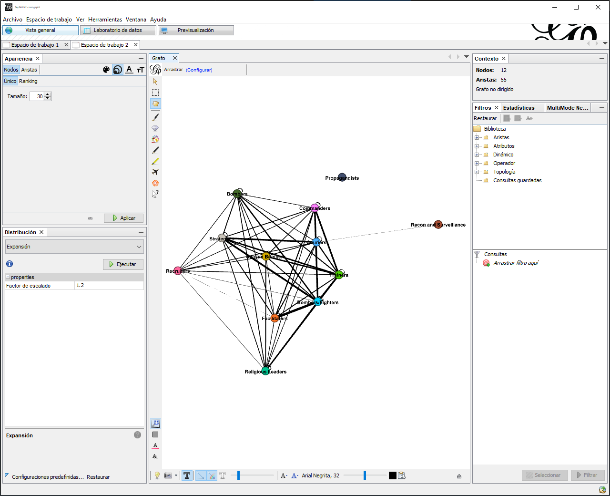
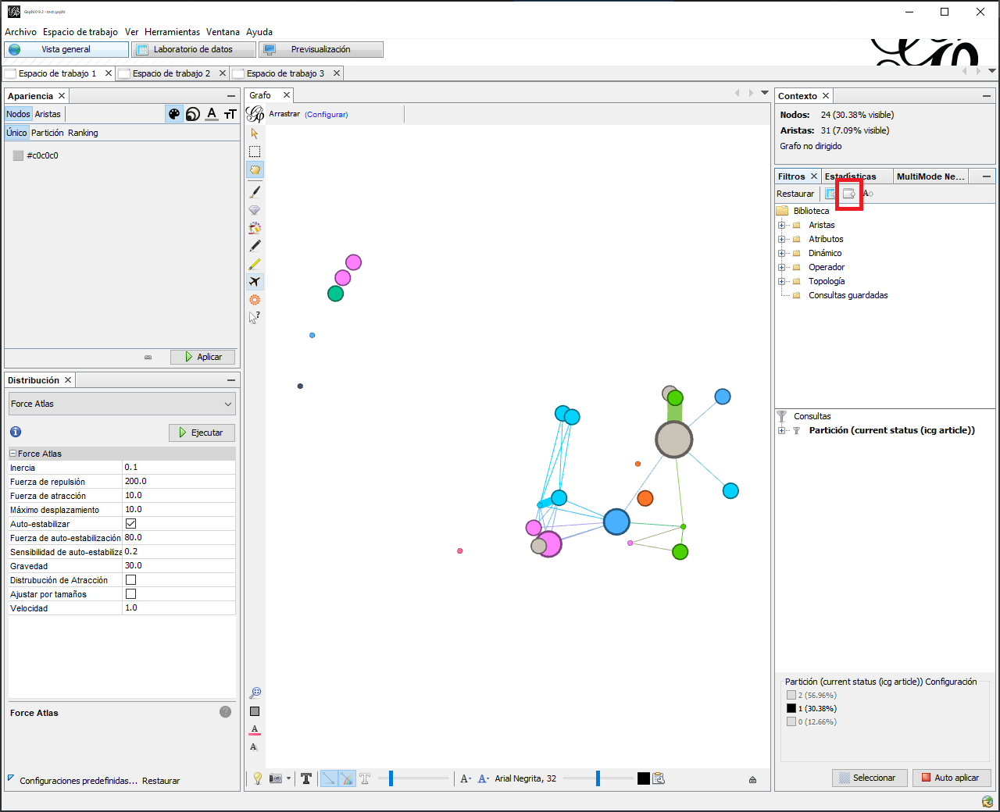
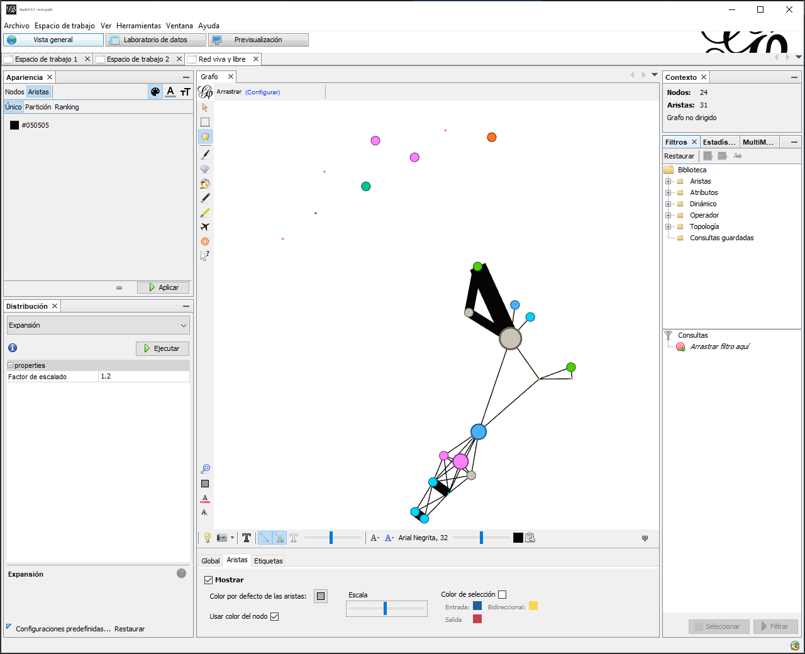

```{r setup, include=FALSE}
library(data.table)
library(igraph)
```

# Extraer y Simplificar Redes

En este último capítulo de técnicas de manipulación de datos, abarcaremos los temas de simplificación y extracción de subredes. @Everton2012 menciona que a menudo al trabajar con redes sociales grandes es difícil apreciar los patrones de interacciones por el volumen de información; por esto, los analistas utilizan un conjunto de técnicas para encoger la red o extraer subconjuntos de datos con características relevantes. El objetivo de este capítulo es presentarle herramientas comúnmente utilizadas para reimaginar redes con propósito de localizar patrones emergentes. Para mantener claridad, en esta sección tocaremos cada técnica de manera individual. Antes concluir, tendrá la oportunidad de practicar el uso de estas herramientas en Gephi.


## Extraer

Extraer es una técnica utilizada para aislar porciones de una red con base a un conjunto de características. Estas pueden ser características de los nodos o las aristas. Por ejemplo, en una red de pandilleros tenemos miembros asociado por diferentes tipos de enlaces, algunos de los miembros se encuentran libres y vivos, vivos y en búsqueda, y encarcelados/detenidos. La Figura \@ref(fig:2-6-pandilleros) es una representación gráfica de este ejemplo. En ella los nodos libres y vivos están coloreados de negro, los vivos y en búsqueda en gris, y los encarcelados/detenidos en blanco. Por su parte los enlaces rojos son familiares, los verdes financieros, rosados amistosos y azul son de superior-subordinado.

```{r 2-6-pandilleros, fig.cap = "Red de Pandilleros"}
files <- list.files(path       = "data/pandillas/",
                    pattern    = "*.csv$",
                    full.names = TRUE)
files <- lapply(files, data.table::fread)
g <- graph_from_data_frame(
  d       = data.table::rbindlist(files[2:6])[Relationship != "Illegitimate Organizational Affiliation", ],
  directed = FALSE,
  vertices =  files[[1]]
)

plot.igraph(g,
            layout = layout_with_kk,
            vertex.label = NA,
            vertex.size  = 7.5,
            vertex.color = c("black", "grey", "white")[as.factor(get.vertex.attribute(g, name = "Status/Text"))],
            edge.color   = c("red", "green", "pink", "blue")[as.factor(get.edge.attribute(g, name = "Relationship"))]
            )
```

Podemos enfocarnos en las características de los nodos y extraer una subred con base a estos atributos. Por ejemplo, si el enfoque del análisis es localizar a los nodos vivos y libres más activos, es importante extraer de la red solo nodos libres o en búsqueda. La Figura \@ref(fig:2-6-vivos) sólo incluye nodos vivos y libres, por ello se han removido seis nodos de el conjunto de datos original.

```{r 2-6-vivos, fig.cap = "Red de Pandilleros Vivos y Libres"}
g %>%
  delete.vertices(.,
                  v = V(.)[get.vertex.attribute(.,
                                                name = "Status/Text") == "Incarcerated/Detained"]) %>%
  plot.igraph(
            layout = layout_with_kk,
            vertex.label = NA,
            vertex.size  = 7.5,
            vertex.color = c("black", "grey", "white")[as.factor(get.vertex.attribute(., name = "Status/Text"))],
            edge.color   = c("red", "green", "pink", "blue")[as.factor(get.edge.attribute(., name = "Relationship"))]
            )
```

Similarmente, podemos extraer subredes con base en los patrones o tipos de relaciones. Supongamos que el objetivo es aislar nodos enlazados únicamente por vínculos financieros, la Figura \@ref(fig:2-6-fin) representa la subred de nodos exclusivamente conectados por vínculos de finanzas. 

```{r 2-6-fin, fig.cap = "Red de Pandilleros con Lazos Financieros"}
g %>%
  delete.edges(.,
               edges = E(.)[get.edge.attribute(.,
                                               name = "Relationship") != "Financial"]) %>%
  plot.igraph(
            layout = layout_with_kk,
            vertex.label = NA,
            vertex.size  = 7.5,
            vertex.color = c("black", "grey", "white")[as.factor(get.vertex.attribute(., name = "Status/Text"))],
            edge.color   = "green"
            )
```

## Simplificar

Simplificar, tambien llamado colapsar, es una estrategia que permite el aglomerar múltiples nodos con un atributo compartido a uno solo nodo. Como sugiere @Everton2012, esta estrategia es valiosa si el objetivo del análisis es examinar los patrones de enlaces entre tipos de nodos y no entre nodos individuales.  

Una vez más, retornemos a la red de pandilleros. Esta vez, los nodos han sido coloreados con base a la afiliación de cada miembro a pandillas, Figura \@ref(fig:2-6-pos).

```{r 2-6-pos, fig.cap = "Red de Pandilleros con Nodos Coloreados por Pandilla"}
g %>%
  plot.igraph(
            layout = layout_with_kk,
            vertex.label = NA,
            vertex.size  = 7.5,
            vertex.color = c("#1b9e77", "#d95f02", "#7570b3", "#e7298a",
                             "#66a61e", "#e6ab02", "#a6761d", "#666666"
                             )[as.factor(get.vertex.attribute(., name = "Illegitimate Organizational Affiliation"))]
            )
```

Utilizando estas categorías, podemos colapsar la red. Por ejemplo, la Figura \@ref(fig:2-6-collapsed) es una representación de la red donde cada nodo representa una categoría. Cada vínculo entre estas categorías simboliza la presencia de una relación entre dos personas con afiliaciones a dicho grupo.

```{r 2-6-collapsed, fig.cap= "Pandilleros, Collapsados por Grupo Ilícito"}
g %>%
  contract(.,
           mapping = as.factor(get.vertex.attribute(., name = "Illegitimate Organizational Affiliation")),
           vertex.attr.comb = toString) %>%
  plot.igraph(
    layout = layout_with_kk,
            vertex.label = NA,
            vertex.size  = 20,
            vertex.color = c("#1b9e77", "#d95f02", "#7570b3", "#e7298a",
                             "#66a61e", "#e6ab02", "#a6761d", "#666666"
                             )[as.factor(get.vertex.attribute(., name = "Illegitimate Organizational Affiliation"))]
  )
```


## Ejercicio Práctico

En este ejercicio, veremos técnicas para combinar datos relacionales con datos de atributos. Estos son útiles para resaltar diferentes aspectos de la red o para simplificar las redes. En este ejercicio utilizaremos un subconjunto de los datos principales de Noordin: “Red Operativa”, junto con los atributos asociados. 

### Antes de empezar

Para poder manipular los datos adecuadamente es necesario descargar e instalar un módulo adicional de software, *Grupos by partition* ó *Grupos por partición*. Haga esto siguiendo los mismos pasos que utilizamos en para descargar el modulo *MultimodeNetworks Transformation* en ejercicio práctico en el capitulo [Derivando Datos Modo-Uno de Modo-Dos]. 


Recuerde que deberá reiniciar Gephi.

### Importar redes y atributos en Gephi

:::{.row}
:::{.lcolumn-20 data-latex="{0.18\\textwidth}"}
*[Vista general]*

*Archivo > Abrir*
*Importar como > Tabla de nodos*
:::

:::{.col data-latex="{0.04\\textwidth}"}
\ <!-- an empty Div (with a white space), serving as
a column separator for tex -->
:::

:::{.rcolumn-80 data-latex="{0.78\\textwidth}"}
  1.	Comenzaremos importando la red operacional junto con sus atributos en Gephi. Primero, abra el archivo [`Attributes (Nodes Table).csv`](https://raw.githubusercontent.com/cjcallag/arso/main/data/simplifying/Attributes%20(Nodes%20Table).csv) utilizando el comando *Archivo > Abrir* en Gephi. Este archivo contiene una lista de los nodos de red y sus atributos correspondientes. Gephi debe detectar el tipo de archivo que está importando, pero mantenga en mente que a veces no funciona correctamente. En el cuadro de diálogo  de importación (Figura \@ref(fig:2-6-importacion)), asegúrese de indicar que el *Separador* sean comas y de importar el archivo como una *Tabla de Nodos*. Luego haga clic en *Siguiente*. 
:::
:::

\newline

:::{.row}
:::{.lcolumn-20 data-latex="{0.18\\textwidth}"}
\ <!-- an empty Div (with a white space), serving as
a column separator for tex -->
:::

:::{.col data-latex="{0.04\\textwidth}"}
\ <!-- an empty Div (with a white space), serving as
a column separator for tex -->
:::

:::{.rcolumn-80 data-latex="{0.78\\textwidth}"}
  2.	En la siguiente pantalla de importación (Figura \@ref(fig:2-6-importacion2)) vera que se ha detectado una serie de atributos: `Education Level`, `Contact with People`, `Current Status (ICG Article)`, `Military Training`, `Nationality`, `Noordin’s Network`, `Primary Group Affiliation`, y `Role`, junto con la identificación y etiqueta de cada nodo (actor) en la red. Gephi probablemente importará de manera predeterminada todos los atributos como *String* (caracteres de texto). Por lo tanto, usando los menus desplegables debajo de cada atributo, cámbielo de *String* a *Integer* (números enteros). Luego, de clic en *Terminar*.
:::
:::

```{r 2-6-importacion, fig.cap= "Cuadro de dialogo para importar un archivo CSV (1 de 2)"}

```

```{r 2-6-importacion2, fig.cap= "Cuadro de dialogo para importar un archivo CSV (2 de 2)"}

```


:::{.row}
:::{.lcolumn-20 data-latex="{0.18\\textwidth}"}
\ <!-- an empty Div (with a white space), serving as
a column separator for tex -->
:::

:::{.col data-latex="{0.04\\textwidth}"}
\ <!-- an empty Div (with a white space), serving as
a column separator for tex -->
:::

:::{.rcolumn-80 data-latex="{0.78\\textwidth}"}
  3.	A continuación, debería ver el *Informe de importación* de Gephi (Figure (Figura \@ref(fig:2-6-importacion3)). Aquí, indique que desea agregar los datos a un nuevo espacio de trabajo. No cambie ningún otro valor predeterminado de importación (como esta tabla no incluye aristas, ninguna de las otras opciones afectará el resultado). Haga clic en *Aceptar*.
:::
:::

```{r 2-6-importacion3, fig.cap= "Informe de importación de Gephi"}
knitr::include_graphics("images/02-07-03.png")
```

:::{.row}
:::{.lcolumn-20 data-latex="{0.18\\textwidth}"}
*[Vista general]*

*Archivo > Abrir*
*Importar como > Tabla de aristas*
:::

:::{.col data-latex="{0.04\\textwidth}"}
\ <!-- an empty Div (with a white space), serving as
a column separator for tex -->
:::

:::{.rcolumn-80 data-latex="{0.78\\textwidth}"}
  4.	Ahora importemos la lista de aristas correspondiente, [`Operational (Edge List).csv`](https://raw.githubusercontent.com/cjcallag/arso/main/data/simplifying/Operational%20(Edge%20List).csv), usando el comando *Archivo > Abrir*. Gephi debe detectar el formato del archivo correctamente, pero asegúrese que los separadores sean comas y que el archivo de importación sea reconocido como *Tabla de aristas* (Figura \@ref(fig:2-6-importacion4)). Luego haga clic en *Siguiente*. En e siguiente cuadro de diálogo, acepte todos los valores predeterminados de Gephi y haga clic en *Terminar*. 
:::
:::

```{r 2-6-importacion4, fig.cap= "Cuadro de dialogo para importar un archivo CSV"}

```

:::{.row}
:::{.lcolumn-20 data-latex="{0.18\\textwidth}"}
\ <!-- an empty Div (with a white space), serving as
a column separator for tex -->
:::

:::{.col data-latex="{0.04\\textwidth}"}
\ <!-- an empty Div (with a white space), serving as
a column separator for tex -->
:::

:::{.rcolumn-80 data-latex="{0.78\\textwidth}"}
5.	Una vez más, deberá ver el informe de importación de Gephi (Figure \@ref(fig:2-6-importacion5)). Aunque, es importante que le indique a Gephi que el grafo no es dirigido, que desea utilizar la estrategia para combinar aristas *Minimo* y que desea agregar los datos al lugar de trabajo existente. Note que el informe indica que solo hay 68 nodos, sin embargo, el reporte de importación de los atributos (Figura \@ref(fig:2-6-importacion3)) indico que hay 79. ¿Por qué? La respuesta es que la red contiene 11 nodos aislados, estos son, individuos que no tienen enlaces a otros en esta red. Haga clic en *Aceptar*. Antes de comenzar, guarde sus datos como archivo de Gephi.
:::
:::

```{r 2-6-importacion5, fig.cap = "Reporte de importación"}

```

### Uso de atributos de nodo en visualizaciones de red

:::{.row}
:::{.lcolumn-20 data-latex="{0.18\\textwidth}"}
*[Vista general]*

*Apariencia > Nodos > Partición > --Escoge un atributo > Current status (icg article)*
:::

:::{.col data-latex="{0.04\\textwidth}"}
\ <!-- an empty Div (with a white space), serving as
a column separator for tex -->
:::

:::{.rcolumn-80 data-latex="{0.78\\textwidth}"}
  1.	Ahora, veamos cómo podemos incorporar algunos de los datos de atributos de nodo en nuestras visualizaciones de red. En la pantalla *Vista general*, ubique la pestaña *Apariencia*, luego haga clic en *Nodos* y el ícono de la paleta de colores a la derecha, y finalmente en la opción *Partición*. Usando el menú desplegable de atributos, seleccione `current status (icg article)` y de clic en *Aplicar*. Los nodos ahora deben exhibir tres colores diferentes, cada uno de los cuales refleja el estado actual de un actor (es decir, si está muerto “0”, vivo y libre “1” o en la cárcel “2”; todo esto está en el libro de códigos). El color asociado con cada atributo se encuentra justo debajo del menú desplegable. Si no le gustan los colores predeterminados, puede dar clic en el cuadro junto al número o en el enlace *Paleta…*, que abrirá una ventanilla con múltiples opciones.
:::
:::

\newline

:::{.row}
:::{.lcolumn-20 data-latex="{0.18\\textwidth}"}
*[Vista general]*

*Apariencia > Nodos > Partición > --Escoge un atributo > role*

*Paleta... > Generate...*
:::

:::{.col data-latex="{0.04\\textwidth}"}
\ <!-- an empty Div (with a white space), serving as
a column separator for tex -->
:::

:::{.rcolumn-80 data-latex="{0.78\\textwidth}"}
  2. Ahora, seleccione `role` y de clic en *Aplicar*. Este atributo contiene 12 roles, desplácese hacia el final de la lista de colores asociados con los roles, notará que Gephi no posee suficientes colores para este número de categorías. Para rectificar esto, haga clic en el enlace *Paleta…* y elija *Generar…* en el cuadro de diálogo (Figura \@ref(fig:2-6-importacion6)), aumente el número de colores a 12, elija uno de los ajustes preestablecidos, haga clic en *Generar* y luego *Aceptar*. En la ventana *Descripción general*, haga clic en *Aplicar*, y ahora todos sus nodos deben tener un color individual.
:::
:::

```{r 2-6-importacion6, fig.cap = "Cuadro de diálogo 'Generar paleta'"}

```

:::{.row}
:::{.lcolumn-20 data-latex="{0.18\\textwidth}"}
*[Vista general]*

*Apariencia > Nodos > Tamaño > Ranking > Attributo > Education Level*

:::

:::{.col data-latex="{0.04\\textwidth}"}
\ <!-- an empty Div (with a white space), serving as
a column separator for tex -->
:::

:::{.rcolumn-80 data-latex="{0.78\\textwidth}"}
  3.	Ahora, ajustemos el tamaño de los nodos según el nivel educativo. En la pestaña *Apariencia*, haga clic en *Nodos*,  luego en el ícono de tamaño (a la derecha de la paleta de colores) y luego en *Ranking*. Usando el menú desplegable de atributos, seleccione `education level` y haga clic en *Aplicar*. El tamaño de los nodos ahora debe reflejar el nivel de educación. Los tamaños de nodo mínimo y máximo predeterminados de Gephi predeterminados constan de un rango arbitrario de valores. Si observa los valores de este atributo en la ventana *Laboratorio de datos*, verá que el nivel educativo va de 0 a 8. Para distinguir los nodos un poco mejor, ajusté el mínimo y el máximo de 3 a 27 (no usamos 0 como mínimo porque los nodos desaparecerán). Use las técnicas de visualización cubiertas en nuestros laboratorios anteriores. Este autor presenta un ejemplo en la Figura \@ref(fig:2-6-7) generado utilizando el diseño *Force Atlas* porque no empuja los aislados lejos del resto de la red. **¿Detecta algún patrón relacional asociado con los atributos de los nodos (por ejemplo, los actores con niveles de educación más altos se encuentran en el centro de la red)?** 
:::
:::

```{r 2-6-7, fig.cap = "Red operacional de Noordin"}

```

### Simplificación (colapso / reducción) en Gephi

:::{.row}
:::{.lcolumn-20 data-latex="{0.18\\textwidth}"}
\ <!-- an empty Div (with a white space), serving as
a column separator for tex -->
:::

:::{.col data-latex="{0.04\\textwidth}"}
\ <!-- an empty Div (with a white space), serving as
a column separator for tex -->
:::

:::{.rcolumn-80 data-latex="{0.78\\textwidth}"}
  1.	Solo prosiga a completar esta sección si ha descargado el módulo requerido, *Grupos por partición*.
:::
:::

\newline

:::{.row}
:::{.lcolumn-20 data-latex="{0.18\\textwidth}"}
*[Vista general]*

*Herramientas > Generate groups by partition*
:::

:::{.col data-latex="{0.04\\textwidth}"}
\ <!-- an empty Div (with a white space), serving as
a column separator for tex -->
:::

:::{.rcolumn-80 data-latex="{0.78\\textwidth}"}
  2. En la ventana *Descripción general*, seleccione el comando *Herramientas > Generate groups by partition*. Aparecerá un cuadro de diálogo que le preguntará si desea crear un nuevo espacio de trabajo o sobrescribir el actual. Elija *Crear*. Esto generará un nuevo espacio de trabajo donde los nodos han sido colapsados según el rol de cada nodo. Es importante tener en cuenta que este módulo contrae la red en base a la partición de nodos seleccionada en la ventana *Vista general*. Si hubiéramos querido colapsar la red basándose, por ejemplo, en el estado actual, entonces habríamos tenido que volver a colorear y revisualisar la red usando otra partición, siguiendo los comandos detallados en la seccion [Uso de atributos de nodo en visualizaciones de red].
:::
:::

\newline

:::{.row}
:::{.lcolumn-20 data-latex="{0.18\\textwidth}"}
\ <!-- an empty Div (with a white space), serving as
a column separator for tex -->
:::

:::{.col data-latex="{0.04\\textwidth}"}
\ <!-- an empty Div (with a white space), serving as
a column separator for tex -->
:::

:::{.rcolumn-80 data-latex="{0.78\\textwidth}"}
  3.	Finalmente, necesitamos cambiar el nombre de las etiquetas para que correspondan con los diferentes roles. Cambie a la ventana *Laboratorio de datos*, seleccione la *Tabla de nodos* y verá que ahora solo hay 12 nodos correspondiendo a los grupos colapsados (por ejemplo, `Group of Jabir`). Al colapsar los nodos el nombre asociado con el grupo corresponde a uno de los actores que pertenecen a este subconjunto. Para modificar las etiquetas con los roles, vamos a tener que abrir la tabla original de atributos (`Attributes (Nodes Table).csv`) y la clave a continuación:
:::
:::

| Código | Definición  |
|:------:|:------|
| 0      | Sin información/poca claridad |
| 1      | Estratega: Planificador de alto nivel |
| 2      | Fabricante de bombas: Individuo que construye bombas |
| 3      | Bombardero/combatiente: Individuo que participa en ataques con bombas o que se describe como un combatiente |
| 4      | Entrenador/instructor: Individuo que entrena o instruye a nuevos miembros |
| 5      | Terrorista suicida: Individuo que planea o ya ha realizado un ataque suicida |
| 6      | Reconocimiento y vigilancia: Participa en la vigilancia y reconocimiento |
| 7      | Reclutador: Se dedica a identificar y reclutar nuevos miembros |
| 8      | Mensajero /Intermediario: Facilita las comunicaciones entre miembros |
| 9      | Propagandista: Desarrolló campañas de información |
| 10     | Facilitador: Asiste en el funcionamiento de la red |
| 11     | Líder religioso: Proporciona formación y apoyo religioso |
| 12     | Comandante/Líder táctico: A cargo de las operaciones a nivel local/táctico |

  En Excel observara que el rol de Jabir es `7`, y en la clave vemos que el rol `7` es el de `Recruiter` (o reclutador en español). En la columna de etiqueta (*Label*) en la tabla de nodos haga doble clic en la fila `Group by Jabir`, que abrirá un cuadro de texto. Allí, remplace la etiqueta con el rol (`Reclutador` o `Recruiter`) y luego repita este proceso para todos los grupos restantes. Cuando haya cambiado el nombre de todas las etiquetas, la red resultante tendrá un aspecto similar a la Figura \@ref(fig:2-6-8). 

```{r 2-6-8, fig.cap = "Nodos por rol"}
knitr::include_graphics("images/02-07-08.png")
```

:::{.row}
:::{.lcolumn-20 data-latex="{0.18\\textwidth}"}
*[Vista General]*

*Nodos > Tamaño > Único*
:::

:::{.col data-latex="{0.04\\textwidth}"}
\ <!-- an empty Div (with a white space), serving as
a column separator for tex -->
:::

:::{.rcolumn-80 data-latex="{0.78\\textwidth}"}
  4.	Ahora, cambie la Ventana *Vista general* y visualice la red. Los nodos probablemente variarán en tamaño, por lo que se recomienda modificar el tamaño utilizando los comandos *Nodos > Tamaño > Único* en esta secuencia. También use el algoritmo de diseño *Force Atlas* para editar el gráfico. Note que los pesos de las aristas reflejan en número de enlaces entre cada par de nodos, por lo que podemos reducir el grosor de estos. Además, agregue el tamaño de las etiquetas a su gusto (vea nuestra sugerencia en la Figura \@ref(fig:2-6-9)). Antes de pasar al siguiente paso, haga clic derecho en el nodo `propagandista` (o `propagandist`). Esta acción abrirá un cuadro de diálogo; allí, seleccione *Bloquear*. Hacer esto evita que el nodo se mueva al aplicar algoritmos de diseño adicionales.
:::
:::

```{r 2-6-9, fig.cap = "Red colapsada por atributo de rol (diseño Force Atlas)"}
knitr::include_graphics("images/02-07-09.png")
```


:::{.row}
:::{.lcolumn-20 data-latex="{0.18\\textwidth}"}
\ <!-- an empty Div (with a white space), serving as
a column separator for tex -->
:::

:::{.col data-latex="{0.04\\textwidth}"}
\ <!-- an empty Div (with a white space), serving as
a column separator for tex -->
:::

:::{.rcolumn-80 data-latex="{0.78\\textwidth}"}
  5.	Experimenté con varios algoritmos de diseño, en mi grafico (Figura \@ref(fig:2-6-10)) vera un sociograma modificado con el algoritmo de diseño *OpenOrd*. Mirando el gráfico (que usted mismo puede producir en Gephi), **¿Qué sugieren los patrones entre los roles?** Tenga en cuenta que algunos de los nodos tienen vínculos consigo mismos (bucles). **¿Qué crees que indican estos patrones? ¿Por qué cree que el nodo “Recon and sureveillance” no se encuentra más cerca a los demás nodos?**
:::
:::

  
```{r 2-6-10, fig.cap = "Red colapsada por el atributo de rol (diseño OpenOrd)"}

```

### Extracción en Gephi

:::{.row}
:::{.lcolumn-20 data-latex="{0.18\\textwidth}"}
*[Vista general]*

*Filtros > Atributos > Partición > current status*

*Consultas > Partición > 1*

*Filtrar > Exportar gráfico filtrado a un nuevo espacio de trabajo*

:::

:::{.col data-latex="{0.04\\textwidth}"}
\ <!-- an empty Div (with a white space), serving as
a column separator for tex -->
:::

:::{.rcolumn-80 data-latex="{0.78\\textwidth}"}
  1.	Ahora, vamos a extraer un conjunto de red más grande. Para hacer esto, volvamos a la red original (sin colapsar), que probablemente se encuentra el primer espacio de trabajo. En la pestaña *Filtros* en el lado derecho de la ventana *Descripción general*, seleccione *Atributos*, luego *Partición* y luego *current status (icg articles)* a la sección *Consultas*. En el cuadro debajo de la sección *Consultas* - *Partition (current status (icg article)) Configuración* – deberá ver tres cuadros, etiquetados *2*, *1*, y *0*, que indican si el actor esta muerto `0`, vivo y libre `1`, o en la cárcel `2`. Aquí, extraeremos la red `Viva y libre` marcando la casilla *1*. Haga clic en *Filtrar* y luego use el botón *Exportar gráfico filtrado a un nuevo espacio de trabajo*, que utilizamos en el laboratorio anterior (cuadro rojo en la Figura \@ref(fig:2-6-11)).
:::
:::

```{r 2-6-11, fig.cap = "Red viva y libre filtrada"}

```

:::{.row}
:::{.lcolumn-20 data-latex="{0.18\\textwidth}"}
\ <!-- an empty Div (with a white space), serving as
a column separator for tex -->
:::

:::{.col data-latex="{0.04\\textwidth}"}
\ <!-- an empty Div (with a white space), serving as
a column separator for tex -->
:::

:::{.rcolumn-80 data-latex="{0.78\\textwidth}"}
  2.	Cambie el nuevo espacio de trabajo y cámbiele el nombre (por ejemplo, `Red viva y libre`). Después de experimentar con algunos algoritmos de diseño, tamaño de nodo con base en el nivel educativo, tamaño de etiqueta y pesos de borde, produje el grafico en la Figura \@ref(fig:2-6-12). Tenga en cuenta que vez elegí no mostrar los nodos aislados. Los colores reflejan el rol.
:::
:::

```{r 2-6-12, fig.cap = "Red viva y libre (sin aislados)"}

```
