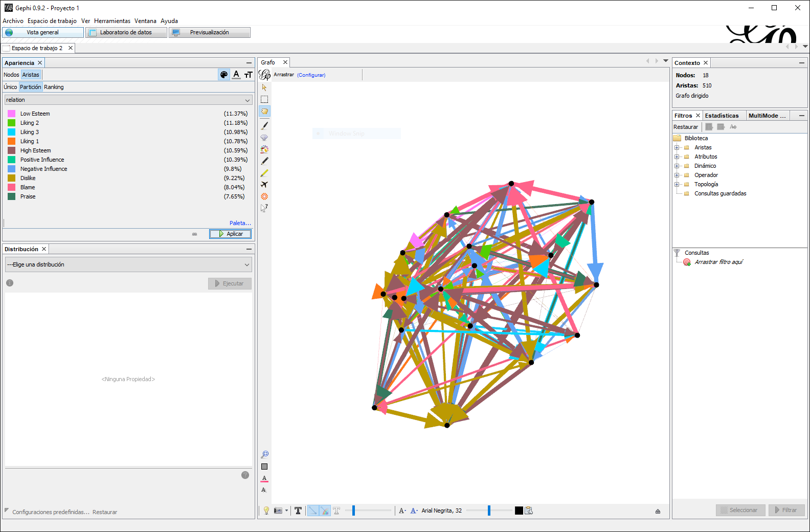
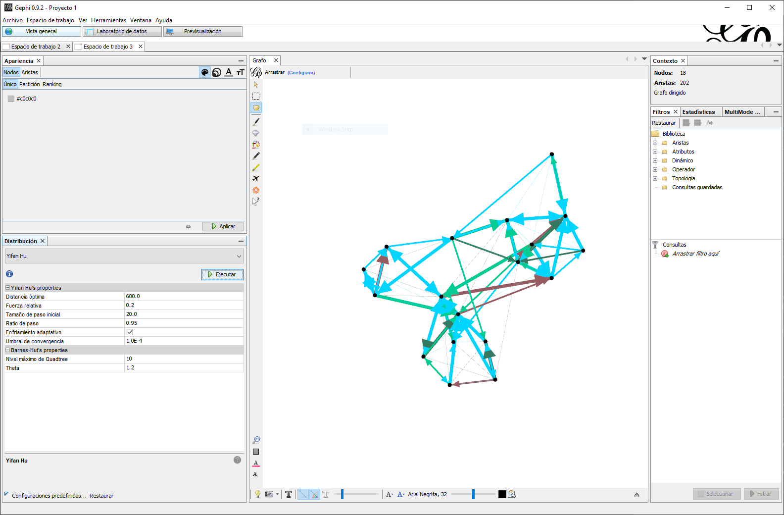

```{r setup, include=FALSE}
library(data.table)
library(DT)
```

# Multiples Relaciones

Hasta este punto, solo hemos trabajado con un tipo (modo-uno o modo-dos) de relaciones a la vez. Sin embargo, en el mundo real los actores incrustados en redes sociales se encuentran entrelazados los unos con otros por múltiples relaciones [@Hanneman2005]. Por ejemplo, en su mente visualice su red social, es decir, los circulos sociales en los que usted se encuentra incrustado.  ¿Qué relaciones a considerado? Es probable incluya vínculos familiares, amistosos, profesionales, membresía ligas de deportes o clubes religiosos. El punto clave es que las redes sociales constan de múltiples tipos de relaciones que unen a los actores que se encuentran dentro de ellas. 

Por consiguiente, los analistas de redes trabajan con múltiples relaciones para poder abarcar la gama de interacciones en un sistema social.  En este capítulo, cubriéremos algunas técnicas utilizadas al trabajar con múltiples tipos de relaciones, tomando pauta para recalcar las ventajas y desventajas de diferentes enfoques. Concluiremos con un ejercicio practico en Gephi que le dará la oportunidad de utilizar estos conceptos. 

## Matrices y Listas de Aristas

Empecemos por considerar como trabajar con múltiples relaciones utilizando matrices. Las matrices subsecuentes (\@ref(eq:mat1) y \@ref(eq:mat2)) representan dos relaciones diferentes, la matriz izquierda contiene relaciones familiares y la matriz derecha financieras. Por separado, cuentan unan historia diferente de los miembros de la red.

:::: {.row}
:::: {.lcolumn-50}
\begin{matrix}
  & A & B & C & D & E & F \\
A & 0 & 1 & 1 & 0 & 0 & 0 \\
B & 1 & 0 & 1 & 0 & 0 & 0 \\
C & 1 & 1 & 0 & 0 & 0 & 0 \\
D & 0 & 0 & 0 & 0 & 1 & 1 \\
E & 0 & 0 & 0 & 1 & 0 & 1 \\
F & 0 & 0 & 0 & 1 & 1 & 0 \\
(\#eq:mat1)
\end{matrix}
::::

:::: {.rcolumn-50}
\begin{matrix}
  & A & B & C & D & E & F \\
A & 0 & 0 & 0 & 0 & 0 & 0 \\
B & 0 & 0 & 0 & 0 & 0 & 0 \\
C & 0 & 0 & 0 & 1 & 0 & 0 \\
D & 0 & 0 & 1 & 0 & 0 & 0 \\
E & 0 & 0 & 0 & 0 & 0 & 0 \\
F & 0 & 0 & 0 & 0 & 0 & 0 \\
(\#eq:mat2)
\end{matrix}
::::
::::

El objetivo como analistas es analizar la combinación de estas relaciones de manera que podamos identificar los bordes de la red. La Figura \@ref(fig:combined) es una representación de los datos descritos previamente en formato de sociomatriz. El grafo incluye dos triadas cerradas consistentes de miembros familiares. Entre estos grupos, encontramos una relación financiera que une estos grupos. 

```{r combined, echo = FALSE, fig.cap = "Multiples Relaciones"}
data.frame(
  from       = c("A", "A", "B", "D", "D", "E", "C"),
  to         = c("B", "C", "C", "E", "F", "F", "D"),
  color = c("#e41a1c", "#e41a1c", "#e41a1c", "#e41a1c", "#e41a1c", "#e41a1c", "#018571")
  ) %>%
  igraph::graph_from_data_frame(directed = FALSE) %>%
  igraph::plot.igraph(
    edge.color   = igraph::get.edge.attribute(., name = "color"),
    edge.width   = 10,
    vertex.size  = 30,
    vertex.color = "white",
    vertex.label.color = "black"
  )
```

Como hemos mencionado previamente, el recopilar información en sociomatrices es laborioso e ineficiente. Por consíguete, al recopilar múltiples tipos de relaciones es sugerible utilizar una lista de aristas, el formato básico de dos columnas puede ser expandido para incluir una columna clasificando el tipo de vínculo. Recuerde que en una lista de aristas cada fila representa un vínculo, por lo tanto, es posible apilar relaciones de la siguiente manera:

```{r, echo = FALSE}
data.frame(
  Origen   = c("A", "A", "B", "D", "D", "E", "C"),
  Destino  = c("B", "C", "C", "E", "F", "F", "D"),
  Relación = c("Familiar", "Familiar", "Familiar", "Familiar", "Familiar", 
               "Familiar", "Financiera"
               )
  ) %>%
  DT::datatable(rownames = FALSE,
                options  = list(dom = "t")) %>%
  DT::formatStyle("Relación", target = "row", 
                  backgroundColor = DT::styleEqual(c("Familiar",
                                                     "Financiera"),
                                                   c("#e41a1c", "#018571")))
```

El incorporar múltiples relaciones en una sola lista con una variable categórica, permite la importación de datos de manera efectiva. Sin embargo, es común encontrar analistas que mantienen sus relaciones en múltiples archivos por propósitos de combinar datos. 

## Combinar

El combinar datos relacionales en ARSo puede significar diferentes acciones para trabajar con datos. @Cunningham2016 proponen tres técnicas: apilar, agregar y recombinar. En esta sección discutiremos las tres. 

### Apilar

El apilar es una técnica comúnmente utilizada por analistas para mantener y utilizar múltiples relaciones de manera independiente [@Cunningham2016].  El como mantener e incorporar estos archivos varia con base a la herramienta de software. Por ejemplo, las matrices subsecuentes (\@ref(eq:mat3) y \@ref(eq:mat4)) contienen relaciones de manera independiente, al apilarlas podemos crear un gráfico (ver Figura \ref(fig:apiladas)) que incorpora ambas sin tener que unir estas matrices; por consiguiente, todos los datos se mantienen íntegros.

:::: {.row}
:::: {.lcolumn-50}
\begin{matrix}
  & A & B & C & D & E & F \\
A & 0 & 1 & 1 & 0 & 0 & 0 \\
B & 1 & 0 & 1 & 0 & 0 & 0 \\
C & 1 & 1 & 0 & 0 & 0 & 0 \\
D & 0 & 0 & 0 & 0 & 1 & 1 \\
E & 0 & 0 & 0 & 1 & 0 & 1 \\
F & 0 & 0 & 0 & 1 & 1 & 0 \\
(\#eq:mat3)
\end{matrix}
::::

:::: {.rcolumn-50}
\begin{matrix}
  & A & B & C & D & E & F \\
A & 0 & 0 & 0 & 0 & 0 & 0 \\
B & 0 & 0 & 0 & 0 & 1 & 0 \\
C & 0 & 0 & 0 & 1 & 0 & 0 \\
D & 0 & 0 & 1 & 0 & 0 & 0 \\
E & 0 & 1 & 0 & 0 & 0 & 0 \\
F & 0 & 0 & 0 & 0 & 0 & 0 \\
(\#eq:mat4)
\end{matrix}
::::
::::

```{r apiladas, echo = FALSE, fig.cap = "Relaciones Apiladas"}
data.frame(
  from       = c("A", "A", "B", "D", "D", "E", "C", "B"),
  to         = c("B", "C", "C", "E", "F", "F", "D", "E"),
  color = c("#e41a1c", "#e41a1c", "#e41a1c", "#e41a1c", "#e41a1c", "#e41a1c", "#018571", "#018571")
  ) %>%
  igraph::graph_from_data_frame(directed = FALSE) %>%
  igraph::plot.igraph(
    edge.color   = igraph::get.edge.attribute(., name = "color"),
    edge.width   = 10,
    vertex.size  = 30,
    vertex.color = "white",
    vertex.label.color = "black"
  )
```

El objetivo de apilar es el poder agregar o remover datos al análisis con base en las necesidades del analista. Sin embargo, algunas plataformas de software tratan datos apilados como separados y por consiguiente calculan medidas con base a cada matriz de manera independiente. Por ejemplo, el contar vínculos de las matrices apiladas previamente produce dos valores 6 y 2. Es por ello, que usualmente el apilar relaciones solo se utiliza como una herramienta visual.

### Agregar

Como lo sugiere el nombre, agregar es una técnica que consiste en crear una nueva red de un conjunto de relaciones; usualmente, sumando las relaciones en un nuevo producto [@Cunningham2016]. Nuevamente, el proceso de agregar relaciones varia con base al programa de software. Sin embargo, podemos visualizar el proceso utilizando una sumación de matrices. Por ejemplo, las matrices subsecuentes () representan dos tipos de relaciones asimétricas. Note que ambas matrices constan del el mismo numero de filas y columnas, lo cual es requerido para sumar matrices.

:::: {.row}
:::: {.lcolumn-50}
\begin{matrix}
  & A & B & C & D \\
A & 0 & 1 & 1 & 0 \\
B & 1 & 0 & 1 & 0 \\
C & 1 & 1 & 0 & 0 \\
D & 0 & 0 & 0 & 0 \\
E & 0 & 0 & 0 & 1 \\
F & 0 & 0 & 0 & 1 \\
(\#eq:mat3)
\end{matrix}
::::

:::: {.rcolumn-50}
\begin{matrix}
  & A & B & C & D \\
A & 0 & 0 & 0 & 0 \\
B & 0 & 0 & 0 & 0 \\
C & 0 & 0 & 0 & 1 \\
D & 0 & 0 & 1 & 0 \\
E & 0 & 1 & 0 & 0 \\
F & 0 & 0 & 0 & 0 \\
(\#eq:mat4)
\end{matrix}
::::
::::

El proceso en este ejemplo es simple, se suman las entradas correspondientes(ver \ref(fig:matsum)). Sin embargo, diferentes herramientas de software incluyen modificaciones de esta operación como el tomar un promedio de valores correspondientes, solo incluir el valor mínimo o máximo, etc.

\begin{equation}
\begin{matrix}
  & A & B & C & D \\
A & 0 & 1 & 1 & 0 \\
B & 1 & 0 & 1 & 0 \\
C & 1 & 0 & 0 & 0 \\
D & 0 & 0 & 1 & 0
\end{matrix}

\enspace + \enspace

\begin{matrix}
  & A & B & C & D \\
A & 0 & 1 & 0 & 0 \\
B & 0 & 0 & 0 & 0 \\
C & 0 & 0 & 0 & 1 \\
D & 0 & 0 & 1 & 0
\end{matrix}

\enspace = \enspace

\begin{matrix}
  & A & B & C & D \\
A & 0 & 2 & 1 & 0 \\
B & 1 & 0 & 1 & 0 \\
C & 1 & 0 & 0 & 2 \\
D & 0 & 0 & 1 & 0
\end{matrix}
(\#eq:matsum)
\end{equation}


```{r agregadas, echo = FALSE, fig.cap = "Relaciones Agregadas"}
data.frame(
  from  = c("A", "A", "B", "B", "C", "C", "D"),
  to    = c("B", "C", "A", "C", "A", "D", "C"),
  width = c(2, 1, 1, 1, 1, 2, 1)
  ) %>%
  igraph::graph_from_data_frame(directed = TRUE) %>%
  igraph::plot.igraph(
    layout             = igraph::layout_with_fr,
    edge.width         = igraph::get.edge.attribute(., name = "width") * 2,
    edge.curved        = 0.5,
    edge.arrow         = "to",
    vertex.size        = 30,
    vertex.color       = "white",
    vertex.label.color = "black"
    )
```

El agregar redes, como el proceso de apilar, tiene ventajas y desventajas. Permite consolidar datos antes de ejecutar medidas. Sin embargo, al consolidarlos perdemos información acerca del tipo de vínculo. Por ejemplo, en la matriz producto anterior vemos algunos valores de “2”, los cuales corresponden a la presencia de vínculos precursores en ambas matrices. Sin embargo, para los vínculos con un valor de “1” es imposible determinar a qué categoría o matriz precursora pertenece dicho vinculo sin evaluar las entradas correspondientes. Por consiguiente, los analistas de redes tienden a agregar datos y retener los conjuntos precursores.

### Recombinar

Ocasionalmente al trabajar con datos de redes encontraremos situaciones en las cuales es necesario evaluar si la presencia de un enlace es suficiente evidencia en determinar la conexión entre dos actores. Particularmente al trabajar con redes oscuras donde las actividades se mantienen encubiertas, el triangular una relación a menudo requiere el utilizar umbrales o filtros para confirmar una conexión entre actores [@Cunningham2016]. 

@Cunningham2016 da un ejemplo practico de recombinar redes. Supongamos que tenemos dos redes modo-dos. La primera (ver \@ref(eq:mat3)) vincula a personas con ubicaciones. La segunda (ver \@ref(eq:mat4)) vincula personas con roles operacionales. 

:::: {.row}
:::: {.lcolumn-50}
\begin{matrix}
  & Lima & Cusco & Arequipa \\
A & 0    & 0     & 1        \\
B & 0    & 0     & 1        \\
C & 1    & 0     & 0        \\
D & 0    & 1     & 0        \\
E & 0    & 1     & 0        \\
F & 0    & 1     & 0        \\
G & 0    & 1     & 0        \\
H & 0    & 1     & 0        \\
I & 1    & 0     & 0        \\
J & 1    & 0     & 0        \\
K & 0    & 0     & 1        \\
(\#eq:mat3)
\end{matrix}
::::

:::: {.rcolumn-50}
\begin{matrix}
  & Finanza & Logística & Operativo \\
A & 1        & 0         & 0         \\
B & 1        & 0         & 0         \\
C & 1        & 0         & 0         \\
D & 0        & 1         & 0         \\
E & 0        & 1         & 0         \\
F & 0        & 0         & 1         \\
G & 0        & 0         & 1         \\
H & 1        & 0         & 0         \\
I & 0        & 1         & 0         \\
J & 1        & 0         & 0         \\
K & 1        & 0         & 0         \\
(\#eq:mat4)     
\end{matrix}
::::
::::

El vincular a todas las personas en una ubicación no siempre es adecuado, por ejemplo, en una ciudad de millones de habitantes es probable que dos personas que residen en dicha ciudad no se conozcan. Similarmente, el hecho de que dos personas compartan el mismo rol operacional en una organización no significa que estas estén enlazadas. Sin embargo, podemos recombinar nuestros datos para generar una sociomatriz donde actores en la misma ubicación y con el mismo rol operacional comparten un vinculo mutuo. Para ello, utilizamos los siguientes pasos:

\begin{equation}

\begin{matrix}
  & Lima & Cusco & Arequipa \\
A & 0    & 0     & 1        \\
B & 0    & 0     & 1        \\
C & 1    & 0     & 0        \\
D & 0    & 1     & 0        \\
E & 0    & 1     & 0        \\
F & 0    & 1     & 0        \\
G & 0    & 1     & 0        \\
H & 0    & 1     & 0        \\
I & 1    & 0     & 0        \\
J & 1    & 0     & 0        \\
K & 0    & 0     & 1        \\
\end{matrix}

\enspace \times \enspace

\begin{matrix}
         & A & B & C & D & E & F & G & H & I & J & K \\
Lima     & 0 & 0 & 1 & 0 & 0 & 0 & 0 & 0 & 1 & 1 & 0 \\
Cusco    & 0 & 0 & 0 & 1 & 1 & 1 & 1 & 1 & 0 & 0 & 0 \\
Arequipa & 1 & 1 & 0 & 0 & 0 & 0 & 0 & 0 & 0 & 0 & 1
\end{matrix}

\\
\\
\\
\\
\enspace \circ \enspace
\\
\\
\\
\\

\begin{matrix}
  & Finanza & Logística & Operativo \\
A & 1        & 0         & 0         \\
B & 1        & 0         & 0         \\
C & 1        & 0         & 0         \\
D & 0        & 1         & 0         \\
E & 0        & 1         & 0         \\
F & 0        & 0         & 1         \\
G & 0        & 0         & 1         \\
H & 1        & 0         & 0         \\
I & 0        & 1         & 0         \\
J & 1        & 0         & 0         \\
K & 1        & 0         & 0         \\
\end{matrix}

\enspace \times \enspace

\begin{matrix}
          & A & B & C & D & E & F & G & H & I & J & K \\
Finanza   & 1 & 1 & 1 & 0 & 0 & 0 & 0 & 1 & 0 & 1 & 1 \\
Logística & 0 & 0 & 0 & 1 & 1 & 0 & 0 & 0 & 1 & 0 & 0 \\
Operativo & 0 & 0 & 0 & 0 & 0 & 1 & 1 & 0 & 0 & 0 & 0
\end{matrix}

\end{equation}

El proceso es simple, primero cada matriz de incidencia (\@ref(eq:mat3) y \@ref(eq:mat4)) es multiplicada por su matriz equivalente transpuesta, esto es equivalente a la operación presentada en la sección de [Proyección] previamente. Puesto que el objetico es aislar enlaces que aparecen en ambas matrices, el siguiente paso es multiplicar ambas utilizando el producto Hadamard (operación por elementos) que vimos previamente. 

\begin{matrix}
  & A & B & C & D & E & F & G & H & I & J & K \\
A & - & 1 & 0 & 0 & 0 & 0 & 0 & 0 & 0 & 0 & 1 \\
B & 1 & - & 0 & 0 & 0 & 0 & 0 & 0 & 0 & 0 & 1 \\
C & 0 & 0 & - & 0 & 0 & 0 & 0 & 0 & 0 & 1 & 0 \\
D & 0 & 0 & 0 & - & 1 & 0 & 0 & 0 & 0 & 0 & 0 \\
E & 0 & 0 & 0 & 1 & - & 0 & 0 & 0 & 0 & 0 & 0 \\
F & 0 & 0 & 0 & 0 & 0 & - & 1 & 0 & 0 & 0 & 0 \\
G & 0 & 0 & 0 & 0 & 0 & 1 & - & 0 & 0 & 0 & 0 \\
H & 0 & 0 & 0 & 0 & 0 & 0 & 0 & - & 0 & 0 & 0 \\
I & 0 & 0 & 0 & 0 & 0 & 0 & 0 & 0 & - & 0 & 0 \\
J & 0 & 0 & 1 & 0 & 0 & 0 & 0 & 0 & 0 & - & 0 \\
K & 1 & 1 & 0 & 0 & 0 & 0 & 0 & 0 & 0 & 0 & - \\
\end{matrix}

```{r recombinar, echo = FALSE, fig.cap = "Relaciones Recombinar"}
data.frame(
  from = c("A", "D", "F", "C"),
  to   = c("B", "E", "G", "J")
  ) %>%
  igraph::graph_from_data_frame(directed = FALSE) %>%
  igraph::plot.igraph(
    layout             = igraph::layout_with_fr,
    edge.width         = 5,
    edge.arrow         = "to",
    vertex.size        = 30,
    vertex.color       = "white",
    vertex.label.color = "black"
    )
```

Además de multiplicaciones de matriz, existen múltiples otras estrategias para recombinar relaciones. Sin embargo, esta discusión será continuada mas adelante. Por ahora, solo nos enfocaremos en familiarízalo con el concepto de recombinación. 

## Ejercicio Práctico

Los datos que utilizaremos son los datos de la red del Monasterio Sampson recopilados por Samuel Sampson, quien registró las interacciones sociales entre un grupo de novicios (hombres que se preparan para unirse a una orden monástica). Grabó cuatro tipos de "lazos" entre los novatos: gusto (en tres períodos de tiempo diferentes) y disgusto (un período de tiempo); alta y baja estima; influencia positiva y negativa; alabanza y culpa. Cada novicio clasificó sus tres preferencias para cada tipo de enlace, donde 3 indica su primera opción, 2 la segunda y 1 la tercera (algunos ofrecieron rangos empatados y eligieron cuatro). Durante el período de observación de Sampson, ocurrió una "crisis en el claustro" en respuesta a algunos de los cambios propuestos por el Concilio Vaticano II. Esto condujo a la expulsión de cuatro novicios y la partida voluntaria de varios otros. Según sus observaciones, Sampson dividió (es decir, ordenó y clasifico) a los novatos en cuatro grupos: (1) los jóvenes turcos, (2) la oposición leal, (3) los marginados y (4) los neutrales. Los jóvenes turcos llegaron más tarde y cuestionaron las prácticas del monasterio, a diferencia de la oposición leal que defendieron estas prácticas. Los marginados eran novatos que no fueron aceptados en el grupo más grande, mientras que los neutrales fueron aquellos que no tomaron partido en el debate sobre las prácticas del monasterio. La mayor parte de la oposición leal había asistido a un seminario, "Cloisterville", antes de su llegada al monasterio.

### Importar múltiples redes a Gephi

::::{.row}
::::{.lcolumn-20}
*[Vista general]*

*Archivo > Abrir*
*Importar como > Tabla de nodos*
*Separador > Coma* 
::::
::::{.rcolumn-80}
  1.	Para "apilar" redes en Gephi, necesitaremos cargar cada red por separado. Por esto, es mejor que nuestros datos de red estén en forma de tablas de nodos y de aristas. Comience importando la tabla de nodos de Sampson (**ADD DATA LINK HERE**). Para hacerlo, use el comando *Archivo > Abrir* y siga el mismo proceso que hemos hecho en laboratorios anteriores. Asegúrese de que Gephi reconozca que la hoja de cálculo como una tabla de nodos y separada por comas. Dado que esta hoja de cálculo solo consta de nodos y sus atributos, en el informe de importación no tiene que preocuparse por las opciones. Sin embargo, debemos ser un poco más selectivos cuando importamos las listas de borde. Después de importar la tabla de nodos, examine brevemente los datos en la ventana *Laboratorio de datos*. 
::::
::::

::::{.row}
::::{.lcolumn-20}
*[Vista general]*

*Archivo > Abrir*
*Importar como > Tabla de aristas*
*Separador > Coma* 
::::
::::{.rcolumn-80}
  2.	Use el comando *Archivo > Abrir* para importar el archivo `Liking 1.csv` (**ADD DATA LINK HERE**) . En el primer cuadro de diálogo (Figura \@ref(fig:aristas)), asegúrese de que Gephi sepa que es una tabla de aristas y que los datos están separados por comas. Haga clic en *Siguiente* y en el siguiente cuadro de diálogo (no se muestra) acepte los valores predeterminados de Gephi y haga clic en *Terminar*. En el *Informe de importación* (Figura \@ref(fig:importacion)), indique que es una red dirigida, no desea mezclar los bordes, pero sí desea agregar los datos al espacio de trabajo existente. Luego haga clic en *Aceptar*.
::::
::::

```{r aristas, fig.cap = "Importar lista de aristas"}
knitr::include_graphics("images/02-06-01_aristas.png")
```

```{r importacion, fig.cap = "Reporte de Importación"}
knitr::include_graphics("images/02-06-02_reporte.png")
```

::::{.row}
::::{.lcolumn-20}

::::
::::{.rcolumn-80}
  3.	Repita el proceso para importar las nueve listas de aristas restantes (**ADD DATA LINK HERE**). Solo tenga cuidado al importar cada archivo, fijese en importar cada relación al espacio de trabajo existente. Note que en el *Informe de importación* para cada lista de aristas, Gephi mantendrá seleccionadas la mayoría de las opciones anteriores, pero no *Nuevo espacio de trabajo*. Cada vez que importe un nuevo conjunto de vínculos de red, el gráfico parecerá cada vez más denso. Esto se debe a que cada vez que importa una nueva relación, agrega vínculos a la red. Si seleciona la *Tabla de bordes* en la ventana *Laboratorio de datos* y luego se desplaza hacia abajo, verá que cada conjunto de vínculos (relaciones) se apilan unos sobre otros.
::::
::::

::::{.row}
::::{.lcolumn-20}
*[Vista general]*

*Appearance > Edges*
*Color > Partición*
*--Escoge un atribute > relation > Apply*

*Paleta... > Generar*
::::
::::{.rcolumn-80}
  4.	En la ventana *Vista general*, ubique la pestaña *Apariencia* y luego haga clic en la pestaña *Aristas*, luego en el icono de la paleta de colores, luego en *Partición* y luego con el menú desplegable *--Escoge un atributo*, seleccione *relation* (en español: relación) y haga clic en *Aplicar*. Recuerde que el número predeterminado de colores de partición de Gephi es ocho, pero aquí tenemos 10 tipos de vínculos (relaciones). Por lo tanto, haga clic en el enlace *Paleta ...*, y en el cuadro de diálogo, seleccione *Generar*, y al igual que nosotros hizo anteriormente, cambiar el número de colores a 10 y genere un nuevo conjunto de colores. Una vez más, haga clic en *Aplicar*. El gráfico de red probablemente se ve un poco colorido (Figura \@ref(fig:apilada)). Esto se debe a que cada conjunto de bordes está coloreado por una sola clasificación.
::::
::::

```{r apilada, fig.cap = "Red apilada de datos Monasterio de Sampson"}

```


::::{.row}
::::{.lcolumn-20}

::::
::::{.rcolumn-80}
  5.	Ahora podríamos aplicar uno de los algoritmos de diseño para hacer el gráfico más atractivo, pero por la combinación de vínculos positivos y negativos, el gráfico podría ser engañoso. **¿Por qué?** En las siguientes secciones extraeremos diferentes conjuntos de relaciones y las examinares por separado. Antes de esto, guarde su trabajo en un archivo de Gephi.
::::
::::

### Extrayendo y visualizando múltiples lazos en Gephi

::::{.row}
::::{.lcolumn-20}
*[Vista general]*

*Filtros > Atributos > Partición*

*Consultas > Partición > Filtrar > Exportar gráfico filtrado a un nuevo espacio de trabajo*

::::
::::{.rcolumn-80}
  1.	Extraer múltiples relaciones en Gephi es similar a extraer un subconjunto de red basado en atributos de nodo, lo que hicimos en el laboratorio anterior. En la pestaña *Filtros* a la derecha, primero seleccione *Atributos*, luego *Partición*. Arrastre la partición *relation* a la sección *Consultas*. En el cuadro debajo de la sección Consultas, seleccione `Liking 3` (Me gusta 3), `Positive Influence` (Influencia positiva), `High Esteem` (Alta estima) y `Praise` (Elogio). Luego haga clic en *Filtar* y luego use el botón *Exportar gráfico filtrado a un nuevo espacio de trabajo*.
::::
::::

```{r positivos, fig.cap = "Enlaces positivos de la red Monasterio de Sampson"}

```


::::{.row}
::::{.lcolumn-20}
*[Vista general]*

*Espacio de Trabajo > Renombrar*
*Diseño > Yifan Hu*
::::
::::{.rcolumn-80}
2.	En el nuevo espacio de trabajo, que puede renombrar `Vínculos positivos`, aplique el algoritmo de diseño Yifan Hu. Los nodos probablemente estarán demasiado apegados y será difícil distinguir cualquier patrón. Para rectificar esto, en el cuadro debajo del menú desplegable del algoritmo de diseño, cambie la *Distancia óptima* de 100 a 600 y haga clic en *Ejecutar*. Usando algunas de las otras técnicas discutidas en ejercicios practicos anteriores, termine de modificar la red de lazos positivos en la red del Monasterio Sampson. La Figura \@ref(fig:positivos) es un ejemplo. Como antes, el color de los lazos refleja varios tipos de relaciones. Si no le gusta el color que heredaron cuando exportó el gráfico a este espacio de trabajo, puede volver a la pestaña *Apariencia*, hacer clic en *Aristas*, luego en el icono de la paleta de colores, luego en la opción *Particiones*, y luego con el menú desplegable *Elegir un atributo*, seleccione *relation* y haga clic en *Aplicar*. Exporte su grafico de relaciones positivas con etiquetas. **¿Qué patrones observa?**
::::
::::