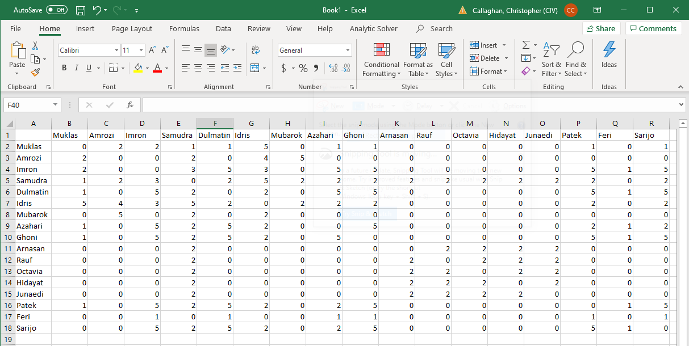
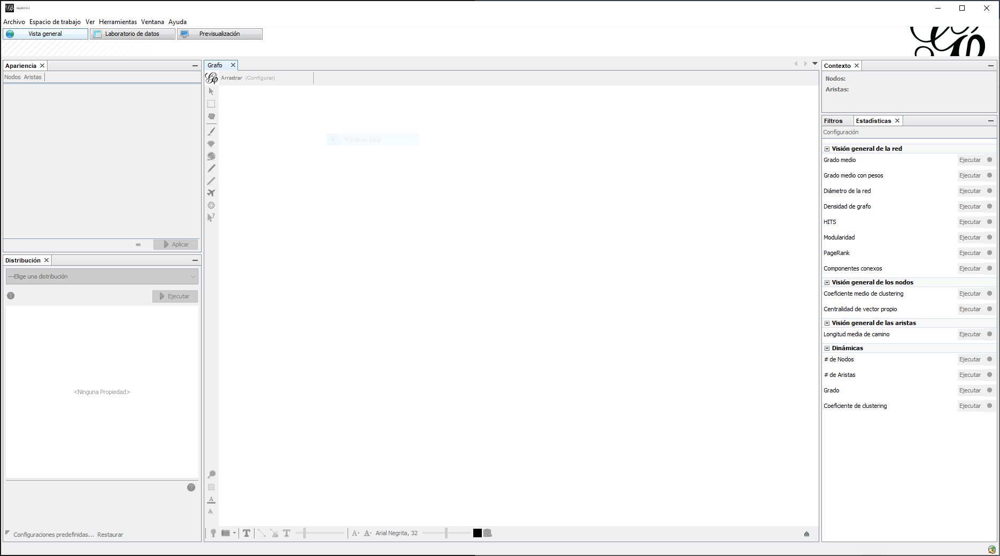
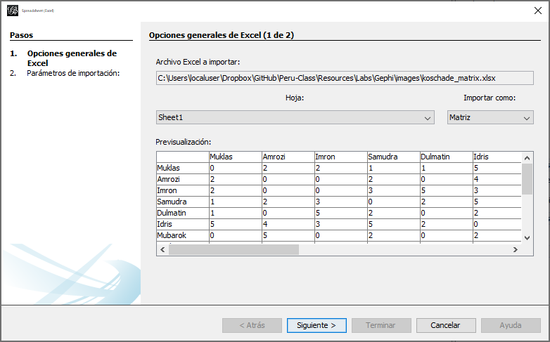
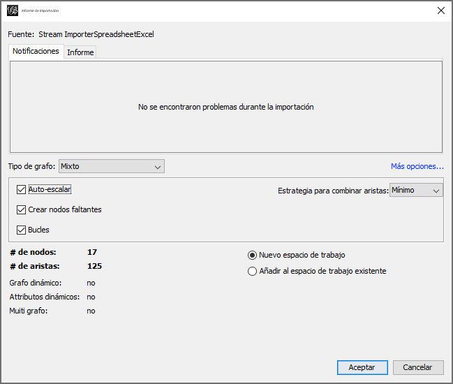
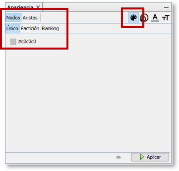
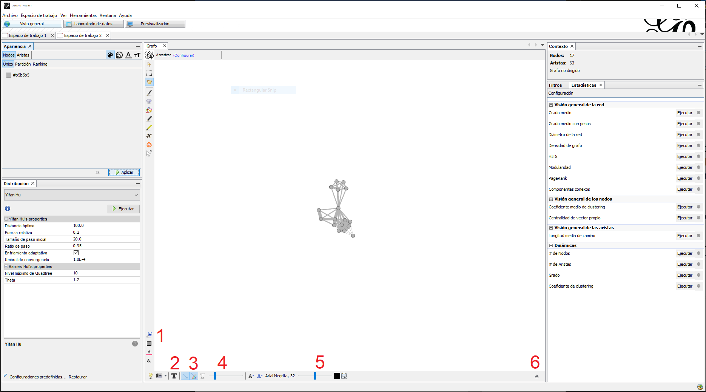
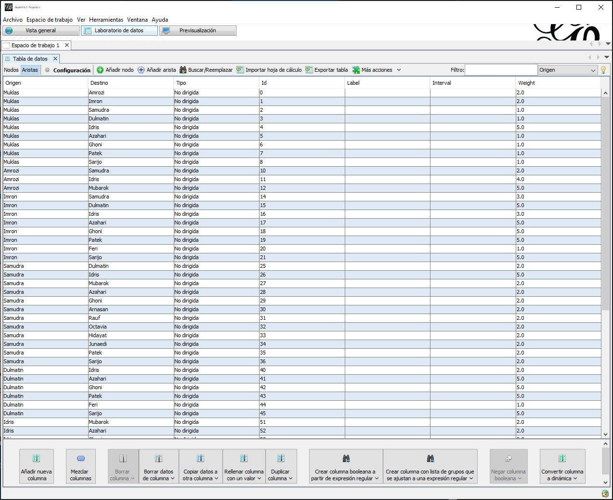
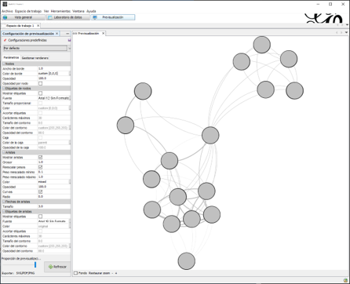
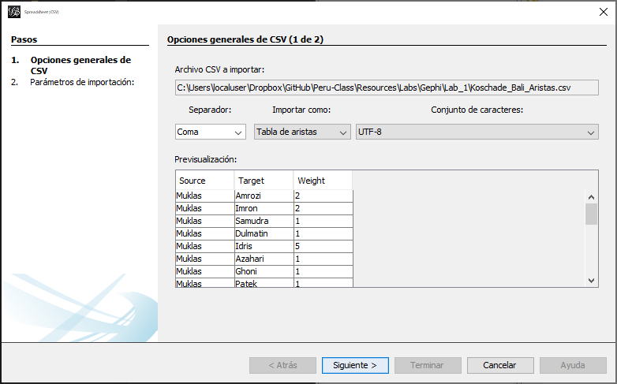
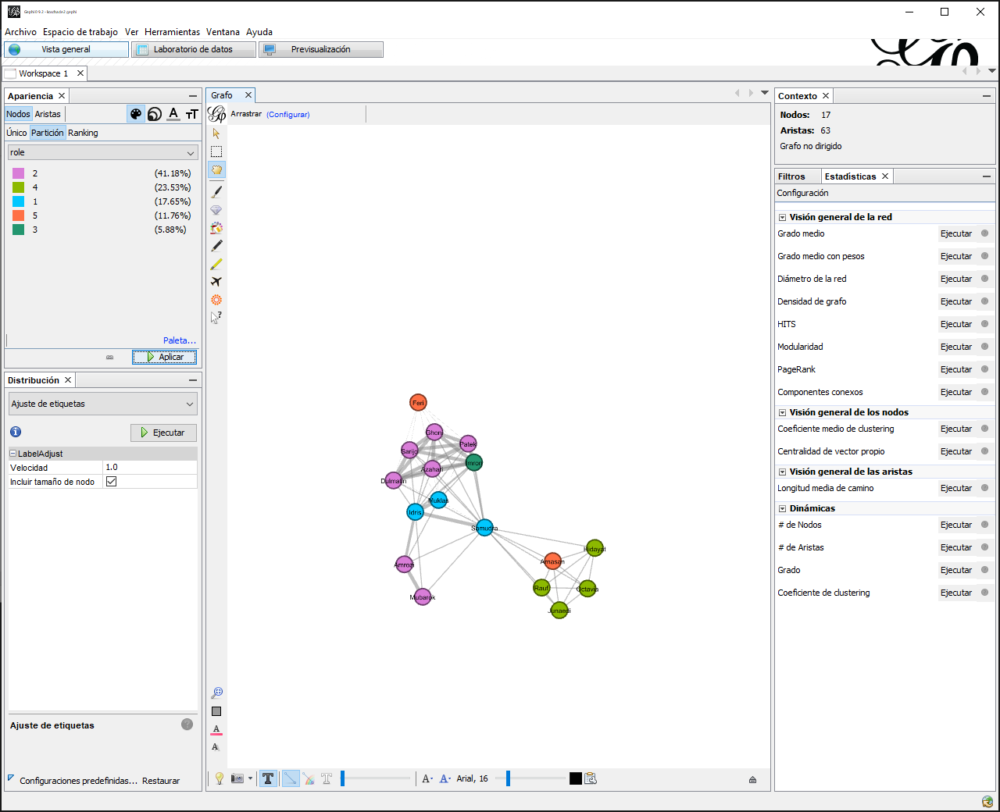

```{r setup, include=FALSE}
library(data.table)
library(DT)
```

# Grabación y Recopilación

Hasta este punto hemos descrito los datos de una red. Por lo que en esta sección, explicaremos cómo recopilar datos e importarlos a Gephi. Estas estrategias igualmente funcionaran con otras plataformas de software. Comenzaremos describiendo sociomatrices. Después, veremos otra manera de codificar relaciones como listas de aristas. Luego, exploramos cómo codificar características no relacionales en listas de nodos. Finalmente, tendrá la oportunidad de poner en práctica este conocimiento a través de un ejercicio práctico en Gephi.


## Matrices

### ¿Qué son?

Comenzamos con la recopilación de datos de red en una matriz. Como señala Hanneman, la forma más común de matriz en ARSo es una matriz cuadrada con número de filas y columnas como actores en nuestro conjunto de datos, en este modelo los valores en las celdas de la matriz registran información sobre los vínculos entre cada par de actores [@Hanneman2005]. Por ejemplo, la matriz \@ref(eq:2-3-simple-matrix) representa la forma más simple y común de codificar datos relacionales en forma de matriz binaria. En este caso, vemos un 1 si existe un vínculo, de lo contrario vemos un 0. 

$$
\begin{matrix}
  & A & B & C & D & E & F \\
A & - & 1 & 1 & 0 & 0 & 0 \\
B & 1 & - & 1 & 0 & 0 & 0 \\
C & 1 & 1 & - & 1 & 0 & 0 \\
D & 0 & 0 & 1 & - & 1 & 1 \\
E & 0 & 0 & 0 & 1 & - & 1 \\
F & 0 & 0 & 0 & 1 & 1 & - \\
(\#eq:2-3-simple-matrix)
\end{matrix}
$$

Como se ha de imaginar, las matrices no siempre son binarias. De hecho, es apropiado y común el recopilar datos de magnitud para un vínculo. Por ejemplo, se puede medir la fuerza de una relación a nivel ordinal o de intervalo. Igualmente, se pueden recaudar datos relacionales con números positivos y negativos, donde los números positivos corresponden a relaciones positivas, el cero es un punto medio neutral y las relaciones negativas tienen valores menores a cero. 

Recuerde que como habíamos visto previamente, los datos codificados en matrices pueden ser simétricos o asimétricos, dirigidos o no dirigidos. Por consiguiente, tradicionalmente es de buena educación ser explícito al mencionar el tipo de matriz que se esta trabajando; por ejemplo, “matriz simétrica binaria modo-uno” o “matriz asimétrica ponderada modo-uno”.

En esta sección, nos enfocamos en matrices de relaciones modo-uno por su simplicidad, pero cabe recalcar que las matrices pueden ser de relación modo-dos. La mayoría de los analistas de redes trabajan con relaciones de modo-uno, sin importar si estas han sido derivadas de una relación modo-dos. Es por ello que retornaremos a las matrices modo-dos cuando toquemos el tema de derivar relaciones modo-uno de modo-dos.

### ¿Por qué usarlas o no?

Las matrices tienen múltiples ventajas en ARSo. Primero, son simples de entender. Sin embargo, la razón clave por la cual se utilizan habitualmente es porque se pueden realizar cálculos matemáticos con estas para resumir la información de la red e ilustrar patrones relacionales [@Borgatti2018].

Al trabajar con múltiples matrices de datos modo-uno con las mismas dimensiones, podemos producir una tercera matriz con el mismo número de dimensiones utilizado el producto Hadamard (operación por elementos). Por ejemplo, tomemos dos matrices con el mismo número de dimensiones una representando amistades y la otra con vínculos de negocios. Con estas podemos producir una tercera relación con las mismas dimensiones la cual nombremos “amigos en negocios”, la ecuación \@ref(eq:2-3-mat-op1) ilustra esta operación de matrices por elemento.

$$
\begin{split}
\begin{matrix}
  & A & B & C \\
A & 0 & 1 & 0 \\
B & 1 & 0 & 1 \\
C & 0 & 1 & 0 \\
\end{matrix}
\enspace\circ\enspace
\begin{matrix}
  & A & B & C \\
A & 0 & 1 & 1 \\
B & 1 & 0 & 0 \\
C & 1 & 0 & 0 \\
\end{matrix}
\enspace &= \enspace
\begin{matrix}
  & A   & B   & C \\
A & 0x0 & 1x1 & 0x1 \\
B & 1x1 & 0x0 & 0x0 \\
C & 0x1 & 1x0 & 0x0 \\
\end{matrix} \\
\enspace &= \enspace
\begin{matrix}
  & A & B & C \\
A & 0 & 1 & 0 \\
B & 1 & 0 & 0 \\
C & 0 & 0 & 0 \\
\end{matrix}
\end{split}
(\#eq:2-3-mat-op1)
$$

Adicionalmente, podemos multiplicar matrices “conformables”; es decir, el número de filas en la primera matriz es igual a el número de columnas en la segunda. Las matrices cuadradas de modo-uno son conformables puesto que tienen el mismo numero de filas y columnas, por lo cual las podemos multiplicar [@Hanneman2005]. A diferencia de el producto Hadamard, en la multiplicación de matrices el orden de estas impacta los resultados. Supongamos que trabajamos con dos matrices de modo-uno ($A$ y $B$), si multiplico $AxB$ el producto no es equivalente a $BxA$ ($AxB \neq BxA$). La ecuación \@ref(eq:2-3-mat-op2) illustra el proceso de multiplicar matrices $AxB$. Empezamos con la parte superior izquierda de la primera matriz y multiplicamos cada valor en la primera fila por los valores de la primera columna de la segunda matriz. Los elementos de una fila de la primera matriz y de una columna de la segunda se multiplican y se suman para producir un solo producto.

$$
\begin{matrix}
  & A & B & C \\
A & 0 & 1 & 0 \\
B & 1 & 0 & 1 \\
C & 0 & 1 & 0 \\
\end{matrix}
\enspace \times \enspace
\begin{matrix}
  & A & B & C \\
A & 0 & 1 & 1 \\
B & 1 & 0 & 0 \\
C & 1 & 0 & 0 \\
\end{matrix}
\enspace = \enspace
\begin{matrix}
  & A & B & C \\
A & 1 & 0 & 0 \\
B & 1 & 1 & 1 \\
C & 1 & 0 & 0 \\
\end{matrix}
$$

$$
\begin{matrix}
  & A                 & B                 & C                 \\
A & (0x0)+(1x1)+(0x1) & (0x1)+(1x0)+(0x0) & (0x1)+(1x0)+(0x0) \\
B & (1x0)+(0x1)+(1x1) & (1x1)+(0x0)+(1x0) & (1x1)+(0x0)+(1x0) \\
C & (0x0)+(1x1)+(0x1) & (0x1)+(1x0)+(0x0) & (0x1)+(1x0)+(0x0) \\
\end{matrix}
(\#eq:2-3-mat-op2)
$$

El proceso de multiplicar $BxA$ es el mismo, pero los resultados son diferentes \@ref(eq:2-3-mat-op3). 

$$
\begin{matrix}
  & A & B & C \\
A & 0 & 1 & 1 \\
B & 1 & 0 & 0 \\
C & 1 & 0 & 0 \\
\end{matrix}
\enspace \times \enspace
\begin{matrix}
  & A & B & C \\
A & 0 & 1 & 0 \\
B & 1 & 0 & 1 \\
C & 0 & 1 & 0 \\
\end{matrix}
\enspace = \enspace
\begin{matrix}
  & A & B & C \\
A & 1 & 1 & 1 \\
B & 0 & 1 & 0 \\
C & 0 & 1 & 0 \\
\end{matrix}
$$

$$
\begin{matrix}
  & A                 & B                 & C                 \\
A & (0x0)+(1x1)+(1x0) & (0x1)+(1x0)+(1x1) & (0x0)+(1x1)+(1x0) \\
B & (1x0)+(0x1)+(0x0) & (1x1)+(0x0)+(0x1) & (1x0)+(0x1)+(0x0) \\
C & (1x0)+(0x1)+(0x0) & (1x1)+(0x0)+(0x1) & (1x0)+(0x1)+(0x0) \\
\end{matrix}
(\#eq:2-3-mat-op3)
$$

En términos prácticos, @Borgatti2018 presentan el siguiente ejemplo, $A$ es una matriz de adyacencia que representa la 'relación de amistad' y $B$ es la relación de 'jefe de'. Entonces si tengo una relación $AxB$ con un nodo, este es el jefe de al menos uno de mis amigos. En contraste, si tengo una relación de $BxA$ con un nodo, entonces este es amigo de mi jefe [@Borgatti2018]. Como puede ver, estas son relaciones muy diferentes producidas al multiplicar las mismas matrices.

Ya que hemos recalcado las ventajas de utilizar matrices, es esencial entender algunas de las desventajas clave:

  - Cada matriz representa un solo tipo de relación. Supongamos que el análisis requiere combinar relaciones familiares y financieras. Para esto, necesitariamos recopilar dos matrices individuales antes de manipularlas. Además, el formato de matriz no permite el agregar metadatos sobre las relaciones, por ejemplo: procedencia de un dato, fecha en que ha ocurrido, entre otros.
  - El mantener una o múltiples matrices requiere mantener todas las células. Por ejemplo, en una red de 100 nodos, el analista debe mantener 10,000 células (100 x 100) aun cuando la mayoría de estas estén vacías (sin relación).
  - Esta estructura no es la manera más eficiente de guardar datos en una computadora. Específicamente, cada 0 que representa la ausencia de una relación tiene un costo en forma de memoria.

Como puede ver, las matrices (como todas las estructuras de recopilación de datos) tienen ventajas y desventajas. El álgebra de matrices es la base de la mayoría de los algoritmos utilizados por analistas de redes, por consiguiente, es esencial entender estas estructuras. Sin embargo, las desventajas mencionadas previamente son la razón por la cual los analistas de redes tienen a mantener sus datos relacionales en otros formatos más eficientes y permisibles. En la siguiente sección cubriremos uno de estos formatos llamado lista de aristas.

## Lista de Aristas

### ¿Qué son?

Son una de las estructuras más económicas en la recopilación de datos. Las listas de aristas solo consideran los vínculos existentes y excluyen lo demás. Por ejemplo, la matriz \@ref(eq:2-3-mat) puede ser colapsada como lista de aristas \@ref(eq:2-3-el).

:::{.row}
::: {.lcolumn-50 data-latex="{0.48\\textwidth}"}
$$
\begin{matrix}
  & A & B & C & D & E & F \\
A & - & 1 & 1 & 0 & 0 & 0 \\
B & 1 & - & 1 & 0 & 0 & 0 \\
C & 1 & 1 & - & 1 & 0 & 0 \\
D & 0 & 0 & 1 & - & 1 & 1 \\
E & 0 & 0 & 0 & 1 & - & 1 \\
F & 0 & 0 & 0 & 1 & 1 & - \\
\end{matrix}
(\#eq:2-3-mat)
$$
:::

:::{.col data-latex="{0.04\\textwidth}"}
\ <!-- an empty Div (with a white space), serving as
a column separator for tex -->
:::

::: {.rcolumn-50 data-latex="{0.48\\textwidth}"}
$$
\begin{matrix}
Origen & Destino \\
A      & B       \\
A      & C       \\
B      & A       \\
B      & C       \\
C      & A       \\
C      & B       \\
C      & D       \\
D      & C       \\
D      & E       \\
D      & F       \\
E      & D       \\
E      & F       \\
F      & D       \\
F      & E      \\
\end{matrix}
(\#eq:2-3-el)
$$
:::
:::

\newline

Esencialmente, una lista de aristas es un rectángulo con un mínimo de dos columnas, cada fila representa una combinación de nodos vinculados. @Cunningham2016 mencionan que aunque las listas de aristas pueden ser dirigidas o no dirigidas, es decir, contienen arcos o bordes, las columnas denotan un actor que “envía” el enlace y otro que “recibe” el enlace. En Gephi, el software denota estas posiciones con nombres obligatorios; es decir, que en términos de Gephi, la columna de “envía” siempre aparecerá nombrada “Origen” (o “Source” en Inglés). Similarmente, la columna “recibe” siempre aparecerá como “Destino” (o “Target” en Inglés). 

Tradicionalmente, los analistas de ARSo tienden a mantener sus listas de aristas en software como Microsoft Excel. Sin embargo, es posible integrar tablas de bases de datos (por ejemplo, SQL) como precursores. 

### ¿Por qué usarlas o no?

Las listas de aristas son comúnmente utilizadas por su simplicidad, eficiencia y versatilidad. Son eficientes pues no incluyen espacios vacíos para vínculos faltantes. Asimismo, el mantenerlas es simple pues cada fila representa una relación. Adicionalmente son versátiles pues proveen flexibilidad en el número y tipo de características de un vínculo que se pueden incluir. Como se ha mencionado previamente, el formato básico de una lista de aristas incluye dos columnas, sin embargo, no hay límite a la cantidad de variables que podemos agregar para describir cada vínculo, por ejemplo: dirigido/no dirigido, fecha, intensidad, tipo, peso, fuente de procedencia, etc.

Las Tablas \@ref(tab:2-3-el1), \@ref(tab:2-3-el2) y \@ref(tab:2-3-el3) son ejemplos de listas de aristas. La primera lista de aristas, Tabla \@ref(tab:2-3-el1), contiene los elementos mínimos requeridos; es decir, dos columnas nombradas que representan los dos vértices conectados por un vínculo relacional. Cada fila representa una relación, sin embargo, no hay manera de diferenciar si estas relaciones son dirigidas/no dirigidas o si ambos vínculos representan el mismo tipo de relaciones (por ejemplo, familiares, financieras, románticas, etc.). Es por ello que la segunda lista, Tabla \@ref(tab:2-3-el2), expande sobre la primera al agregar un par de variables. En este ejemplo, las nuevas columnas permiten diferenciar el tipo de relación e incluso agregan información temporal y pesos a cada enlace. La última lista, Tabla \@ref(tab:2-3-el3), continúa expandiendo la lista de aristas previa ya que  presenta relaciones multimodo. Es decir, algunas relaciones son modo-uno, mientras que otras son modo-dos. 

```{r 2-3-el1}
data.frame("Origen"   = c("A", "B"),
           "Destino"  = c("B", "C")) %>%
  knitr::kable(booktabs = TRUE, caption = "Lista de Aristas Básica")
```


```{r 2-3-el2, fig.align='center'}
data.frame(
  "Origen"   = c("A", "B"),
  "Destino"  = c("B", "C"),
  "Relación" = c("Comunicación",
                 "Financiera"),
  "Tipo"     = c("No dirigido",
                 "Dirigido"),
  "Fecha"    = c("2020-11-03",
                 "2020-11-03"),
  "Peso"     = c(5, 10)) %>%
  knitr::kable(booktabs = TRUE, caption = "Lista de Aristas Expandida")
```


```{r 2-3-el3, fig.align='center'}
data.frame(
  "Origen"   = c("A", "B", "A"),
  "Destino"  = c("B", "C", 1),
  "Relación" = c("Comunicación",
                 "Financiera",
                 "Afiliación"),
  "Tipo"     = c("No dirigido",
                 "Dirigido",
                 "No dirigido"),
  "Fecha"    = c("2020-11-03",
                 "2020-11-03",
                 "2020-11-03"),
  "Peso"     = c(5, 10, 7)) %>%
  knitr::kable(booktabs = TRUE, caption = "Lista de Aristas Expandida y Multimodo")
```

## Lista de Nodos

La lista de nodos, a diferencia de la lista de aristas, contiene los datos no relacionales de cada nodo en un sociograma. Por consiguiente, ambas listas sean mantenidas de manera independiente. 

Es decir, en una lista de aristas es probable que un nodo aparezca de manera repetida, puesto que es común que cada actor en una red este atado a múltiples otros. En contraste, en una lista de nodos es recomendable el tener a un solo registro por actor. Por ejemplo, en la lista de aristas \@ref(eq:2-3-el4) vemos cuatro nodos {A, B, C, D} conectados por tres diferentes tipos de relaciones. La lista de nodos correspondiente \@ref(eq:2-3-nl1) incluye información de estos nodos como género y edad, estas son características no relacionales de aquellos nodos en la red. Aunque podemos repetir el registro de cada actor, no es necesario normalmente el software solo toma en cuenta un registro, normalmente el último en la lista. 

::: {.row}
::: {.lcolumn-50 data-latex="{0.48\\textwidth}"}
$$
\begin{matrix}
Origen & Destino & Relación \\
A      & B       & Amistad  \\
A      & C       & Familia  \\
A      & D       & Finanzas \\
\end{matrix}
(\#eq:2-3-el4)
$$
:::

:::{.col data-latex="{0.04\\textwidth}"}
\ <!-- an empty Div (with a white space), serving as
a column separator for tex -->
:::

::: {.rcolumn-50 data-latex="{0.48\\textwidth}"}
$$
\begin{matrix}
Id & Género    & Edad \\
A  & Masculino & 20 \\
B  & Femenino  & 20 \\
C  & Femenino  & 20 \\
D  & Masculino & 29 \\
\end{matrix}
(\#eq:2-3-nl1)
$$
:::
:::

\newline

Por su parte, Gephi es capaz de ingerir listas de nodos. Para ello, requiere que esta tabla contenga el nombre de columna `Id`. Esta variable representa la columna que el software tomará en cuenta como fuente de identificadores únicos para los nodos en una red. Por ejemplo, en la lista de nodos \@ref(eq:2-3-nl1) vemos entradas correspondientes a los identificadores de cada nodo en la lista de aristas.


## Ejercicio Práctico

Este ejercicio tiene dos propósitos: 

  1. Proporcionarle práctica en recopilar datos
  2. Importar y manipular datos de modo-uno a Gephi
  
Las redes de modo-uno consistende un conjunto único de actores, estos pueden ser personas, grupos, organizaciones, corporaciones, naciones, etc. Los lazos entre estos pueden ser lazos de amistad o parentesco, transacciones materiales (por ejemplo, transacciones comerciales), redes de comunicación (por ejemplo, élenvió o la recepción de mensajes), etc. En este laboratorio, utilizaremos los datos recopilados por Stuart Koschade de la célula terrorista Jemaah Islamiyah (JI) responsable del atentado terrorista en Bali del 2002. Todos los datos requeridos en este ejercicio deberán ser primero generados por el usuario y luego descargados.

El segundo propósito de esta actividad es presentarle algunas de las funciones de la plataforma Gephi. Específicamente, nos centraremos en visualizar redes. Estos gráficos son importantes porque pueden ayudarnos a rastrear y detectar patrones de relaciones en una red social determinada. Sin embargo, puesto que el ojo humano puede ser engañado fácilmente, los analistas de redes sociales confían en algoritmos de dibujo de gráficos que colocan sistemáticamente a los actores en el “espacio social”. 

### Preparar y Visualizar Redes de Modo-Uno en Gephi

Localice el artículo de Stuart Koschade, [aquí](https://www.tandfonline.com/doi/full/10.1080/10576100600798418). La única versión disponible es en inglés, por consiguiente, no es requerido que lea el texto. Utilizando Excel (u otro programa con hojas de cálculo) registre los datos de redes sociales que figuran en la Tabla 2 en el artículo de Koschade. Su matriz debe ser similar a la Figura \@ref(fig:2-3-koschade) a continuación. 

```{r 2-3-koschade, out.width="100%",  fig.cap = "Hoja de cálculo de Excel que muestra la matriz de datos en Koschade"}

```

:::{.row}
:::{.lcolumn-20 data-latex="{0.18\\textwidth}"}
*[Vista general] > Nuevo Projecto*
:::

:::{.col data-latex="{0.04\\textwidth}"}
\ <!-- an empty Div (with a white space), serving as
a column separator for tex -->
:::

:::{.rcolumn-80 data-latex="{0.78\\textwidth}"}
  1. Abra Gephi y seleccione la opción *Nuevo proyecto* en la pantalla de “Bienvenido a Gephi”. Asegúrese de estar en la ventana “Vista general” en la esquina superior izquierda de la interfaz. Una vez allí, su interfaz deberá parecerse a la Figura \@ref(fig:2-3-gv). 
:::
:::

```{r 2-3-gv, out.width="100%", fig.cap = "Ventana 'Vista general' en Gephi"}

```

:::{.row}
:::{.lcolumn-20 data-latex="{0.18\\textwidth}"}
*Archivo > Abrir…*
:::

:::{.col data-latex="{0.04\\textwidth}"}
\ <!-- an empty Div (with a white space), serving as
a column separator for tex -->
:::

:::{.rcolumn-80 data-latex="{0.78\\textwidth}"}
  2. Primero debemos importar los datos de recopilados en el primer paso a Gephi. Para hacer esto, use el comando *Archivo > Abrir…*. Esto abrirá un cuadro de diálogo (no mostrado) desde el cual puede ubicar y seleccionar el archivo de Excel que creo anteriormente. Una vez que haya hecho esto, haga clic en *Abrir* y aparecerá un nuevo cuadro de diálogo, similar a la Figura \@ref(fig:2-3-import). Tenga en cuenta que, en la esquina superior derecha, tiene la opción de importa la hoja de cálculo en varios formatos. Como registramos los datos en matriz, utilizaremos la opción *Matriz*. Haga clic en *Siguiente*, en el siguiente cuadro de díalogo, haga clic en *Terminar* (puesto que no tenemos información de tiempo asociada con estos datos).
:::
:::
  
```{r 2-3-import, fig.cap = "Ventana de Importación en Gephi"}

```

:::{.row}
:::{.lcolumn-20 data-latex="{0.18\\textwidth}"}
*Tipo de grafo > No dirigido*
 
*Mas opciones… > Estrategias para combinar aristas>Mínimo*
:::

:::{.col data-latex="{0.04\\textwidth}"}
\ <!-- an empty Div (with a white space), serving as
a column separator for tex -->
:::

:::{.rcolumn-80 data-latex="{0.78\\textwidth}"}
  3. Gephi produce un *Informe de importación* (ver Figura \@ref(fig:2-3-import-report)), que proporciona varios tipos de información, por ejemplo, si ocurrió algún error durante la importación, numero de nodos (actores) en la red, la cantidad de bordes (aristas), etc. Ahora, necesitamos decirle a Gephi que esta es una red no dirigida utilizando el menú desplegable *Tipo de grafico* (el tipo predeterminado es *Mixto*). A continuación, haga clic en el enlace *Mas opciones…*, y luego en el menú desplegable *Estrategia para combinar aristas* seleccione *Mínimo*. Este último paso asegura que los pesos de los bordes no se dupliquen. Ahora, haga clic en *Aceptar*.
:::
:::
  
```{r 2-3-import-report, fig.cap = "Reporte de Importación Gephi"}

```

:::{.row}
:::{.lcolumn-20 data-latex="{0.18\\textwidth}"}
*Apariencia > Nodos > Único*
:::

:::{.col data-latex="{0.04\\textwidth}"}
\ <!-- an empty Div (with a white space), serving as
a column separator for tex -->
:::

:::{.rcolumn-80 data-latex="{0.78\\textwidth}"}
  4. Su red ahora deberá aparecer en pantalla, pero es probable que los nodos aparezcan de manera desordenada. Comencemos cambiando el color de los nodos. En la esquina superior izquierda de la interfaz vera un pestana *Apariencia* (consulte la Figura \@ref(fig:2-3-apariencia)). Allí, seleccione la pestaña *Nodos* y el ícono de paleta de color (que es el ícono más a la izquierda). Debajo de la pestaña *Nodos* verá un rango de opciones, si no está seleccionada la pestaña *Único*, haga clic en esta. Debajo de esta opción, note un cuadro gris (a la izquierda de `#c0c0c0`); de clic y manténgalo presionado para seleccionar un nuevo color, luego seleccione *Aplicar*. 
:::
:::

```{r 2-3-apariencia, out.width="50%", fig.cap = "Pestaña de Apariencia "}

```


:::{.row}
:::{.lcolumn-20 data-latex="{0.18\\textwidth}"}
*Distribuicion  >Fruchterman Reingold, Force Atlas, Expansion, Yifan Hu*
:::

:::{.col data-latex="{0.04\\textwidth}"}
\ <!-- an empty Div (with a white space), serving as
a column separator for tex -->
:::

:::{.rcolumn-80 data-latex="{0.78\\textwidth}"}
  5. Justo debajo de la pestaña *Apariencia* encontraraá otra de nombre *Distribución* (consulte la Figura \@ref(fig:2-3-diseno)). Gephi ofrece varias opciones de distribución de nodos, spara más información sobre estas consulte la página de tutoriales de [Gephi](https://gephi.org/users/tutorial-layouts/).  En esta actividad solo exploraremos algunas de estas estrategias de distribución. Utilizando el menú desplegable, primero seleccione el algoritmo de nombre *Fruchterman Reigold* y haga clic en el botón *Ejecutar*. Dependiendo de la red, es posible que este algoritmo no sea el adecuado. Pruebe otros, por ejemplo *Force Atlas*. Al principio parecerá que los nodos han colapsado unos sobre otros, pero esto es engañoso. Para ver porque, elija la opción *Expansion* y haga clic repetidamente en el botón *Ejecutar* hasta que el gráfico sea los suficientemente grande para poder distinguir las conexiones entre nodos. Finalmente. Pruebe el algoritmo *Yifan Hu*, el cual, al menos con la red de Koschade, produce el gráfico más adecuado. Es decir, los subgrupos son fáciles de detectar y los nodos no se encuentran apilados unos sobre los otros. 
:::
:::

```{r 2-3-diseno, out.width="50%", fig.cap = "Pestaña de Diseño"}
knitr::include_graphics("images/02-Fig_6_Layout.png")
```

:::{.row}
:::{.lcolumn-20 data-latex="{0.18\\textwidth}"}
*Grafo*
:::

:::{.col data-latex="{0.04\\textwidth}"}
\ <!-- an empty Div (with a white space), serving as
a column separator for tex -->
:::

:::{.rcolumn-80 data-latex="{0.78\\textwidth}"}
  6. Estas manipulaciones deben crear un gráfico similar a la Figura \@ref(fig:2-3-botones) (similar pues usted ha elegido el color de los nodos). Ahora, note lo diferentes botones al costado de la ventana del *Grafo* (ver Figura \@ref(fig:2-3-botones)), estos nos permiten hacer algunos ajustes rápidos al grafo. Por ejemplo, el botón 1 centra el gráfico, el 2 activa y desactiva las etiquetas, o puede controlar el tamaño de las etiquetas con la barra deslizante demarcada con el número 5. El botón 3 alterna el color de los nodos. Por último, note la flecha pequeña en la esquina inferior derecha (número 6), en el siguiente paso y otros laboratorios utilizaremos esta opción.
:::
:::  
  
```{r 2-3-botones, fig.cap = "Botones en Gephi"}

```

:::{.row}
:::{.lcolumn-20 data-latex="{0.18\\textwidth}"}
\ <!-- an empty Div (with a white space), serving as
a column separator for tex -->
:::

:::{.col data-latex="{0.04\\textwidth}"}
\ <!-- an empty Div (with a white space), serving as
a column separator for tex -->
:::

:::{.rcolumn-80 data-latex="{0.78\\textwidth}"}
  7.	Al darle clic a la pequeña flecha (número 6 en la Figura \@ref(fig:2-3-botones)), se debe levantar un panel con controles adicionales para manipular la red. El menú que debe es el de controles *Globales* (Figura \@ref(fig:2-3-globales)). En este, quizás el control más útil es la barra deslizante de zoom (etiqueta 2), que controla el tamaño del gráfico. En la imagen de abajo he aumentado el tamaño de la red y he centrado la imagen presionando el botón derecho del ratón y arrastrando el gráfico hacia el centro de la ventana. Además de modificar la dimensión del gráfico, puede cambiar el fondo dando clic en el cuadro en la esquina inferior izquierda (etiqueta 1).
:::
:::  

```{r 2-3-globales, fig.cap = "Pestaña de Controles Globales en Gephi"}
knitr::include_graphics("images/01-botones_gephi2.png")
```

```{r 2-3-globales2, fig.cap = "Pestaña de Control de Aristas"}
knitr::include_graphics("images/01-botones_gephi3.png")
```

:::{.row}
:::{.lcolumn-20 data-latex="{0.18\\textwidth}"}
\ <!-- an empty Div (with a white space), serving as
a column separator for tex -->
:::

:::{.col data-latex="{0.04\\textwidth}"}
\ <!-- an empty Div (with a white space), serving as
a column separator for tex -->
:::

:::{.rcolumn-80 data-latex="{0.78\\textwidth}"}
  8.	En la Figura \@ref(fig:2-3-globales2) he seleccionado el panel de control de aristas, proceda haciendo lo mismo. Ahora, cambie el color de las aristas a gris (vea etiqueta 1 en la Figura \@ref(fig:2-3-globales2)) y use la barra deslizante (etiqueta 2) para reducir el ancho de cada línea. . Finalmente, seleccione la pestaña de etiquetas en el panel de control. Aquí, haga clic en el cuadro a un lado de *Nodos* (etiqueta 1 en la Figura \@ref(fig:2-3-globales3)) para activar las etiquetas de los nodos en el gráfico. Como verá estas serán inicialmente un poco grandes. Para ajustar estas cambie el tamaño estas utilizando la barra deslizante (etiqueta 3 en Figura \@ref(fig:2-3-globales3)). En Gephi siempre hay un par de maneras de hacer lo mismo. Por ejemplo, si selecciona el botón a un lado de “Fuentes” (etiqueta 2) note que puede cambiar múltiples propiedades de las etiquetas de cada nodo. El análisis de redes depende de gráficos claros y concisos. Tómese un par de minutos para modificar estas etiquetas a su gusto y cuando termine cierre el panel dando clic a la flecha (etiqueta 4) a mano derecha (ahora apuntando hacia abajo). 
:::
:::

```{r 2-3-globales3, fig.cap = "Panel de Control de Etiquetas en Gephi"}
knitr::include_graphics("images/01-botones_gephi4.png")
```


:::{.row}
:::{.lcolumn-20 data-latex="{0.18\\textwidth}"}
\ <!-- an empty Div (with a white space), serving as
a column separator for tex -->
:::

:::{.col data-latex="{0.04\\textwidth}"}
\ <!-- an empty Div (with a white space), serving as
a column separator for tex -->
:::

:::{.rcolumn-80 data-latex="{0.78\\textwidth}"}
  9. Terminemos de editar el gráfico. Para esto, seleccione la pestaña de *Distribución* y seleccione la opción *Ajuste de etiquetas* y haga clic en *Ejecutar*. Este algoritmo de diseño moverá los nodos ligeramente para que las etiquetas no se superpongan. Ahora, seleccione la opción *Noverlap*, y nuevamente de clic en *Ejecutar*. Verá que nuevamente los nodos deberán moverse, creando una distancia entre ellos para que sean más fáciles de discernir. Ahora, observe el grafo. **¿Surge patrones? ¿Hay algún grupo distinto? Si es así, ¿alguna persona actúa como intermediario entre los distintos grupos? ¿Alguno de los individuos parece estas más aislado socialmente que otros? ¿Cómo se comparan los dibujos con la Figura 1 en el artículo de Koschade?**
:::
:::
 
\newline 
 
:::{.row}
:::{.lcolumn-20 data-latex="{0.18\\textwidth}"}
\ <!-- an empty Div (with a white space), serving as
a column separator for tex -->
:::

:::{.col data-latex="{0.04\\textwidth}"}
\ <!-- an empty Div (with a white space), serving as
a column separator for tex -->
:::

:::{.rcolumn-80 data-latex="{0.78\\textwidth}"}
  10.	Ahora, desplace el cursor sobre uno de los nodos, al hacer esto Gephi debe resaltar un nodo a la vez y los enlaces a otros nodos. En la Figura \@ref(fig:2-3-ego), presentamos el nodo de Patek resaltado, este tiene vínculos con varias personas dentro de su propia esfera de influencia, además algunos de estos nodos vecinos están conectados entre ellos. Sin embargo, note que los vecinos de Patek no están enlazados con Samudra. Utilizando esta herramienta (resaltar nodos) en su propio gráfico, **¿saltan patrones que no haya notado antes?** Finalmente, tome una captura de pantalla de su grafico dando clic en el icono de la cámara en la esquina inferior de la ventanilla del gráfico.
:::
:::

```{r 2-3-ego, out.width="75%", fig.cap = "Red con Patek Resaltado"}
knitr::include_graphics("images/02-Fig_10_Patek_Ego.png")
```

:::{.row}
:::{.lcolumn-20 data-latex="{0.18\\textwidth}"}
*[Laboratorio de datos]*

*Tabla de datos > Nodos*
:::

:::{.col data-latex="{0.04\\textwidth}"}
\ <!-- an empty Div (with a white space), serving as
a column separator for tex -->
:::

:::{.rcolumn-80 data-latex="{0.78\\textwidth}"}
  11.	Echemos un vistazo a los datos de la red. Para esto, seleccione el botón *Laboratorio de datos*. Notará que en la esquina superior izquierda hay una pestaña *Tabla de datos* con dos subpestañas , *Nodos* y *Aristas*. Haga clic primero en la pestaña *Nodos* y deberá ver una lista de los identificadores (`Id`) y etiquetas de los nodos (actores) en la red.
:::
:::

```{r 2-3-edges-table, out.width="75%", fig.cap = "Lista de Aristas en la Table de Datos"}

```


:::{.row}
:::{.lcolumn-20 data-latex="{0.18\\textwidth}"}
*[Laboratorio de datos]*

*Tabla de datos > Aristas*
:::

:::{.col data-latex="{0.04\\textwidth}"}
\ <!-- an empty Div (with a white space), serving as
a column separator for tex -->
:::

:::{.rcolumn-80 data-latex="{0.78\\textwidth}"}
  12.	Ahora, haga clic en la pestaña *Aristas* y obtendrá una lista de todos los vínculos entre todos los actores (Figura \@ref(fig:2-3-edges-table)). Tenga en cuenta que esta información no se presenta en formato de matriz. En cambio, este formato llamaremos lista de bordes o lista de aristas. Estas enumeran un nodo de `Origen` (actor) y un nodo de `Destino` (actor), independientemente de si el enlace es dirigido o no. 
:::
:::

### Guardar Gráfico de Red en Gephi

:::{.row}
:::{.lcolumn-20 data-latex="{0.18\\textwidth}"}
*[Previsualización]*
:::

:::{.col data-latex="{0.04\\textwidth}"}
\ <!-- an empty Div (with a white space), serving as
a column separator for tex -->
:::

:::{.rcolumn-80 data-latex="{0.78\\textwidth}"}
  1. Ahora, veamos como guardar nuestro gráfico de red. Para esto haga clic en el botón *Previsualización* para cambiar de espacio en Gephi. Al principio aparecerá una ventana vacía, así que haga clic en el botón *Refrescar* en la parte inferior de la ventana. Esto resultará en un gráfico de red similar a la Figura \@ref(fig:2-3-preview).
:::
:::

```{r 2-3-preview, out.width="75%", fig.cap = "Ventana de Previsualización"}

```

:::{.row}
:::{.lcolumn-20 data-latex="{0.18\\textwidth}"}
*Etiquetas de nodos > Mostrar etiquetas, Tamaño proporcional, Fuente*
:::

:::{.col data-latex="{0.04\\textwidth}"}
\ <!-- an empty Div (with a white space), serving as
a column separator for tex -->
:::

:::{.rcolumn-80 data-latex="{0.78\\textwidth}"}
  2. Definitivamente debemos hacer algunos ajustes en el panel izquierdo de la ventana. Comencemos seleccionando primero la opción *Mostrar etiquetas* y deseleccionar la opción *Tamaño proporcional* (esta reducirá el tamaño de las etiquetas) en la subsección *Etiquetas de nodo*. Una vez más haga clic en *Refrescar* para ver el efecto de los cambios. Si cree que las etiquetas siguen siendo demasiado grandes, haga clic en la opción *Fuente* (en la misma subsección) y podrá reducir el tamaño de la fuente. Nuevamente, deberá hacer clic en *Refrescar* para ver el efecto de los cambios.  
:::
:::

\newline 

:::{.row}
:::{.lcolumn-20 data-latex="{0.18\\textwidth}"}
*Aristas > Mostrar aristas, Reescalar pesos*
:::

:::{.col data-latex="{0.04\\textwidth}"}
\ <!-- an empty Div (with a white space), serving as
a column separator for tex -->
:::

:::{.rcolumn-80 data-latex="{0.78\\textwidth}"}
  3. Ahora cambiemos las propiedades de las aristas. Haga clic en la opción *Mostrar aristas* (si no está autoseleccionada) en la subsección de *Aristas*. Además, seleccione la opción *Reescalar pesos*, esto reducirá el grosor de los enlaces. Tenga en cuenta que justo debajo de la opción *Reescalar pesos* se encuentran los valores predeterminados para la escalación de pesos. Si desea, puede modificar estos valores para el mínimo sea 0.2 y el máximo 2.0. Una vez más, seleccione *Refrescar*.
:::
:::

\newline 

:::{.row}
:::{.lcolumn-20 data-latex="{0.18\\textwidth}"}
*Aristas > Color*
:::

:::{.col data-latex="{0.04\\textwidth}"}
\ <!-- an empty Div (with a white space), serving as
a column separator for tex -->
:::

:::{.rcolumn-80 data-latex="{0.78\\textwidth}"}
  4.	Por último, haga clic en el cuadro de opción de *Color* en la subsección de *Aristas*. Esto abrirá un cuadro de diálogo que permite elegir el color de los bordes. Elija la opción de color *Especifico* que abrirá una paleta de colores de la cual usted puede elegir su propio color al gusto. Una vez que haya seleccionado un color, no olvide darle clic a *Refrescar*. 
:::
:::

```{r 2-3-preview2, out.width="75%", fig.cap = "Ventana de Previsualización con Ajustes"}
knitr::include_graphics("images/02-Fig-13_preview.png")
```

:::{.row}
:::{.lcolumn-20 data-latex="{0.18\\textwidth}"}
*Archivo > Guardar como*
:::

:::{.col data-latex="{0.04\\textwidth}"}
\ <!-- an empty Div (with a white space), serving as
a column separator for tex -->
:::

:::{.rcolumn-80 data-latex="{0.78\\textwidth}"}
  5. Ahora, guardemos nuestro gráfico. Gephi ofrece tres opciones de formato: SVG, PDF, y PNG. En la ventana de *Previsualización* de clic en el botón *SVG/PDF/PNG* a un lado de la etiqueta *Exportar* en la parte inferior izquierda de la ventana. Por ahora, exporte su grafico en `PNG`. Para hacer esto, elija *Archivos PNG (.png)* en el menú desplegable. Adicionalmente, haga clic en el botón de “Opciones” en la parte inferior derecha. Esta opción abre otro cuadro de diálogo que permite aumentar el número de pixeles y la calidad de la imagen en el archivo producido. Seleccione *OK* sin cambiar las dimensiones de la imagen, cambie el nombre el archivo a producir, y guárdelo en su escritorio. Antes de pasar al siguiente paso guarde su trabajo con el comando *Archivo > Guardar como*.
:::
:::

### Importación de Listas de Aristas Modo-Uno

:::{.row}
:::{.lcolumn-20 data-latex="{0.18\\textwidth}"}
*[Vista General]*

*Archivo > Abrir*
:::

:::{.col data-latex="{0.04\\textwidth}"}
\ <!-- an empty Div (with a white space), serving as
a column separator for tex -->
:::

:::{.rcolumn-80 data-latex="{0.78\\textwidth}"}
  1. Ahora, veamos como importar una lista de aristas. Hemos preparado una para este ejercicio, [descárgue `koschade_bali_edges.csv` desde aquí](https://raw.githubusercontent.com/cjcallag/arso/main/data/recording_data/koschade_bali_edges.csv). Ábrala en Excel y examínela. Para importar vamos a repetir algunos pasos anteriores, use el comando *Archivo > Abrir* para abrir un cuadro de dialogo desde el cual puede importar el archivo de csv. Haga clic en *Abrir* y aparecerá un nuevo cuadro de diálogo, similar a la Figura \@ref(fig:2-3-importacion). Tenga en cuenta que, una vez más, tenemos la opción de importar varias estructuras de datos, pero Gephi ha auto detectado que el archivo es una lista de aristas, de clic en *Siguiente*. En la siguiente venta, Gephi ofrece opciones para indicar que tipo de datos se incluirán, por ejemplo, la columna `Peso`. Ya que los valores predeterminados son adecuados, haga clic en *Finalizar*.
:::
:::
  
```{r 2-3-importacion, fig.cap = "Cuadro de Diálogo de Importación"}

``` 

:::{.row}
:::{.lcolumn-20 data-latex="{0.18\\textwidth}"}
*[Laboratorio de datos]*

*Tabla de datos > Nodos*
:::

:::{.col data-latex="{0.04\\textwidth}"}
\ <!-- an empty Div (with a white space), serving as
a column separator for tex -->
:::

:::{.rcolumn-80 data-latex="{0.78\\textwidth}"}
  2.	Ahora, deberá ver un cuadro de informe de importación de Gephi. Dígale a Gephi que la red no es dirigida, seleccione la estrategia *Mínima* de combinación de aristas y haga clic en *Aceptar*. Ahora que hemos terminado de importar, cambie la ventana a *Laboratorio de datos* y haga clic en *Tabla de datos > Nodos*. Tenga en cuenta que no hasta ahora no hay etiquetas adjuntas a los nodos, solo identificadores (`Id`). 
:::
:::

\newline 

:::{.row}
:::{.lcolumn-20 data-latex="{0.18\\textwidth}"}
*Copiar dataos a otra columna > Id*

*Label > Ok*
:::

:::{.col data-latex="{0.04\\textwidth}"}
\ <!-- an empty Div (with a white space), serving as
a column separator for tex -->
:::

:::{.rcolumn-80 data-latex="{0.78\\textwidth}"}
  3.	Para agregar etiquetas a estos nodos vamos a copiar los identificadores de cada nodo a la columna de etiquetas (`Label`). Seleccione la función *Copiar datos a otra columna* (botón ubicado en la parte inferior de la ventana) y seleccione `Id`. En el cuadro de diálogo que aparecerá, seleccione `Label` y haga clic en *Ok*. 
:::
:::

\newline 

:::{.row}
:::{.lcolumn-20 data-latex="{0.18\\textwidth}"}
*[Vista general]*

*Archivo > Abrir*
:::

:::{.col data-latex="{0.04\\textwidth}"}
\ <!-- an empty Div (with a white space), serving as
a column separator for tex -->
:::

:::{.rcolumn-80 data-latex="{0.78\\textwidth}"}
  4.	Ahora, importemos los datos de atributos, específicamente `roles`. Seleccione el comando *Archivo > Abrir* y localice y descargue el archivo [`koschade_bali_nodes.csv` aquí](https://raw.githubusercontent.com/cjcallag/arso/main/data/recording_data/koschade_bali_nodes.csv). En el cuadro de diálogo, indique que es una *Tabla de nodos* en la opción *Importar como:* y de clic en *Siguiente*. Acepte los valores predeterminados de Gephi y de clic en *Finalizar*. Acepte los valores predeterminados, excepto que esta vez en *Informe de importación* cambie la opción de *Nuevo espacio de trabajo* a *Anadir al espacio de trabajo existente* y de clic en *Aceptar*.
:::
:::

\newline 

:::{.row}
:::{.lcolumn-20 data-latex="{0.18\\textwidth}"}
*[Laboratorio de datos]*
:::

:::{.col data-latex="{0.04\\textwidth}"}
\ <!-- an empty Div (with a white space), serving as
a column separator for tex -->
:::

:::{.rcolumn-80 data-latex="{0.78\\textwidth}"}
  5.	Los nuevos atributos deben aparecer en la bajo la pestaña de *Nodos* en el *Laboratorio de datos*. Allí deberá ver una nueva columna de `Role`, que contiene una serie de números indicativos de los diferentes roles de los actores en la red: 
  
  -	1 = Equipo de Comando
  -	2 = Fabricantes de Bombas
  -	3 = Asistente Operacionales
  -	4 = Equipo Lima
  -	5 = Bombarderos Suicidas
:::
:::

\newline 

:::{.row}
:::{.lcolumn-20 data-latex="{0.18\\textwidth}"}
*[Vista general]*

*Apariencia*
*Nodos > Partición > Color > --Escoge un atributo > role*
:::

:::{.col data-latex="{0.04\\textwidth}"}
\ <!-- an empty Div (with a white space), serving as
a column separator for tex -->
:::

:::{.rcolumn-80 data-latex="{0.78\\textwidth}"}
  6.	Cambie a la ventana de *Vista general* y modifique el gráfico como lo hizo anteriormente. Esta vez coloree los nodos según los nodos de los actores. Para hacer esto, primero seleccione *Nodos > Partición > Color* en la ventanilla de *Apariencia*. Utilizando el menú desplegable *Elija un atributo*, seleccione `rol` y haga clic en *Aplicar* (consulte la Figura \@ref(fig:2-3-rol)). De forma predeterminada, el color de los arcos reflejara el color del actor de origen. Noten que puede cambiar el color de todas las aristas en el menú de *Aristas* a un lado de *Nodos*.
:::
:::

```{r 2-3-rol, fig.cap = "Red Koschade, Color de Nodos = Rol"}

```
