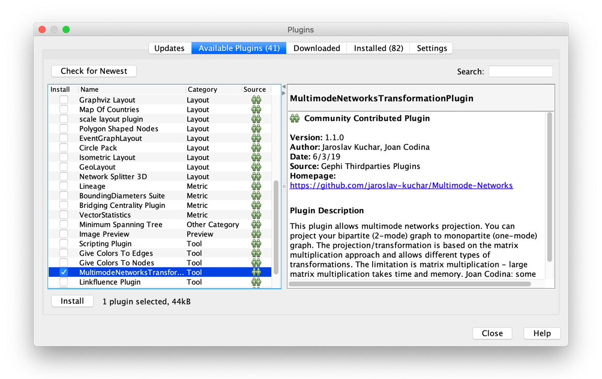
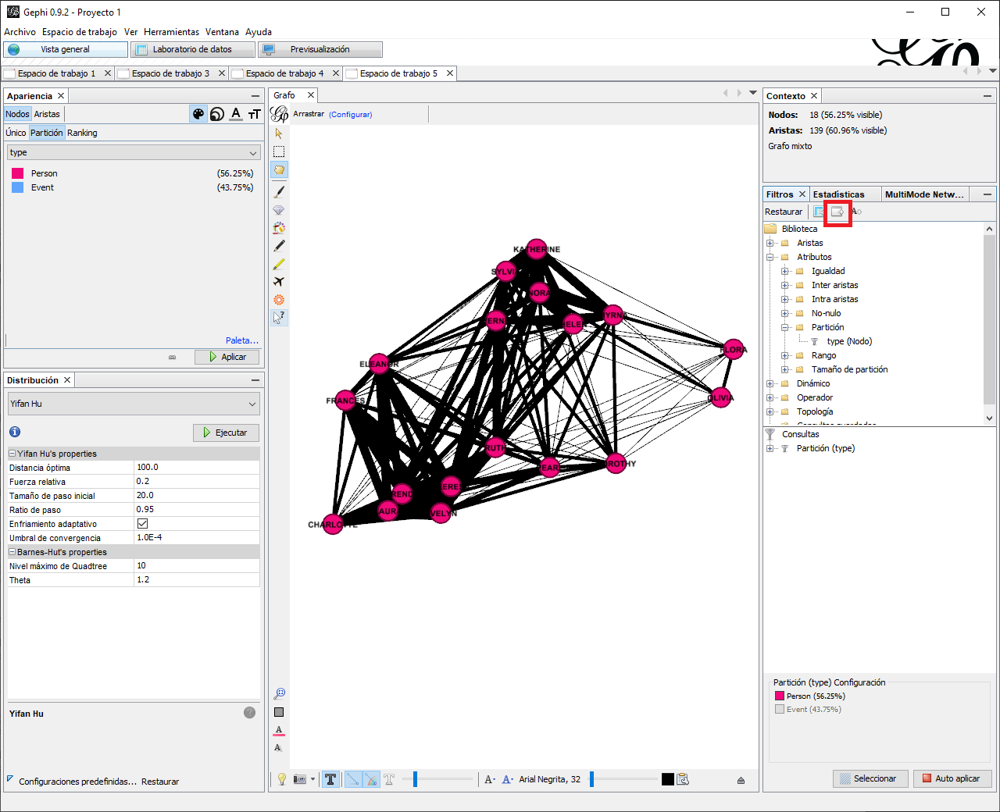

```{r setup, include=FALSE}
library(data.table)
library(DT)
```

# Derivando Datos Modo-Uno de Modo-Dos

En este capítulo volveremos a ver datos de modo-dos, donde el objetivo principal es pasar más allí de la definición y explorar como estos sirven de precursores a relaciones de modo-uno. A lo largo de este, retornaremos a la multiplicación de matrices, si no se siente cómodo con este proceso favor de repasar el capítulo previo. Concluiremos con un ejercicio práctico en Gephi.

## Modo-Dos, ¿Qué es?

Para recapitular, las redes de modo-dos son aquellas que constan de dos grupos de nodos y donde los enlaces solo existen entre nodos de diferentes clases. A veces se les conoce como redes de afiliación, redes de membresía o incidencia [@Everton2012]. Imagínese una red modo-dos que conecta personas a eventos, por ejemplo, pandilleros conectados con pandillas u otros grupos ilícitos. Bajo la definición previa, los vínculos solo conectan pandilleros a organizaciones como en la Figura \@ref(fig:2-4-bip). 

```{r 2-4-bip, fig.cap = "Gráfico Bipartita"}
igraph::graph_from_literal(A-E1, B-E1, C-E1, C-E2, D-E2, D-E3, D-E3) %>%
  igraph::set_vertex_attr(., name = "type",
                          value = igraph::bipartite_mapping(.)[["type"]]) %>%
  my_bigraph()
```

## Proyección

El encontrar datos de modo-dos en ARSo es común. Tradicionalmente el objetivo del análisis es mapear el espacio social entre miembros de una sola clase de nodo. En la Figura \@ref(fig:2-4-bip), un objetivo podría ser derivar las conexiones entre personas con base a sus membresías a organizaciones. Similarmente, es posible derivar relaciones entre organizaciones para entender las dinámicas organizacionales. El derivar relaciones de modo-uno empezando con datos de modo-dos es una de las herramientas más comunes y relevantes utilizadas por analistas de ARSo. Este proceso se conoce como proyección. 

Para lograr esto, retornaremos a la multiplicación de matrices. Primero, examine la siguiente matriz de adyacencia con los datos de la Figura \@ref(fig:2-4-bip). Note que los vínculos solo conectan personas con eventos, por consiguiente, asumimos que lo que tenemos es una red bipartita. 

$$
\begin{matrix}
  & A & B & C & D & E1 & E2 & E3 \\
A  & - & 0 & 0 & 0 & 1  & 0  & 0  \\
B  & 0 & - & 0 & 0 & 1  & 0  & 0  \\
C  & 0 & 0 & - & 0 & 1  & 1  & 0  \\
D  & 0 & 0 & 0 & - & 0  & 1  & 1  \\
E1 & 1 & 1 & 1 & 0 & -  & 0  & 0  \\
E2 & 0 & 0 & 1 & 1 & 0  & -  & 0  \\
E3 & 0 & 0 & 0 & 1 & 0  & 0  & -  \\
\end{matrix}
(\#eq:2-4-bip-adj)
$$

Otra forma de representar los datos de una red bipartita, además de una lista de arista, es una matriz de incidencia. En esta, vemos que las filas y las columnas contienen las diferentes clases. Por ejemplo, en la siguiente matriz de incidencia encontramos los eventos como columnas y las personas como filas. 

$$
\begin{matrix}
  & E1 & E2 & E3 \\
A & 1  & 0  & 0  \\
B & 1  & 0  & 0  \\
C & 1  & 1  & 0  \\
D & 0  & 1  & 1  \\ 
\end{matrix}
(\#eq:2-4-bip-inc)
$$

Para multiplicar matrices estas tienen que ser conformables, es decir, el número de filas en la primera matriz es igual a el número de columnas en la segunda. Es por ello que para multiplicar la matriz de incidencia previa consigo misma es necesario transponerla. Supongamos que la matriz de incidencia es $M$, en esta situación el producto de la multiplicación de matrices seria $MxM^T$, como se ve representado en la siguiente operación. 

$$
\begin{split}
\begin{matrix}
  & E1 & E2 & E3 \\
A & 1  & 0  & 0  \\
B & 1  & 0  & 0  \\
C & 1  & 1  & 0  \\
D & 0  & 1  & 1  \\ 
\end{matrix}
\enspace \times \enspace
\begin{matrix}
   & A & B & C & D \\
E1 & 1 & 1 & 1 & 0 \\
E2 & 0 & 0 & 1 & 1 \\
E3 & 0 & 0 & 0 & 1 \\
\end{matrix}
\end{split}
(\#eq:2-4-proj1)
$$

El proceso de multiplicar dos matrices conformables es el mismo que hemos visto anteriormente. Empezando en el lado superior izquierdo de la primera matriz, multiplicamos cada célula de la primera matriz por los valores en cada célula de la primera columna de la segunda matriz, sumamos los resultados y proseguimos con cada fila de la primera matriz multiplicada por cada columna de la segunda [@Hanneman2005]. La siguiente operación incluye los resultados de dicho proceso.

$$
\begin{smallmatrix}
  & A                 & B                 & C                 & D                 \\
A & (1x1)+(0x0)+(0x0) & (1x1)+(0x0)+(0x0) & (1x1)+(0x1)+(0x0) & (1x0)+(0x1)+(0x1) \\
B & (1x1)+(0x0)+(0x0) & (1x1)+(0x0)+(0x0) & (1x1)+(0x1)+(0x0) & (1x0)+(0x1)+(0x1) \\
C & (1x1)+(1x0)+(0x0) & (1x1)+(1x0)+(0x0) & (1x1)+(1x1)+(0x0) & (1x0)+(1x1)+(0x1) \\
D & (0x1)+(1x0)+(1x0) & (0x1)+(1x0)+(1x0) & (0x1)+(1x1)+(1x0) & (0x0)+(1x1)+(1x1) \\
\end{smallmatrix}
\enspace = \enspace
$$

$$
\begin{matrix}
  & A & B & C & D \\
A & 1 & 1 & 1 & 0 \\
B & 1 & 1 & 1 & 0 \\
C & 1 & 1 & 2 & 1 \\
D & 0 & 0 & 1 & 2 \\
\end{matrix}
(\#eq:2-4-mult)
$$

Después de remover la diagonal, vínculos con uno mismo, el resultado es una matriz de adyacencia entre personas, ver siguiente matriz. Esta es simétrica y por lo tanto usualmente tratamos estos datos como no dirigidos puesto que es imposible determinar que actor inició el enlace y quien lo recibe.  La Figura \@ref(fig:2-4-projected1) representa estos datos relacionales. Note que esta representación de la red solo contiene datos de modo-uno, por consiguiente, es posible “medir” el espacio social entre los actores. El ejemplo más simple de ello es la centralidad de grado, la cual es un conteo del número de vínculos de un actor y tiende a representar actividad, es decir, mientras más vínculos más activo es un nodo. En la Figura \@ref(fig:2-4-projected1) el actor C tiene una centralidad de grado equivalente a 3, es decir que es el nodo más activo en participar en eventos con otros nodos. 

$$
\begin{matrix}
  & A & B & C & D \\
A & 0 & 1 & 1 & 0 \\
B & 1 & 0 & 1 & 0 \\
C & 1 & 1 & 0 & 1 \\
D & 0 & 0 & 1 & 0 \\
\end{matrix}
(\#eq:2-4-proj1-clean)
$$

```{r 2-4-projected1, fig.cap = "Red proyectada, persona-a-persona"}
igraph::graph_from_literal(A-B, A-C, B-A, B-C, C-A, C-B, C-D, D-C) %>% 
  my_igraph()
```

Recuerde que el orden de las matrices en una multiplicación impacta el resultado.  Por ejemplo, si la primera matriz en la multiplicación es la transpuesta $M^T$, el producto de dicha operación sería $M^TxM$, ilustrado en la siguiente ecuación. 

$$
\begin{split}
\begin{matrix}
   & A & B & C & D \\
E1 & 1 & 1 & 1 & 0 \\
E2 & 0 & 0 & 1 & 1 \\
E3 & 0 & 0 & 0 & 1 \\
\end{matrix}
\enspace \times \enspace
\begin{matrix}
  & E1 & E2 & E3 \\
A & 1  & 0  & 0  \\
B & 1  & 0  & 0  \\
C & 1  & 1  & 0  \\
D & 0  & 1  & 1  \\ 
\end{matrix}
\end{split}
(\#eq:2-4-proj2)
$$

Una vez más, la multiplicación produce una matriz de adyacencia, pero en este caso los vínculos conectan eventos a otros eventos, como vemos en la matriz producto de la siguiente ecuación. 

$$
\begin{smallmatrix}
   & E1                      & E2                      & E3                      \\
E1 & (1x1)+(1x1)+(1x1)+(0x0) & (1x0)+(1x0)+(1x1)+(0x1) & (1x0)+(1x0)+(1x0)+(0x1) \\
E2 & (0x1)+(0x1)+(1x1)+(1x0) & (0x0)+(0x0)+(1x1)+(1x1) & (0x0)+(0x0)+(1x0)+(1x1) \\
E3 & (0x1)+(0x1)+(0x1)+(1x0) & (0x0)+(0x0)+(0x1)+(1x1) & (0x0)+(0x0)+(0x0)+(1x1) \\
\end{smallmatrix}
\enspace = \enspace
$$

$$
\begin{matrix}
   & E1 & E2 & E3  \\
E1 & 3  & 1  & 0 \\
E2 & 1  & 2  & 1 \\
E3 & 0  & 1  & 1 \\
\end{matrix}
(\#eq:2-4-proj2-clean)
$$

Después de remover la diagonal, la matriz puede ser dibujada como grafo (ver Figura \@ref(fig:2-4-projected2)). En este gráfico el evento 2 (E2) tiene un grado de centralidad equivalente a dos, por lo cual asumimos que es el evento más popular o asistido por más personas que han asistido a otros eventos en la red. 

```{r 2-4-projected2, fig.cap = "Red proyectada, evento-a-evento"}
igraph::graph_from_literal(E1-E2, E2-E3) %>% 
  igraph::plot.igraph(
    vertex.color = "red",
    vertex.shape = "square",
    edges.color  = "grey",
    vertex.size  = 30
  )
```

Como puede ver, ambos productos de la proyección de una red bipartita pueden ser analizados por sí mismos. En los siguientes capítulos de este manual presentamos una variedad de algoritmos analíticos diseñados para redes de modo-uno. Por consiguiente, antes de aplicar estas herramientas matemáticas, es crucial que el analista transforme sus datos a modo-uno. 

Es probable que se esté preguntando, “¿tendré que multiplicar matrices a mano para proyectar mis datos de modo-dos a modo-uno?” La respuesta es, “no”. Gephi, y otras herramientas de software tienen la habilidad de proyectar redes modo-dos. Es por ello que a continuación tendrá la oportunidad de trabajar con redes de modo-dos a través de un ejercicio práctico en Gephi. Sin embargo, el contenido de esta sección le debe haber presentado suficiente información para entender las mecánicas del proceso que implementará el software.


## Ejercicio Práctico

Los datos que usaremos en este ejercicio se les conoce como los datos de Davis: Southern Club Women. Davis y sus colegas registraron la asistencia de 18 mujeres a 14 eventos sociales diferentes. El resultado es una matriz de persona por evento, por lo tanto, cada celda (*xij*) es igual a `1` si la persona (*i*) asistió al evento social (*j*), y `0` en el caso contrario.


### Antes de empezar


:::{.row}
:::{.lcolumn-20 data-latex="{0.18\\textwidth}"}
*Herramientas > Plugins*
:::

:::{.col data-latex="{0.04\\textwidth}"}
\ <!-- an empty Div (with a white space), serving as
a column separator for tex -->
:::

:::{.rcolumn-80 data-latex="{0.78\\textwidth}"}
  1.	Para este ejercicio requerirá el módulo (plugin) complementario para procesar datos: *MultimodeNetworks Transformation*. Para comprobar si lo ha instalado previamente, cheque utilizando los comandos *Herramientas > Plugins* que abrirá un cuadro de diálogo (Figura \@ref(fig:2-4-instalados)). Allí, haga clic en la pestaña *Instalados*, y si ve el módulo en esta lista, puede dar clic en *Cerrar*.
:::
:::
  
```{r 2-4-instalados, out.width="75%", fig.cap = "Plugins instalados"}
knitr::include_graphics("images/02-05-01_installed.png")
```

:::{.row}
:::{.lcolumn-20 data-latex="{0.18\\textwidth}"}
\ <!-- an empty Div (with a white space), serving as
a column separator for tex -->
:::

:::{.col data-latex="{0.04\\textwidth}"}
\ <!-- an empty Div (with a white space), serving as
a column separator for tex -->
:::

:::{.rcolumn-80 data-latex="{0.78\\textwidth}"}
  2.	Si no lo ha instalado previamente, haga clic en la pestaña *Plugins disponibles*, desplácese hacia abajo y localice el módulo requerido (Figura \@ref(fig:2-4-disponibles)). Marque la casilla a la izquierda de la opción y haga clic en *Instalar*. Siga las instrucciones. Para que estos cambios tomen efecto deberá reiniciar Gephi.
:::
:::

```{r 2-4-disponibles, out.width="75%", fig.cap = "Plugins disponibles"}

```

:::{.row}
:::{.lcolumn-20 data-latex="{0.18\\textwidth}"}
*Ventana > Multimode Projections*
:::

:::{.col data-latex="{0.04\\textwidth}"}
\ <!-- an empty Div (with a white space), serving as
a column separator for tex -->
:::

:::{.rcolumn-80 data-latex="{0.78\\textwidth}"}
  3.	Después de reiniciar Gephi, asegúrese que el nuevo módulo este instalado correctamente. Para activarlo, use los comandos *Ventana > Multimode Projections*. Esta acción abrirá una nueva ventanilla (Figura \@ref(fig:2-4-multimode)). Ahora está listo para comenzar con el resto del ejercicio.
:::
:::

```{r 2-4-multimode, out.width="75%", fig.cap = "Pestaña MultiMode Projection"}
knitr::include_graphics("images/02-05-03_pestana.png")
```

### Importar Redes de Modo-dos en Gephi Utilizando Listas de Aristas

:::{.row}
:::{.lcolumn-20 data-latex="{0.18\\textwidth}"}
*Ventana > Multimode Projections*
:::

:::{.col data-latex="{0.04\\textwidth}"}
\ <!-- an empty Div (with a white space), serving as
a column separator for tex -->
:::

:::{.rcolumn-80 data-latex="{0.78\\textwidth}"}
  1. Para importar datos de red modo-dos en formato de lista de bordes (o lista de aristas), usaremos dos conjuntos de datos. El primero, una lista de nodos que contiene una columna con la identificación del nodo (columna requerida, `ID`), etiqueta y tipo de nodo. El segundo conjunto es una lista de aristas que contiene los vínculos entre nodos. Antes de importar los datos, descargue los archivos [`davis_edges.csv`](https://raw.githubusercontent.com/cjcallag/arso/main/data/two_mode/davis_edges.csv) y [`davis_nodes.csv`](https://raw.githubusercontent.com/cjcallag/arso/main/data/two_mode/davis_nodes.csv).
:::
:::

```{r 2-4-importar, out.width="75%", fig.cap = "Cuadro de Diálogo: Importar Hoja de Cálculo"}
knitr::include_graphics("images/02-05-04_importar.png")
```
 
:::{.row}
:::{.lcolumn-20 data-latex="{0.18\\textwidth}"}
*Archivo > Abrir*
:::

:::{.col data-latex="{0.04\\textwidth}"}
\ <!-- an empty Div (with a white space), serving as
a column separator for tex -->
:::

:::{.rcolumn-80 data-latex="{0.78\\textwidth}"}
  2. Primero importaremos la lista de nodos. Utilice los comandos *Archivo > Abrir* y luego localice y abra `davis_nodes.csv`. En el cuadro de diálogo (Figura \@ref(fig:2-4-importar)) dígale a Gephi que el archivo es una tabla de nodos y asegure que el separador entre valores sea una coma. Haga clic en *Siguiente* y luego en el siguiente cuadro de diálogo seleccione *Terminar*. Como siempre, esto abrirá el informe de importación (Figura \@ref(fig:2-4-nodes)). Por favor indique que el tipo de grafo es *No dirigido*, la estrategia para combinar las aristas es *Mínimo*,  y que desea agregar estos datos en un nuevo espacio de trabajo. Ahora, haga clic en *Aceptar*. 
:::
:::
  
```{r 2-4-nodes, out.width="75%", fig.cap = "Informe de Importación para Lista de Nodos"}
knitr::include_graphics("images/02-05-04_nodos.png")
```
 
 
:::{.row}
:::{.lcolumn-20 data-latex="{0.18\\textwidth}"}
\ <!-- an empty Div (with a white space), serving as
a column separator for tex -->
:::

:::{.col data-latex="{0.04\\textwidth}"}
\ <!-- an empty Div (with a white space), serving as
a column separator for tex -->
:::

:::{.rcolumn-80 data-latex="{0.78\\textwidth}"}
  3. Observe los datos que ha importado en la tabla de nodos en la ventana *Laboratorio de datos*. Si cambia a la ventana *Vista general* verá nodos, pero no aristas (lo cual es correcto puesto que no hemos importado los enlaces).
:::
:::

\newline

:::{.row}
:::{.lcolumn-20 data-latex="{0.18\\textwidth}"}
*Archivo > Abrir*
:::

:::{.col data-latex="{0.04\\textwidth}"}
\ <!-- an empty Div (with a white space), serving as
a column separator for tex -->
:::

:::{.rcolumn-80 data-latex="{0.78\\textwidth}"}
  4. Ahora, importe la lista de aristas (`davisedge.csv`) utilizando los comandos *Archivo > Abrir*. Esta vez, importe la lista de aristas, asegurándose que Gephi sepa que se está importando este tipo de archivo (*Tabla de Aristas*). Luego haga clic en *Siguiente* y en el siguiente cuadro de diálogo seleccione *Terminar*. En el informe de importación indique que el tipo de grafo es *No dirigido*, la estrategia para combinar las aristas es *Mínimo*,  y que desea añadir al espacio de trabajo existente. Concluya dando clic en *Aceptar* (Figura \@ref(fig:2-4-aristas)).
:::
:::
  
```{r 2-4-aristas, out.width="75%", fig.cap = "Informe de Importación para Lista de Aristas"}
knitr::include_graphics("images/02-05-06_aristas.png")
```

:::{.row}
:::{.lcolumn-20 data-latex="{0.18\\textwidth}"}
\ <!-- an empty Div (with a white space), serving as
a column separator for tex -->
:::

:::{.col data-latex="{0.04\\textwidth}"}
\ <!-- an empty Div (with a white space), serving as
a column separator for tex -->
:::

:::{.rcolumn-80 data-latex="{0.78\\textwidth}"}
  5.	Puesto que la tabla de nodos incluye un atributo (`type`) que indica si un nodo es `persona` o `evento`, no necesitamos la herramienta *MultiMode Networks Projection* que descargamos para diferenciar entre clases de nodos.  
:::
:::

  

```{r 2-4-bip-1, out.width="75%", fig.cap = "Datos Bipartitas Desde Lista de Aristas"}
knitr::include_graphics("images/02-05-07_bip_data.png")
```

:::{.row}
:::{.lcolumn-20 data-latex="{0.18\\textwidth}"}
*[Vista general]*

*Apariencia > Nodos > Color > Partición > --Escoge un attributo > type*
:::

:::{.col data-latex="{0.04\\textwidth}"}
\ <!-- an empty Div (with a white space), serving as
a column separator for tex -->
:::

:::{.rcolumn-80 data-latex="{0.78\\textwidth}"}
  6.	Cambie a la ventana *Vista general* y, en la pestaña *Apariencia*, seleccione *Nodos > Color > Partición* y, a continuación, con el menú desplegable *--Elija un atributo*, seleccione *type*. Antes de presionar *Aplicar*, haga clic en el enlace *Paleta…* justo arriba del botón *Aplicar* y elija la paleta roja/azul. Ahora presione *Aplicar*. Una vez que haya terminado, guarde sus datos, pero no cierre Gephi. En la siguiente parte, exploraremos cómo "proyectar" una red de modo-dos para crear dos redes de modo-uno.
:::
:::


### Proyectar Redes de Modo-dos en Gephi

:::{.row}
:::{.lcolumn-20 data-latex="{0.18\\textwidth}"}
*[Vista general]*

*MulitMode Networks Projection > Load Attributes > Attribute types > type*
:::

:::{.col data-latex="{0.04\\textwidth}"}
\ <!-- an empty Div (with a white space), serving as
a column separator for tex -->
:::

:::{.rcolumn-80 data-latex="{0.78\\textwidth}"}
  1.	En la ventana *Descripción general*, seleccione la pestaña *MultiMode Networks Projection* que instalamos previamente (si no lo puede localizar seleccione el menú de *Ventana* y de clic en *MultiMode Projections*).  De clic en el botón  *Load attributes* que cargará los atributos de los nodos. Ahora, en el menú desplegable *Attribute type* seleccione la opción *type*. Al proyectar queremos crear dos redes de modo-uno, la primera entre personas y la segunda entre eventos.
:::
:::

\newline

:::{.row}
:::{.lcolumn-20 data-latex="{0.18\\textwidth}"}
*Left matrix  > Person–Event*
*Right matrix > Event–Person*

*Run*
:::

:::{.col data-latex="{0.04\\textwidth}"}
\ <!-- an empty Div (with a white space), serving as
a column separator for tex -->
:::

:::{.rcolumn-80 data-latex="{0.78\\textwidth}"}
  2.	Comencemos creando la red “persona a persona” (mujeres conectadas solo a mujeres). Para hacer esto, modifique los menús desplegables de la siguiente manera: *Left matrix* = Person-Event y *Right matrix* = Event-Person. Luego de clic en *Run*.
:::
:::

\newline

:::{.row}
:::{.lcolumn-20 data-latex="{0.18\\textwidth}"}
*Filtros > Atributos > Partición > type*

*Consultas > Person > Filtrar *
:::

:::{.col data-latex="{0.04\\textwidth}"}
\ <!-- an empty Div (with a white space), serving as
a column separator for tex -->
:::

:::{.rcolumn-80 data-latex="{0.78\\textwidth}"}
  3. Ahora agregaremos un filtro para extraer las relaciones entre los nodos tipo `person`. Seleccione la pestaña *Filtros*, abra la carpeta *Atributos* y localice la opción *type* dentro de la sección *Partición*. Arrastre el filtro de *type* a la sección de *Consultas* (Figura \@ref(fig:2-4-bip-3)). En respuesta a esta acción verá una nueva ventanilla al fondo de este panel (titulada *Partición (type) Configuración*), seleccione la opción *Person* y de clic en el botón *Filtrar* (Figura \@ref(fig:2-4-bip-3)). Ahora exporte este gráfico (y los datos filtrados) a un nuevo espacio de trabajo dando clic en el botón *Exportar el grafo filtrado en un nuevo espacio de trabajo* (el botón resaltado por una caja roja en la Figura \@ref(fig:2-4-bip-3)).
:::
:::


```{r 2-4-bip-3, out.width="75%", fig.cap = "Red Bipartita Filtrada, Partición = Person"}

```


:::{.row}
:::{.lcolumn-20 data-latex="{0.18\\textwidth}"}
*Apariencia > Nodos > Tamaño > Unique *
:::

:::{.col data-latex="{0.04\\textwidth}"}
\ <!-- an empty Div (with a white space), serving as
a column separator for tex -->
:::

:::{.rcolumn-80 data-latex="{0.78\\textwidth}"}
  4. En el espacio de trabajo recién creado, modifique la visualización de la red usando las herramientas de diseño en Gephi. La Figura \@ref(fig:2-4-bip-4) es un ejemplo (diseño, etiquetas y el tamaño de nodos editados). Observando esta red conteste las siguientes interrogantes. **¿Qué mujeres parecen estar socialmente cerca entre sí? ¿Algunas son más centrales? ¿Qué mujeres parecen ser las más distantes del grupo?**
:::
:::
  
```{r 2-4-bip-4, out.width="75%", fig.cap = "Enlaces de Persona-a-Persona"}
knitr::include_graphics("images/02-05-09_bip_data_4.png")
```


:::{.row}
:::{.lcolumn-20 data-latex="{0.18\\textwidth}"}
*MultiMode Networks Projection*

*Right matrix > Event–Person* 
*Left matrix  > Person–Event*

*Run*
:::

:::{.col data-latex="{0.04\\textwidth}"}
\ <!-- an empty Div (with a white space), serving as
a column separator for tex -->
:::

:::{.rcolumn-80 data-latex="{0.78\\textwidth}"}
  5. Regrese al espacio previo de trabajo donde generó la red de modo-uno. En la ventanilla de *Filtros* seleccione *Auto aplicar* (al hacer esto el botón cambiará y dirá *Filtrar*). Regrese a la pestaña *MultiMode Networks Projection*, modifique los menús desplegables de la siguiente manera: *Left matrix* = Event-Person y *Right matrix* = Person-Event. Luego de clic en *Run*.
:::
:::

\newline

:::{.row}
:::{.lcolumn-20 data-latex="{0.18\\textwidth}"}
*Filtros > Atributos > Partición > type*

*Consultas > Event > Filtrar* 
:::

:::{.col data-latex="{0.04\\textwidth}"}
\ <!-- an empty Div (with a white space), serving as
a column separator for tex -->
:::

:::{.rcolumn-80 data-latex="{0.78\\textwidth}"}
  6.	Una vez más verá nuevos enlaces en el gráfico. Ahora agregaremos un filtro para extraer las relaciones de entre los nodos *Evento*. Seleccione la pestaña *Filtros*, abra la carpeta *Atributos* y localice la opción “type” dentro de la sección *Partición*. Arrastre el filtro de *type* a la sección de *Consultas*. En respuesta a esta acción verá una nueva ventanilla al fondo de este panel (titulada *Partición (type) Configuración*), seleccione la opción *Event* y de clic en el botón *Filtrar*. Ahora exporte este gráfico (y los datos filtrados) a un nuevo espacio de trabajo dando clic en el botón *Exportar el grafo filtrado en un nuevo espacio de trabajo*.
:::
:::

\newline

:::{.row}
:::{.lcolumn-20 data-latex="{0.18\\textwidth}"}
*Filtros > Atributos > Partición > type*

*Consultas > Event > Filtrar* 
:::

:::{.col data-latex="{0.04\\textwidth}"}
\ <!-- an empty Div (with a white space), serving as
a column separator for tex -->
:::

:::{.rcolumn-80 data-latex="{0.78\\textwidth}"}
  7.	En el nuevo espacio de trabajo verá una red de modo-uno que contiene relaciones de evento-a-evento. Como hicimos con la red de persona-a-persona modifique el gráfico con las herramientas de diseño en Gephi (Figura \@ref(fig:2-4-bip-5)). Mirando esta red, **¿Qué eventos parecen socialmente cercanos entre sí? ¿Alguno parece más central, más popular que los demás? ¿Alguno parece ser menos popular?**
:::
:::
  
```{r 2-4-bip-5, out.width="75%", fig.cap = "Enlaces de Evento-a-Evento"}
knitr::include_graphics("images/02-05-09_bip_data_5.png")
```
