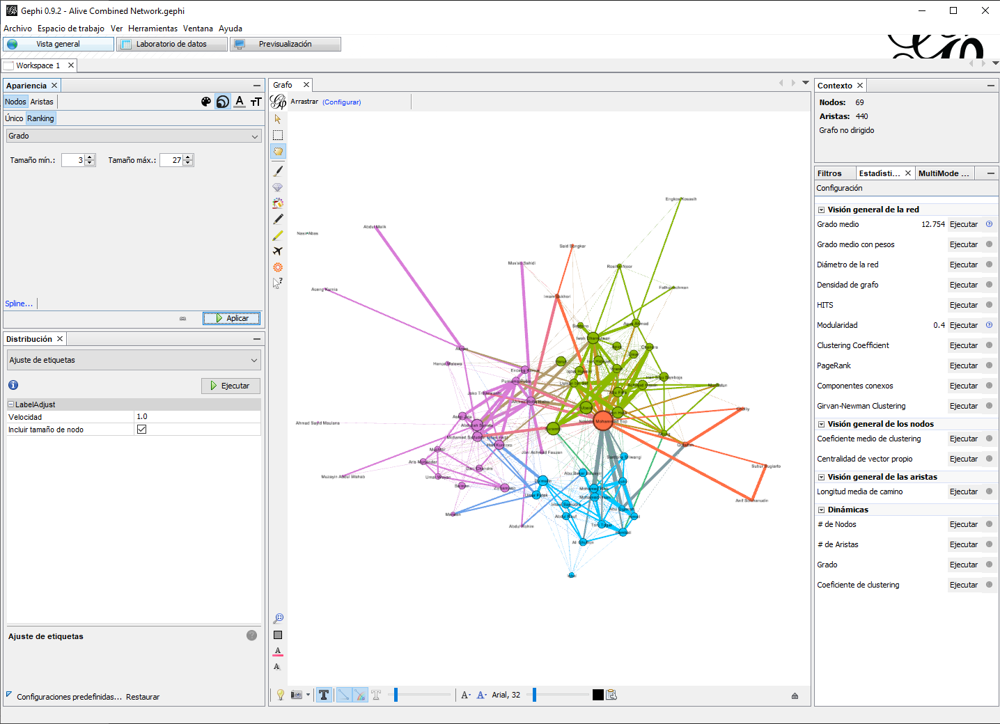
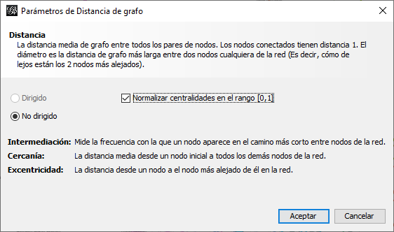

```{r setup, include=FALSE}
library(data.table)
library(DT)
library(igraph)
```


# Centralidad

La centralidad es uno de los conceptos más antiguos del ARSo. Un actor central puede ser alguien que tiene numerosos vínculos con otros actores (grado), alguien que está más cerca (en términos de distancia del camino) a todos los demás actores (cercanía), alguien que se encuentra en el camino más corto (geodésico) entre dos actores cualesquiera (intermediación), o alguien que tiene vínculos con otros actores muy centrales (eigenvector). En algunas redes, los mismos actores obtienen una puntuación alta en las cuatro medidas. En otras no. 

Por supuesto, hay más de cuatro medidas de centralidad. UCINET implementa más de 20, el programa R CINNA incluye más de 40, y [David Schoch ha creado una tabla periódica interactiva de más de 100 medidas de centralidad](http://schochastics.net/sna/periodic.html).

Aquí discutiremos las tres centralidades más comunes, originalmente desarrolladas por Freeman [-@Freeman1979], es decir: grado, cercanía e intermediación. Además, otras medidas importantes serán introducidas como eigenvector [@Bonacich1987], grados de entrada y salida [@Wasserman1994] y centros de actividad y autoridades [@Kleinberg1999]. Para diferenciar entre medidas destinadas para datos dirigidos y no-dirigidos, dividiremos el capitulo en dos secciones. Adicionalmente, utilizaremos el marco teórico, originalmente postulado Freeman [-@Freeman1979], en @Cunningham2016 para clasificar las medidas de centralidad en tres familias: medidas basadas en frecuencia, medidas basadas en distancia y medidas basadas en caminos [@Cunningham2016, 142]. Como todos los capítulos, este concluirá con un ejercicio practico en Gephi. 

## Datos No Dirigidos: Centralidad y Poder 

Aquí consideramos algunas de las medidas de centralidad apropiadas para trabajar con datos no dirigidos. Para clarificar algunas de las similitudes y diferencias entre estas medidas, serán presentadas utilizando un el sistema de clasificación en @Cunningham2016. Específicamente, en tres secciones:

  - Basadas en frecuencia: la característica unificadora de estas es el enfoque en la frecuencia con la que un actor tiene vínculos con otros en la red. Por ello, estas suponen que la alta frecuencia de enlaces es correspondiente a poder o importancia en la red. 
  - Basadas en distancia: estas asumen que las distancias entre actores es el factor principal en determina la centralidad y poder de cada nodo. 
  - Basadas en caminos: estas se basan en la ubicación de un nodo en la red, principalmente se esta ubicación es una posición de corretaje o intermediación. 

### Medidas Basadas en Frecuencia

#### Centralidad de Grado

La centralidad de grado es la medida más simple y fácil de calcular y entender, por ello comisaremos aquí. Esta medida se define como el conteo de vínculos de un actor. En una red no dirigida, no tomamos en cuenta si estos enlaces son “de” o “hacia” el nodo. Con esto en mente, para una red binaria la centralidad de grado se define formalmente como:

$$
C_i^{deg} = \sum\limits_{j=1}^n x_{ij}
$$
Donde la medida se calcula para todos lo nodos en un grafo. Es decir, el grado se define como la suma de los vínculos entre un nodo ($i$) hacia actores adyacentes ($x_{ij}$). Por ejemplo, el grado de centralidad de los nodos en la Figura \@ref(fig:degree) aparecen en la Tabla \@ref(tab:dscores). El nodo con mayor grado en este grafo es A puesto a que se encuentra enlazado con cuatro otros, D y E tienen un grado de centralidad de dos y finalmente C y B tienen un grado de uno.

::::{.row}
::::{.lcolumn-50}
```{r degree, fig.cap = "Grafo no dirigido"}
g <- graph_from_literal(A--B, A--C, A--D, A--E, E--D)
g %>% my_igraph()
```
::::
::::{.rcolumn-50}
```{r dscores}
g %>%
  set_vertex_attr(name = "grado", value = degree(.)) %>%
  get.data.frame(what = "vertices") %>%
  knitr::kable(., caption = "Tabla de índices, grado",
               row.names  = FALSE,
               col.names  = c("Nodo", "Grado"))
```
::::
::::


Existen múltiples maneras de calcular esta medida de manera programática. Sin embargo, el método mas simple es multiplicar la matriz de adyacencia por un vector de unos, donde el largo del vector es correspondiente a el numero de vértices en el grafo [@Meghanathan2016]. La ecuación \@ref(eq:calcdeg) ilustra como computar dicho índice.

\begin{equation}
\begin{matrix}
  & A & B & C & D & E \\
A & 0 & 1 & 1 & 1 & 1 \\
B & 1 & 0 & 0 & 0 & 0 \\
C & 1 & 0 & 0 & 0 & 0 \\
D & 1 & 0 & 0 & 0 & 1 \\
E & 1 & 0 & 0 & 1 & 0
\end{matrix}

\times

\begin{matrix}
\\ 1 \\ 1 \\ 1 \\ 1 \\ 1
\end{matrix}

=

\begin{matrix}
\\ 4 \\ 1 \\ 1 \\ 2 \\ 2
\end{matrix}

(\#eq:calcdeg)
\end{equation}

Como todas las medidas en esta sección, la manera en la que se calcula el grado de centralidad es indicativo de el objetivo de la medida y como se debe interpretar. @Cunningham2016 postulan que el grado mide la popularidad de un actor en términos de influencia directa entre este y otros nodos directamente adyacentes [@Cunningham2016, 147]. La idea principal aquí es que los vínculos sirven como canales para el flujo de influencia, materiales, ideas, etc. Por consiguiente, un nodo como A en la Figura \@ref(fig:degree) que a invertido su tiempo y recursos en enlazarse con cuatro otros nodos en una red, es posiblemente mas activo en la red que un actor como B conexo solo a un nodo. 

Similarmente, los nodos con alto grado de centralidad tienden a ser más visibles en la red. Si asumimos que ciertos bienes – por ejemplo, información – tienden a difundirse en una red por medio de los enlaces, entonces podemos asumir que aquellos nodos con alto grado de centralidad estarán bien informados [@Borgatti2018]. Por ejemplo, en la Figura \@ref(fig:degree) el nodo A puede recibir información de tres ubicaciones aisladas, de los nodos B o C, y de la traída compuesta por D y E. En contraste, B y C solo pueden acceder a información de la red a través de A. Similarmente, D y B dependen de A para acceder a recursos no redundantes en la triada. 

#### Centralidad de Eigenvector

### Medidas Basadas en Distancia

#### Centralidad de Cercanía

La medida más común basada en distancia entre nodos es la centralidad de cercanía definida por Freeman [-@Freeman1979] como la distancia geodésica entre un nodo y los demás en una red. Se calcula sumando las distancias geodésicas entre cada nodo y los demás y después invirtiendo el valor para cambiar el índice de una medida de distancia a cercanía [@Valente2010, 85]. Es común calcular la centralidad de cercanía como un índice normalizado (con valores de 0 a 1) de la siguiente manera:

$$C_i^{clo} = \frac{N-1}{\sum\limits_{j = 1}^{n}d_{ij}}$$

Donde $d_{ij}$ es la distancia geodésica entre dos nodos. Adicionalmente, el número máximo teórico de cercanía en cualquier red es $N-1$, por lo tanto, al dividir las distancias sumadas por este numerados generamos un valor normalizado. El dividir el valor máximo por la suma de las distancias genera un índice donde los valores grandes corresponden a nodos más centrales [@Borgatti2018, 199].

Calcular esta medida es simple, el grafo \@ref(fig:clo) servirá como ejemplo. Comenzaremos por encontrar los caminos geodésicos entre todos los nodos, presentado en la matriz izquierda de la ecuación \@ref(eq:clomeasure). El siguiente paso consiste en sumar las distancias para cada nodo. Finalmente, dividimos el número máximo teórico de cercanía ($N-1$) por la suma de las distancias de cada nodo. Por ejemplo, el nodo A tiene una distancia cumulativa de 15 y el valor teórico máximo de cercanía es 6. Por lo tanto, la cercanía normalizada del nodo A es equivalente a $\frac{6}{15} = 0.4$.

```{r clo,  fig.cap = "Grafo no dirigido"}
g <- graph_from_literal(A--C, C--B, C--D, D--E, D--F, E--F, E--G, G--F)
g %>% my_igraph()
```

\begin{equation}
\begin{matrix}
  & A & B & C & D & E & F & G \\
A & 0 & 2 & 1 & 2 & 3 & 3 & 4 \\
B & 2 & 0 & 1 & 2 & 3 & 3 & 4 \\
C & 1 & 1 & 0 & 1 & 2 & 2 & 3 \\
D & 2 & 2 & 1 & 0 & 1 & 1 & 2 \\
E & 3 & 3 & 2 & 1 & 0 & 1 & 1 \\
F & 3 & 3 & 2 & 1 & 1 & 0 & 1 \\
G & 4 & 4 & 3 & 2 & 1 & 1 & 0
\end{matrix}

\quad

\begin{matrix}
Suma \\ 15 \\ 15 \\ 10 \\ 9 \\ 11 \\ 11 \\ 15
\end{matrix}

\qquad

\begin{matrix}
Cercanía\ Normalizada \\ 0.4 \\ 0.4 \\ 0.6 \\ 0.667 \\ 0.545 \\ 0.545 \\ 0.4
\end{matrix}

(\#eq:clomeasure)
\end{equation}

La centralidad de cercanía es una medida intuitiva. @Borgatti2018 sugieren que en términos de flujo de recursos los nodos más cercanos a menudo reciben materiales, recursos o información rápidamente [@Borgatti2018, 199]. Esto es significativo puesto que los recursos tienden a perder fidelidad a lo largo de distancias de camino largas. Por ejemplo, la información tiende a ser distorsionada conforme cambia de manos en una red o la transferencia de fondos financieros tiende a acumular costos con cada brinco entre nodos. Es por ello que los nodos centrales en términos de cercanía no solo tienden a recibir información, recursos o materiales de manera acelerada, sino también de alta fidelidad. 

Antes de concluir la discusión de centralidad de cercanía, es importante entender una de las limitaciones clave de esta medida. Principalmente, el hecho que esta medida no debe ser aplicada al trabajar con grafos con componentes no conexos, por ejemplo, aquel con múltiples componentes. En estas situaciones @Cunningham2016 sugieren aislar el componente principal antes de calcular la centralidad de cercanía. 

### Medidas Basadas en Caminos

#### Centralidad de Intermediación  

La tercera medida de Freeman [-@Freeman1979] que consideraremos en este capítulo mide la frecuencia con la que un nodo se encuentra en los caminos mas cortos conectando a todos los demás en la red. La centralidad de intermediación es comúnmente utilizada por los analistas de redes puesto que identifica actores en posiciones de corretaje claves. @Wasserman1994 recalca que interacciones de dos actores no adyacentes pueden depender de aquellos que se encuentran entre esos dos; es decir, los intermediarios podrían, potencialmente, tener algún control sobre las interacciones entre nodos no adyacentes, o podríamos también decir, tener más influencia interpersonal sobre otros [@Wasserman1994]. 

Calcularemos centralidad de intermediación con la definición formal de Freeman [-@Freeman1979], quien fue uno de los primeros investigadores en cuantificar esta idea. Donde $g_{jk}$ es el número de caminos más cortos, geodésicos, que unen a dos actores. En un grafo donde los vínculos tienen el mismo peso, es probable que existan múltiples geodésicos entre dos nodos, por ello asumimos que todos los caminos geodésicos tienen la misma probabilidad de ser elegidos, simplemente podemos articula esta idea en términos matemáticos como $\frac{1}{g_{jk}}$. Puesto que el objetivo es identificar el índice de intermediación de un nodo ($i$), $g_{jk}(n_i)$ representa la porción de los caminos geodésicos que conectan a dos actores $g_{jk}$ y que contienen al actor $i$. Freeman define el índice de intermediación de cualquier actor ($n_i$) en un grafo como la suma de todas las probabilidades estimadas para todos los pares de nodos en la red sin incluir al actor $i$ [@Wasserman1994]:

$$
C_B(n_i) = \sum_{j<k} \frac{g_{jk}(n_i)}{g_{jk}}
$$

El índice alcanza su valor máximo cuando el nodo $n_i$ se encuentra en todas las distancias geodésicas. Por lo tanto, el valor máximo es $\frac{(n-1)(n-2)}{2}$ que corresponde a el número de actores sin incluir $n_1$. Podemos utilizar el valor máximo para normalizar el índice a una medida con valores entre 0 y 1, lo cual facilita la comparación con otros índices. Por lo tanto, la centralidad de intermediación centralizada se puede calcular como:

$$
C'_B(n_i) = \frac{\sum_{j<k} \frac{g_{jk}(n_i)}{g_{jk}}}{\frac{(n-1)(n-2)}{2}}
$$
Pongamos esta equacion en practica. La Figura \@ref(fig:betw) incluye un grafo no dirigido. ¿Qué nodo tendrá la centralidad de intermediación mas alta? ? En este ejemplo le préstamos el cálculo de la centralidad de intermediación de los vértices en el grafico. Para esta operación el valor máximo es 6 ($\frac{(5-1)(5-2)}{2}$). Los índices presentados han sido normalizados.

```{r betw, fig.cap = "Grafo no dirigido simple."}
g <- graph_from_literal(A--D, A--C, B--C, B--D, C--D, D--E)
g %>% my_igraph()
```

$Intermediación\ del\ nodo\ A: 0$

$Intermediación\ del\ nodo\ B: 0$

$Intermediación\ del\ nodo\ C: 0.083$
$$
Par\ (A, B) = 1/2 \\
\frac{0.5}{6} = 0.083
$$
$Intermediación\ del\ nodo\ D: 0.583$
$$
Par\ (A, B) = 1/2 \\
Par\ (A, E) = 1/1 \\
Par\ (B, E) = 1/1 \\
Par\ (C, E) = 1/1 \\
\frac{0.5+1+1+1}{6} = 0.583
$$
$Intermediación\ del\ nodo\ E: 0$

Note que en este índice un nodo puede tener un valor nulo, por ejemplo {A, B, E}. Esto ocurre pues estos nodos no se encuentran en ningún camino geodésico entre otros nodos. El ejemplo mas sencillo es el nodo E, que no se encuentra en ningún camino entre nodos pues es un pendiente en la red. Los nodos A y B son redundantes para los demás nodos pues no caen en un camino geodésico, es decir, si E quiere navegar a C la ruta procedería de E a B y luego a C. Otros nodos sirven como posibles intermediadores, por ejemplo C. Este se encuentra en un camino entre A y B. Sin embargo, puesto que existen dos caminos geodésicos entre estos nodos, la porción de caminos entre A y B en la que encontramos a C es solo 0.5. Finalmente, algunos nodos son cruciales para el flujo de la red. Por ejemplo, el nodo D es el punto de acceso a E y se localiza en la mitad de los caminos geodésicos entre A y B.

El proceso demostrado en esta sección es largo y un poco tedioso, sin embargo, los programas de software utilizados por analistas de ARSo producen estos índices con bastante rapidez. Esperamos que pueda ver el valor de esta medida como analista de redes. Simplemente permite identificar nodos cuyo potencial como corredores es mayor en base a su ubicación estructural en una red de nodos. Antes de concluir con esta sección es importante recalcar un punto clave presentado por @Cunningham2016. Los autores notan que no existe ninguna garantía que dos nodos elijan tomar el camino más corto entre estos en la red [@Cunningham2016]. En ciertos contextos sociales, el camino mas largo puede ser preferible. Por ejemplo, una ruta larga puede ser la única ruta conocida por un par de actores y por lo tanto el camino preferido. Esto no quiere decir que la centralidad de intermediación no tiene valor para el analista de redes, esta medida es útil y comúnmente utilizada pues a menudo aporta nueva información, pero esta debe ser evaluada a par con el contexto de la red. 


## Datos Dirigidos: Centralidad y Prestigio

### Medidas Basadas en Frecuencia

#### Centralidad de Grado: Entrada y Salida

Retornemos por un segundo a la idea de grados de centralidad, previamente definida en una red no dirigida como el conteo de vínculos de un actor. Sin embargo, en un grafo dirigido podemos expandir este concepto para captar la dirección del vínculo adyacente a cada nodo. Específicamente, podemos enfocarnos en los vínculos adyacentes hacia o desde el nodo, que de manera formal llamamos grado de entrada o de salida. @Wasserman1994 postula que es necesario considerar ambos por separado pues uno cuantifica la tendencia de los nodos a forjar vínculos mientras que el otro la tendencia de recibirlos [@Wasserman1994, 151]. 

Considere la Figura \@ref(fig:directed) que incluye un grafo dirigido. La dirección de la flecha indica el nodo que recibe un enlace, del otro lado de la flecha encontramos a aquel nodo que envía dicho arco. La interpretación del grado de entrada o salida depende del contexto del grafo. Por ejemplo, supongamos que los vínculos en la Figura \@ref(fig:directed) representan enlaces de confianza; es decir, cada nodo nomina a otros en la red en quien confía. En esta situación interpretaríamos a un nodo con alto grado de entrada como alguien confiable y un nodo con alto grado de salida como alguien confiado.

```{r directed, fig.cap = "Datos dirigidos"}
graph_from_literal(A-+B, B-+C, D-+ C, E-+D, C-+E, C-+A, E-+B, A-+D) %>%
  plot.igraph(vertex.color = "lightblue",
              vertex.size  = 30,
              edges.color  = "grey",
              layout       = layout_in_circle)
```

@Wasserman1994 definen el grado de entrada hacia un nodo $n_i$ como $d_I(n_i)$, donde el grado de entrada es igual al numero de arcos que terminan en $n_i$ ($l_k = <n_j, n_i>$) para todos los arcos ($l_k\ \epsilon\ L$) y nodos ($n_j\ \epsilon\ N$) en el grafo ($G(N, L)$). Similarmente, el grado de salida de un nodo $d_O(n_i)$ es el numero de nodos adyacentes desde $n_i$. Es decir, todos los enlaces que comienzan en $n_i$ ($l_k = <n_i, n_j>$) para todos los arcos ($l_k\ \epsilon\ L$) y nodos ($n_j\ \epsilon\ N$) en el grafo [@Wasserman1994]. En una matriz de adyacencia, la suma de las filas para cada nodo es equivalente a el grado de salida, y los totales de las comunas es igual al grado de entrada. Formalmente: 

$$
d_O(n_i) = \sum^g_{j=1} x_{ij} = x_{i+},
$$

y

$$
d_O(n_i) = \sum^g_{j=1} x_{ij} = x_{+i}.
$$

En términos prácticos el calcular estos valores es simple. La matriz \@ref(eq:measures) contiene los datos dirigidos. En este ejempo, hemos agregados una fila ($d_I(n_i)$) y columna ($d_O(n_i)$) adicional con los valores de centralidad de entrada y salida. Para calcular dichos índices hemos sumado los valores en la sociomatriz. El sumar las filas, de arriba hacia abajo, resulta en el grado de entrada para cada nodo. Similarmente, el sumar las columnas, de izquierda a derecha produce el grado de salida.

\begin{equation}
\begin{matrix}
         & A & B & C & D & E & d_O(n_i) \\
A        & 0 & 1 & 0 & 1 & 0 & 2 \\
B        & 0 & 0 & 1 & 0 & 0 & 1 \\
C        & 1 & 0 & 0 & 1 & 0 & 2 \\
D        & 0 & 0 & 1 & 0 & 0 & 1 \\
E        & 0 & 1 & 0 & 1 & 0 & 2 \\ \\
d_I(n_i) & 1 & 2 & 2 & 3 & 0
\end{matrix}

(\#eq:measures)
\end{equation}

Note que algunos nodos no reciben ningún enlace, por ejemplo, E tiene un grado de entrada de cero $d_I(n_E) = 0$. Sin embargo, esta falta de vínculos hacia E no impacta de manera directa el número de enlaces que comienzan con E, $d_O(n_E) = 2$. El punto clave en interpretar estos índices es el contextualizar las medidas, es decir, hacerse la pregunta como analista: ¿Qué significa un alto grado de entrada o salida con las relaciones presentes?


#### Centros de Actividad y Autoridades

## Ejercicio Práctico

En este ejercicio practicaremos algunas de las medidas de centralidad presentes en Gephi. Para ello necesitara descargar el conjunto de datos titulado: `Alive Combined Network.gephi` (**ADD DATA LINK HERE**).

### Centralidad en Gephi

::::{.row}
::::{.lcolumn-20}
*[Gephi]*
*Archivo > Abrir* 

*[Vista general]*
*Estadísticas > Grado medio > Ejecutar*
::::
::::{.rcolumn-80}
  1.	Abra `Alive Combined Network.gephi` (**ADD DATA LINK HERE**). Los colores de los nodos de la red reflejan los subgrupos de acuerdo con el algoritmo de Louvain. Gephi implementa un puñado de medidas de centralidad. La medida más común de centralidad es el grado, que en una red no dirigida y binaria es simplemente un recuento del número de vínculos de cada actor (es decir, el número de vecinos). Los vínculos en una red son ponderados cuando los actores comparten múltiples entre sí, por un par de actores puede compartir más de un vínculo, como parentesco, religioso, escolar. Para la centralidad de grado, Gephi ofrece la opción de tomar en cuenta el peso de los vínculos o ignorarlo. Para calcular la centralidad de grado no ponderada, ubique la opción *Grado medio* en la pestaña *Estadísticas* y haga clic en *Ejecutar*. Esto genera un informe, que hemos visto antes, que le presenta la centralidad de grado medio y produce un gráfico que indica la distribución de los valores de grado.
::::
::::

::::{.row}
::::{.lcolumn-20}
*[Laboratorio de datos]*
*Tabla de datos > Nodos*
::::
::::{.rcolumn-80}
  2.	En este laboratorio nuestro interés es capturar los puntajes de centralidad de grado de cada actor. Para hacer esto, cambie a la ventana *Laboratorio de datos*, haga clic en *Nodos* en la pestaña *Tabla de datos*, y vera una columna en el extremo derecho con la etiqueta *Grado* (Figura \@ref(fig:1)). Puede ordenar los actores por grado (ya sea ascendente o descendente) haciendo clic en la etiqueta. Por lo tanto, con un par de clics, puede determinar qué actores son más o menos influentes en términos de grado. Si observa la Figura \@ref(fig:1), puede ver que Noordin Top ocupa el primer lugar (46), seguido de Suramto (28), Ubeid (27), Abdullah Sunata (25) e Iwan Dharmawan (25). Si desea puede exportar esta table y manipular la información en Excel.
::::
::::

```{r 1, fig.cap="Red combinada de nodos vivos, Laboratorio de datos"}
knitr::include_graphics("images/03-10-01.png")
```

::::{.row}
::::{.lcolumn-20}
*Apariencia > Nodos Tamaño > Ranking > Aplicar*
::::
::::{.rcolumn-80}
  3.	Para visualizar la red donde el tamaño del nodo refleja el grado de centralidad, en la pestaña *Apariencia*, seleccione *Nodos*, *Tamaño* y elija *Ranking*. En el menú desplegable, elija *Grado* (no importa si elige el primero o el segundo). Haga clic en *Aplicar*. El gráfico de red resultante debe tener un aspecto similar al de la Figura \@ref(fig:2).
::::
::::

```{r 2, fig.cap="Red combinada de nodos vivos, el tamaño refleja el grado de centralidad"}

```

::::{.row}
::::{.lcolumn-20}
*[Vista general]*
*Estadísticas > Grado medio con pesos > Ejecutar*
::::
::::{.rcolumn-80}
  4.	Ahora, repita el proceso excepto que esta vez use *Grado medio con pesos* en lugar de *Grado medio*. Mire los resultados en la ventana *Laboratorio de datos*. **¿Qué actor ocupa el puesto más alto? ¿Cuál es su puntuación? ¿Cómo se comparan las clasificaciones con las anteriores que no tenían en cuenta el peso del enlace?**
::::
::::

::::{.row}
::::{.lcolumn-20}
*Estadísticas > Longitud media de camino > Ejecutar*
::::
::::{.rcolumn-80}
5.	Para obtener la centralidad de cercanía e intermediación en Gephi, podemos usar *Logitud media de camino* en la pestaña *Estadísticas*. Al hacer clic en *Ejecutar*, aparece un cuadro de diálogo (Figura \@ref(fig:3)), que presenta un par de opciones para tratar la red como dirigida o no dirigida (aquí, detecta correctamente que la red no está dirigida). Seleccione la opción para normalizar las centralidaded en el rango. La normalización es buena para comparar diferentes medidas. Note que esta opción también calcula la centralidad de excentricidad, que (como indica el cuadro de diálogo) es la distancia desde un nodo en particular hasta el nodo más lejano en la red. Haga clic en *Aceptar* y Gephi producirá un informe, en el verá que Gephi calcula dos medidas de proximidad: proximidad (Freeman) y proximidad armónica. Dado que se trata de una red desconectada, utilizaremos la segunda. Como hicimos anteriormente, cambie a la ventana *Laboratorio de datos* y vea qué actores obtienen la puntuación más alta en términos de centralidad de intermediación y cercanía armónica (Harmonic Closeness Centrality).
::::
::::

```{r 3, fig.cap="Diámetro de red/distancia promedio de camino"}

```

::::{.row}
::::{.lcolumn-20}
*Estadísticas > Centralidad del vector propio > Ejecutar*
::::
::::{.rcolumn-80}
  6.	Finalmente, para estimar la centralidad de eigenvector, usamos la función *Centralidad del vector propio* de Gephi. En el cuadro de diálogo, indique si la red está dirigida o no y haga clic en *Aceptar*. Al igual que con las otras funciones de centralidad, genera un informe y almacena las puntuaciones de centralidad para cada actor en la tabla de nodos. 
::::
::::
