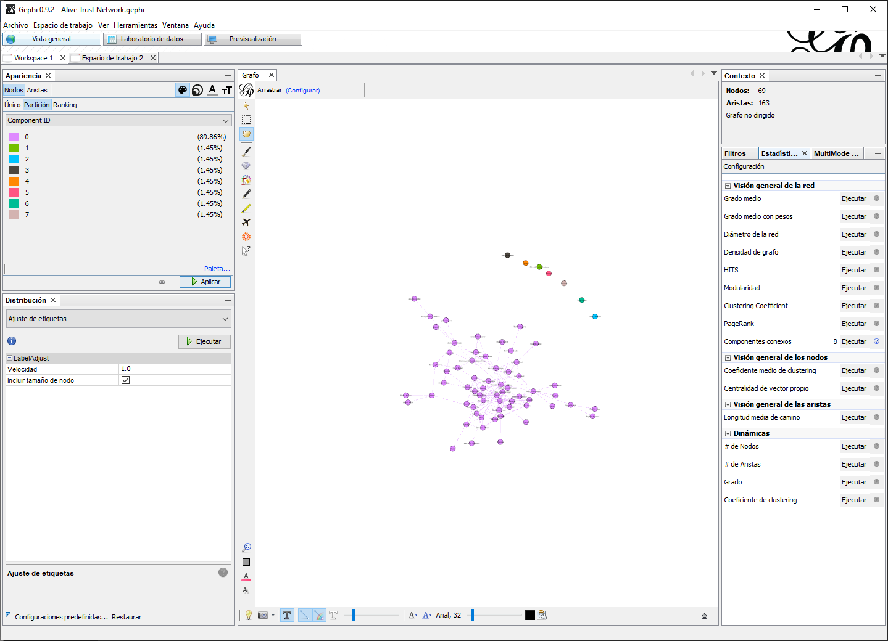
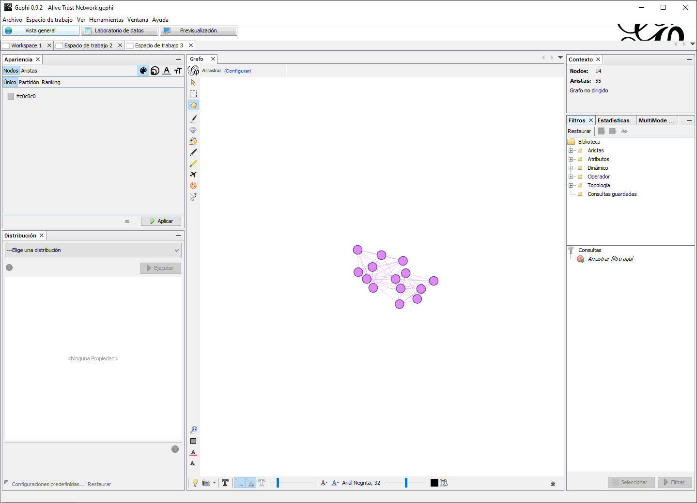

```{r setup, include=FALSE}
library(data.table)
library(DT)
library(igraph)
```

# Subgrupos Cohesivos

En este capítulo, exploraremos algunos (pero no todos) métodos para hallar subgrupos cohesivos de actores dentro de una red social. Los subgrupos cohesivos son subconjuntos de actores entre los cuales existen lazos fuertes, por ello los métodos que utilizaremos formalizan la noción de un grupo social utilizando las propiedades estructurales de una red social [@Wasserman1994].

En esta breve introducción cubriremos componentes, núcleos, grupos Newman y grupos de Louvain. Para poner este nuevo conocimiento en práctica, el capitulo concluye con un ejercicio practico de como implementar estas medidas en Gephi.

## Componentes

Estos son la forma mas simple de subgrupos cohesivos en ARSo. Simplemente, representan subredes en las cuales los miembros están conectados los unos a los otros (directa o indirectamente) pero no a miembros de otras subredes [@Everton2012, pp.171]. Los componentes pueden ser divididos en dos campos, fuertes o débiles. 

### Componentes Débiles

Los nodos en un grafo desconectado se pueden dividir en dos o mas subconjuntos de manera que no haya caminos entre los nodos en diferentes conjuntos [@Wasserman1994], estos subconjuntos del grafo se llaman componentes débiles. Localizar componentes débiles es apropiado para datos dirigidos o no dirigidos, puesto que el objetivo es localizar subconjuntos conectados. Tome por ejemplo la Figura \@ref(fig:weakcomp). En esta imagen, el color de los nodos denota el componente débil al que pertenecen. Como ve, encontramos tres componentes débiles en dicho gráfico, uno con cinco actores, una diada, y un aislado. 

```{r weakcomp, fig.cap = "Red con multiples componentes débiles"}
g <- data.frame(from = c("A", "A", "B", "A", "C", "D", "F", "H"),
           to   = c("B", "C", "D", "E", "E", "A", "G", "H")) %>%
  graph_from_data_frame(directed = FALSE,
                        vertices = data.frame(id    = LETTERS[1:8],
                                              color = c(rep("#1b9e77", 5),
                                                        rep("#d95f02", 2),
                                                        "#7570b3")
                                              )) %>%
  simplify(remove.loops = TRUE)

g %>%
  plot.igraph(
    layout             = layout_with_kk,
    vertex.size        = 30,
    vertex.label.color = "black",
    edges.color        = "grey")

```

El detectar componentes débiles no solo sirve para colorear los grafos, de hecho, una de las aplicaciones mas comunes es el aislar componentes. Por ejemplo, la densidad de el grafo en la Figura \@ref(fig:weakcomp) es `r edge_density(g)`. Este índice sugiere una red escarza, sin embargo, de manera visual podemos ver que algunos componentes son más densos que otros. Por ejemplo, el componente principal, aquel de mayor tamaño en un conjunto de subcomponentes, aparenta ser mas denso. Es por ello que podemos aislar este componente principal y al ejecutar la medida de densidad, vemos un valor de `r g %>% set_vertex_attr(name = "component", value = components(.)$membership) %>% induced_subgraph(which(V(.)$component == 1)) %>% edge_density()`. Otra manera de pensar en este proceso es que nos permiten enfocarnos en diferentes subconjuntos del grafo en nuestro análisis. 

### Componentes Fuertes

Este tipo de subgrupo solo es adecuado cuando los datos son dirigidos. @Easley2010 define los componentes fuertes en un grafo dirigido como subconjuntos de nodos en los cuales (A) que todos los nodos en el subconjunto pueden alcanzarse entre si y  (B) el subconjunto no es parte de un conjunto mayor con la propiedad de que todos los nodos pueden llegar a todos los demás [@Easley2010, pp. 388]. Este tipo de subgrupo solo es adecuado cuando los datos son dirigidos. Por ejemplo, en la Figura \@ref(fig:strongcomp) el color de los nodos nuevamente denota membresía a un subcomponente fuerte.

```{r strongcomp, fig.cap = "Red con multiples componentes fuertes"}
g <- data.frame(from = c("D", "B", "A", "A", "A", "C", "C", "G", "F", "H"),
                to   = c("B", "A", "D", "E", "C", "A", "E", "F", "G", "H")) %>%
  graph_from_data_frame(directed = TRUE#,
                        # vertices = data.frame(id    = LETTERS[1:8],
                        #                       color = c(rep("#1b9e77", 5),
                        #                                 rep("#d95f02", 2),
                        #                                 "#7570b3")
                                              #)
                        ) %>%
  set_vertex_attr(., name = "component",
                  value = components(., "strong")$membership) %>%
  set_vertex_attr(., name = "color",
                  value = c("#7fc97f",
                            "#beaed4",
                            "#fdc086",
                            "#ffff99")[as.factor(V(.)$component)]) %>%
  simplify(remove.loops = TRUE)

g %>%
  plot.igraph(
    layout             = layout_with_kk,
    vertex.size        = 30,
    vertex.label.color = "black",
    edge.color        = "grey",
    edge.arrow.width  = 2,
    edge.arrow.size   = 0.5)

```

Observe que en esta ocasión encontramos cuatro componentes fuertes, el primero se encuentra compuesto por un actor aislado {H}, el segundo es una diada reciproca {F, G}, el tercero es un solo actor {E}, y el cuarto sería el componente fuerte principal {A, B, C, D}. Es probable que se esté preguntando, ¿Por qué E no forma parte del componente fuerte principal? La razón la podemos encontrar en la definición de Easley y Kleinberg. Note que en el componente principal todos los nodos pueden alcanzarse entre sí, es decir, si cualquier nodo en el componente fuese a difundir alguna noticia atreves de sus contactos esta información podría retornar al originador. Esta dinámica se repite con la diada de los actores F y G. Sin embargo, E se encuentra en un componente único puesto que no alcanza a otros nodos.

Como puede ver, los componentes fuertes son mas restrictivos que los componentes débiles. Sin embargo, son utilices al trabajar con datos dirigidos puesto que permiten el análisis de subconjuntos donde todos los nodos pueden alcanzarse entre si tomando en cuenta la direccionalidad de vínculos dirigidos y el flujo potencial de información y/o recursos.

## K-cores

Otra forma de localizar subgrupos cohesivos en una red es basándose en grados nodales; específicamente, utilizando k-cores (o k-núcleos) que se definen en términos del grado mínimo, *k*, en un subgrafo o del número mínimo de adyacencia presentes [@Wasserman1994] . Por ejemplo, la Figura \@ref(fig:kcore) representa un grafo completo, es decir, 0-core. En este, vemos nodos aislados con cero enlaces, nodos pendientes con un solo vinculo y nodos con una variedad de grados de centralidad. Un 1k-core incluye todos los nodos conectados al menos a una persona (ver Figura \@ref(fig:kcore1)). Similarmente, un 2k-core incluye nodos conectados al menos dos otros nodos (ver Figura \@ref(fig:kcore2)). De igual manera podemos definir un 3k-core como nodos con tres o más vínculos (ver Figura \@ref(fig:kcore3)). Al aumentar *k* comenzamos a localizar el núcleo de actores mas interconectados de la red, de igual manera el subconjunto restante aumentara en densidad [@Valente2010]. 

::::{.row}
::::{.lcolumn-50}
```{r kcore, fig.cap = "Red completa"}
g <- data.frame(from = c("A", "A", "B", "A", "C", "D", "C", "C", "F", "H"),
                to   = c("B", "C", "D", "E", "E", "A", "B", "D", "G", "H")) %>%
  graph_from_data_frame(directed = FALSE) %>%
  simplify(remove.loops = TRUE) %>%
  set_vertex_attr(name = "coreness", value = coreness(.))

g %>%
  my_igraph(.layout = "layout_with_fr")
```
::::
::::{.rcolumn-50}
```{r kcore1, fig.cap = "1k-core"}
g %>%
  delete_vertices(v = which(V(.)$coreness < 1)) %>%
  my_igraph(.layout = "layout_with_fr")
```
::::
::::

::::{.row}
::::{.lcolumn-50}
```{r kcore2, fig.cap = "2k-core"}
g %>%
  delete_vertices(v = which(V(.)$coreness < 2)) %>%
  my_igraph(.layout = "layout_with_fr")
```
::::
::::{.rcolumn-50}
```{r kcore3, fig.cap = "3k-core"}
g %>%
  delete_vertices(v = which(V(.)$coreness < 3)) %>%
  my_igraph(.layout = "layout_with_fr")
```
::::
::::

El remover nodos incrementando *k* es una estrategia comúnmente utilizada por analistas de redes para describir la estructura de la red. Específicamente, para aislar el núcleo de la periferia, o los actores mas activos de los actores con pocas conexiones. 

## Girvan-Newman

El algoritmo de Girvan y Newman [-@Newman2004] detecta subcomunidades enfocándose en remover vínculos intermediarios entre subconjuntos de nodos con el propósito de localizar subcomponentes. Simplemente, en la red \@ref(fig:bowtie) vemos dos triadas cerradas conectadas a través de un puente. En este grafico los vínculos han sido dibujados de manera ponderada con base en la intermediación de cada enlace. El algoritmo de Girvan y Newman comienza por calcular la intermediación de los enlaces, remueve de manera sistemática aquellos con el mayor índice de intermediación y procede a recalcular intermediación de enlaces y remover enlaces con alto valor de manera iterativa. Supongamos que ejecutamos este algoritmos por un ciclo, entonces removeriamos el puente entre traídas lo cual produce dos subconjuntos mejor descritos como componentes débiles (ver, \@ref(fig:bowtie2)).   

::::{.row}
::::{.lcolumn-50}
```{r bowtie, fig.cap = "Red hipotética"}
g <- data.frame(from = c("A", "A", "B", "B", "D", "D", "E"),
                to   = c("B", "C", "C", "D", "E", "F", "F")) %>%
  graph_from_data_frame(directed = FALSE) %>%
  set_edge_attr(name = "width", value = edge.betweenness(., directed = FALSE))

coords <- layout_with_kk(g)

g %>%
  igraph::plot.igraph(
    layout       = coords,
    vertex.color = "lightblue",
    vertex.size  = 30,
    edges.color  = "grey")
```
::::
::::{.rcolumn-50}
```{r bowtie2, fig.cap = "Componentes débiles"}
g <- data.frame(from = c("A", "A", "B", "D", "D", "E"),
                to   = c("B", "C", "C", "E", "F", "F")) %>%
  graph_from_data_frame(directed = FALSE) %>%
  set_edge_attr(name = "width", value = edge.betweenness(., directed = FALSE))

g %>%
  igraph::plot.igraph(
    layout       = coords,
    vertex.color = "lightblue",
    vertex.size  = 30,
    edges.color  = "grey")
```
::::
::::

En practica, el algoritmo ejecuta este proceso y retorna un valor categórico correspondiente a la subcomunidad a la que pertenece cada nodo. Por lo tanto, el grafico original no se ve afectado y el analista gana información sobre la comunidad Girvan-Newman correspondiente para cada nodo. Por ejemplo, la Figura \@ref(fig:gn) contiene la red previa con comunidades Girvan-Newman resaltadas.

```{r gn, fig.cap="Comunidades Girvan-Newman y puentes resalatdos."}
g <- data.frame(from = c("A", "A", "B", "B", "D", "D", "E"),
                to   = c("B", "C", "C", "D", "E", "F", "F")) %>%
  graph_from_data_frame(directed = FALSE) %>%
  set_edge_attr(name = "width", value = edge.betweenness(., directed = FALSE)) %>%
  set_vertex_attr(name = "color", value = membership(cluster_edge_betweenness(.)))
cluster_edge_betweenness(g) %>% plot(., g)
```

El algoritmo de Girvan-Newman provee una forma de generar particiones de la red a grupos mutuamente exclusivos y un índice que mide la adecuación de estas particiones, de tal forma que el analista puede elegir entre estas particiones en busca de la más adecuada conforme a los datos de la red [@Valente2010, pp. 106]. Normalmente, la partición de la red que genera el índice de modularidad mas alto es considerado el punto óptimo [@Everton2012].

<!-- ```{r} -->
<!-- gn <- g %>% cluster_edge_betweenness()  -->
<!-- gn %>% plot_dendrogram(mode = "auto", use.modularity = FALSE) -->
<!-- ``` -->

<!-- ```{r} -->
<!-- library(ggplot2) -->
<!-- ggplot() + -->
<!--   geom_line(aes(y = gn$modularity, x = 1:length(gn$modularity))) + -->
<!--   xlab(NULL) + -->
<!--   ylab("Modularidad") -->

<!-- ``` -->


:::: {.infobox .note data-latex="note"}

La modularidad mide la fuerza de la división de una red en módulos (a veces llamados particiones, comunidades, etc.). En términos prácticos, las redes con alta modularidad tienen conexiones densas dentro de los módulos pero escasa entre estos. Se define como:

$$
Q = \frac{1}{2m} \sum_{i, j}[A_{ij} – \frac{k_{i}k_{j}}{2m}]\delta(c_i, c_j)
$$

Donde $A_{ij}$ es el peso del vinculo entre los nodos $i$ y $j$. $k_{i}$ y $k_{j}$ son los grados de cada nodo correspondiente. $\delta(c_i, c_j)$ o Kronecker delta donde el valor es 1.0 si ambos $i$ y $j$ corresponden a la misma partición, de otra manera el valor es 0.0. Por último, $m$ corresponde al número de vínculos en la red. 

El siguiente es un ejemplo de cómo calcular la modularidad de una red a mano a se base en el [ejemplo de Matthew Joseph](https://www.researchgate.net/post/Can_anyone_provide_a_short_example_of_how_the_modularity_is_being_calculated_in_networks) en ResearchGate y [luego Abhishek Mishra]( https://medium.com/walmartglobaltech/demystifying-louvains-algorithm-and-its-implementation-in-gpu-9a07cdd3b010). Empecemos con nuestra pequeña red \@ref(fig:tie3) y su matriz de adyacencia \@ref(eq:tiemat).

::::{.row}
::::{.lcolumn-50}
```{r tie3, fig.cap = "Red hipotética"}
g <- data.frame(from = c("A", "A", "B", "B", "D", "D", "E"),
                to   = c("B", "C", "C", "D", "E", "F", "F")) %>%
  graph_from_data_frame(directed = FALSE) 

g %>%
  igraph::plot.igraph(
    layout       = layout_with_kk,
    vertex.color = "lightblue",
    vertex.size  = 30,
    edges.color  = "grey")
```
::::
::::{.rcolumn-50}
\begin{matrix}
  & A & B & C & D & E & F \\
A & - & 1 & 1 & 0 & 0 & 0 \\
B & 1 & - & 1 & 1 & 0 & 0 \\
C & 1 & 1 & - & 0 & 0 & 0 \\
D & 0 & 1 & 0 & - & 1 & 1 \\
E & 0 & 0 & 0 & 1 & - & 1 \\
F & 0 & 0 & 0 & 1 & 1 & - \\
(\#eq:tiemat)
\end{matrix}
::::
::::

Como mencionamos previamente, la implementación del algoritmo Girvan-Newman comienza por remover el vinculo con la mayor intermediación, en este caso el puente entre los actores D y B. Aquí utilizaremos esta partición como punto de partida, es decir, la primera partición contiene los nodos {A, B, C} y la segunda {D, E, F}. Igualmente, el numero de enlaces en este grafo es $m$ = 7 y el grado de cada es equivalente a:

\begin{matrix}
  & Grado \\
A &  2    \\
B &  3    \\
C &  2    \\
D &  3    \\
E &  2    \\
F &  2    \\
(\#eq:attribute-matrix)
\end{matrix}

Con esta información disponible, podemos calcular la modularidad del grafo:

\begin{align*}
    Q = \frac{1}{2 \times 7} ((0 - \frac{2 \times 2}{(2 \times 7)}) \times 1 &+ && \text{A a A: no connectados (0), mismo grupo (1)}\\
    (1 - \frac{2 \times 3}{(2 \times 7)}) \times 1 &+ && \text{A a B: connectados (1), mismo grupo (1)}\\
    (1 - \frac{2 \times 2}{(2 \times 7)}) \times 1 &+ && \text{A a C: connectados (1), mismo grupo (1)}\\
    (0 - \frac{2 \times 3}{(2 \times 7)}) \times 0 &+ && \text{A a D: no connectados (0), otro grupo (0)}\\
    (0 - \frac{2 \times 2}{(2 \times 7)}) \times 0 &+ && \text{A a E: no connectados (0), otro grupo (0)}\\
    (0 - \frac{2 \times 2}{(2 \times 7)}) \times 0 &+ && \text{A a F: no connectados (0), otro grupo (0)}\\
    (0 - \frac{3 \times 2}{(2 \times 7)}) \times 1 &+ && \text{B a B: no connectados (0), mismo grupo (1)}\\
    (1 - \frac{3 \times 2}{(2 \times 7)}) \times 1 &+ && \text{B a A: connectados (1), mismo grupo (1)}\\
    (1 - \frac{3 \times 2}{(2 \times 7)}) \times 1 &+ && \text{B a C: connectados (1), mismo grupo (1)}\\
    (1 - \frac{3 \times 3}{(2 \times 7)}) \times 0 &+ && \text{B a D: connectados (1), otro grupo (0)}\\
    (0 - \frac{3 \times 2}{(2 \times 7)}) \times 0 &+ && \text{B a E: no connectados (0), otro grupo (0)}\\
    (0 - \frac{3 \times 2}{(2 \times 7)}) \times 0 &+ && \text{B a F: no connectados (0), otro grupo (0)}\\
    &...)
\end{align*}

Podemos simplificar la operación previa como:

\begin{align*}
    Q = \frac{1}{2 \times 7} (4(1) + 2(0.5)) = 0.3571
\end{align*}

La modularidad con los nodos {A,B,C} y {D, E,F} en particiones separadas es igual a $Q$ = 0.3571. En este ejemplo no continuaremos removiendo enlaces y asignando nuevas particiones, como lo haría el algoritmo Girvan-Newman. El objetivo de este ejercicio breve es presentarle en mayor detalle el mecanismo utilizado para calcular la modularidad de una red y determinar el número óptimo de subcomunidades. 
::::

## Louvain

Publicado originalmente en 2008, el método Louvain es un método de optimización codicioso que intenta optimizar la modularidad de las particiones de la red. Esencialmente, la optimización se lleva a cabo en dos pasos. Primero, el método encuentra pequeñas comunidades locales optimizando la modularidad. Luego, agrega nodos que pertenecen a las comunidades identificadas y construye una nueva red con esos nodos colapsados. El proceso continúa hasta que se identifique la máxima modularidad y se produzca una jerarquía de comunidades [@Blondel2008].

```{r process, fig.cap="Visualización de los pasos en el algoritmo", out.width="100%"}
g <- data.frame(from = c("A", "A", "A", "B", "B", "C",
                         "E", "E", "E", "F", "F", "G",
                         "I", "I", "I", "J", "J", "K",
                         "M", "M", "M", "N", "N", "O",
                         "B", "G", "L", "P"),
                to   = c("B", "C", "D", "C", "D", "D",
                         "F", "G", "H", "G", "H", "H",
                         "J", "K", "L", "K", "L", "L",
                         "N", "O", "P", "O", "P", "P",
                         "F", "J", "N", "D")) %>%
  graph_from_data_frame(directed = FALSE) %>%
  set_vertex_attr(name  = "louvain_group",
                  value = membership(cluster_louvain(.)))

coords <- layout_with_kk(g)

par(mfrow=c(1,3))

g %>%
  igraph::plot.igraph(
    layout       = coords,
    vertex.color = "lightblue",
    vertex.size  = 30,
    edges.color  = "grey",
    main         = "Gráfico inicial")

g %>%
  igraph::plot.igraph(
    layout       = coords,
    vertex.color = V(.)$louvain_group,
    vertex.size  = 30,
    edges.color  = "grey",
    main         = "Optimización de la modularidad")

contract(g, V(g)$louvain_group, vertex.attr.comb=toString) %>%
  igraph::plot.igraph(
    layout       = layout_with_fr,
    vertex.color = as.factor(V(.)$louvain_group),
    vertex.size  = 30,
    edges.color  = "grey",
    main         = "Agregación comunitaria")
```

La Figura \@ref(fig:process) es una representación gráfica una sola ronda en el proceso. Sin embargo en términos prácticos, el proceso resulta en particiones que denotan las subcomunidades a las que pertenece cada nodo. La red izquierda de la Figura \@ref(fig:bigone) consta de 100 nodos, a su derecha vemos las subcomunidades optimas detectadas por el algoritmo de Louvain. Es importante recalcar que el objetivo del algoritmo es optimizar la modularidad y por consiguiente los grupos resultantes son una representación matemática de lo patrones de enlaces en el gráfico. Sin embargo, este tipo de herramienta analítica es útil en localizar comunidades cohesivas donde los miembros tienen normas, valores o aptitudes similares. Otra manera de pensar en esto es que los nodos dentro de cada grupo pueden seleccionarse a si mismos como parte del grupo o las presiones sociales del grupo pueden persuadir a los nuevos miembros para que adopten normas o valores del grupo [@Valente2010, 108].  

```{r bigone, fig.cap="Red sin escala (izquierda) y red sin escala con particiones (derecha)", out.width="100%"}
g <- sample_smallworld(dim = 1, size = 100, nei = 3, p = 0.05)

par(mfrow=c(1,2))
louv   <- cluster_louvain(g)
coords <- layout_with_kk(g)

g %>%
  igraph::plot.igraph(
    layout       = coords,
    vertex.color = "lightblue",
    vertex.label = NA,
    vertex.size  = 10,
    edges.color  = "grey")

louv %>% plot(., g,
              layout       = coords,
              vertex.label = NA,
              vertex.size  = 10,
              edges.color  = "grey")

```


## Ejercicio Práctico

Los científicos sociales generalmente asumen que "la interacción social es la base de la solidaridad, las normas compartidas, la identidad y el comportamiento colectivo, por lo que es probable que las personas que interactúan intensamente se consideren parte de un grupo social". Por lo tanto, una herramienta principal del análisis de redes sociales es identificar grupos densos de actores "entre los cuales hay vínculos relativamente fuertes, directos, intensos y / o positivos". Por lo general, se denominan "subgrupos cohesivos", "subredes" o "subgrupos". Una forma de agrupar a los actores se basa en atributos compartidos (por ejemplo, raza, género, etc.). Otro es utilizar el patrón de vínculos entre actores. 

En un mundo ideal, habría un solo algoritmo para identificar subgrupos cohesivos, pero este no es un mundo ideal, por lo que los analistas de redes sociales han desarrollado una variedad de algoritmos para identificar subredes. No los consideraremos todos aquí; simplemente hay demasiados. En cambio, nos centraremos en algunos. En Gephi consideraremos componentes, k-cores y algoritmos de detección de comunidades; y en snExplorer veremos brevemente los recuentos de componentes, k-núcleos y camarillas.


### Antes de Empezar

Para este ejercicio vamos a necesitar el módulo *Newman-Girvan* clustering antes de comenzar Haga esto siguiendo los mismos pasos que utilizamos en para descargar el modulo *MultimodeNetworks Transformation* en ejercicio práctico en el capitulo [Derivando Datos Modo-Uno de Modo-Dos]. 

### Identificación de Subgrupos en Gephi

::::{.row}
::::{.lcolumn-20}
*[Gephi]*

*Archivo > Abrir* 
::::
::::{.rcolumn-80}
  1.	Abra Gephi y lea el archivo `alive_trust_network.gephi`, que puede descargar [aquí](https://github.com/cjcallag/arso/blob/main/data/subgroups/alive_trust_network.gephi?raw=true). Comenzaremos explorando componentes, estos son subgrupos de actores que están conectados (ya sea directa o indirectamente) entre sí. En las redes dirigidas, puede identificar dos tipos de componentes: fuertes y débiles. Los componentes fuertes toman en cuenta la dirección de los lazos, mientras que los componentes débiles no. Con redes no dirigidas, solo puede identificar componentes débiles.
::::
::::

::::{.row}
::::{.lcolumn-20}
*[Vista general]*

*Estadísticas > Componentes conexos > Ejecutar*
::::
::::{.rcolumn-80}
  2.	Para identificar componentes en Gephi, haga clic en *Ejecutar* junto a la función *Componentes conexos* en la pestaña *Estadísticas*. Aparecerá un cuadro de diálogo titulado *Parámetros de Componenetes Conectados* (no se muestra) que ofrece la opción de indicar si nuestros datos son *Dirigidos* o *No dirigidos*. Aquí, estamos trabajando con datos no dirigidos, así que elija esta opción y haga clic en *Aceptar*. Ahora deberá aparecer el informe *Connected Componenets Report* (Reporte de Componentes conectados) (Figura \@ref(fig:1)), que reporta los parámetros de la red, el número de componentes *Results* (Resultados) y un gráfico que indica el número y tamaño de cada uno de los componentes. Como puede ver, Gephi encontró 8 componentes, pero al comparar esta cifra con el gráfico de red, podemos ver que 7 de estos son nodos aislados. Igualmente podemos llegar a esta conclusión examinando el gráfico en el informe. Si observa verá que hay 7 componentes de tamaño 1 y un componente de un poco más grande que 60 (62 en realidad). Cierre la ventana del informe cuando haya terminado.
::::
::::

```{r 1, fig.cap="Reporte de Componentes Conectados en Gephi"}
knitr::include_graphics("images/03-09-01.png")
```

```{r 2, fig.cap="Red de confianza con actores vivos, color por componente"}

```


::::{.row}
::::{.lcolumn-20}
*[Laboratorio de datos]*

*Tabla de datos > Nodos*

*[Vista general]*

*Apariencia > Nodos > Color > Partición > --Escoge un atributo > Component ID > Aplicar*
::::
::::{.rcolumn-80}
  3.	También puede ver los resultados navegando al *Laboratorio de datos* y buscando una nueva columna (partición) en la sección *Nodos* denominada *Component ID* (identificación del componente). Gephi genera una serie de números, comenzando con 0, que identifican los componentes respectivos de cada actor. También podemos usar esta variable categórica para visualizar la red, seleccionando primero la opción *Nodos> Color> Partición* en la pestaña *Apariencia*, y luego con el menú desplegable *--Escoge un atributo*, seleccione *Component ID* y de clic en *Aplicar*. El resultado no es muy interesante (Figura \@ref(fig:2)) ya que cada nodo aislado posee un color diferente, mientras que los actores conectados en el componente más grande (llamado componente principal) son todos del mismo color. 
::::
::::

::::{.row}
::::{.lcolumn-20}
*[Vista general]*

*Filtros > Atributos > Partición > Queries > Partition > Filter > Export filtered graph to a new workspace*

::::
::::{.rcolumn-80}
  4.	No obstante, puede que algunas ocasiones sea útil identificar el componente principal. De hecho, no es raro que los investigadores extraigan el componente principal y lo analicen por separado. Por lo tanto, exportaremos el componente principal a un espacio de trabajo separado donde lo analizaremos por separado. Para hacer esto, en la pestaña *Filtros* a la derecha de la ventana *Vista general*, primero seleccione *Atributos* y luego *Partición*. A continuación, arrastre la partición *Component ID* a *Consultas*. En las opciones abajo, haga clic en el cuadro que tiene el mayor porcentaje de nodos (probablemente `0`), haga clic en *Filtrar* y luego use el botón *Exportar el grafo filtrado en un nuevo espacio de trabajo* (Figura \@ref(fig:3)). **¿Cuál es el tamaño del componente principal? ¿Cuál es su densidad? ¿Grado medio?**
::::
::::

```{r 3, fig.cap="Red de confianza con actores vivos, componente principal"}
knitr::include_graphics("images/03-09-03.png")
```


::::{.row}
::::{.lcolumn-20}

::::
::::{.rcolumn-80}
  5.	Veamos si identificar *k-cores* es una mejor estrategia para identificar subgrupos cohesivos para esta red en particular. La "k" en k-core indica el número mínimo de vínculos de cada actor dentro del núcleo (“core”); por ejemplo, un núcleo 2 incluye a todos los actores que tienen dos o más conexiones con otros actores dentro del núcleo, y un núcleo 3 incluye todos los actores que tienen tres o más vínculos con otros actores dentro de un núcleo. Es importante tener en cuenta que el k-core más alto de una red no corresponde necesariamente al puntaje de centralidad de grado más alto obtenido por un actor en la red. Más bien, es el subgrupo en el que cada actor comparte el mayor número de vínculos. Imagínese una red en la que un actor tiene seis vínculos, pero nadie más tiene más de cuatro. El k-core más alto no sería un 6-core porque todos los demás en el subgrupo también necesitarían tener seis enlaces.
::::
::::

::::{.row}
::::{.lcolumn-20}
*Filtros > Topología > K-core*
::::
::::{.rcolumn-80}
  6.	Regrese a la pestaña *Alive Trust Network*. Una vez más usaremos un filtro para encontrar k-cores. Esta vez, arrastre la opción *K-core* que se encuentra sección de *Topología* en la pestaña *Filtro* a *Consultas*. Hacia la parte inferior de la pestaña *Filtros*, debería ver un cuadro *K-core Configuración* que estará predeterminado en *1*. Haga clic en el botón *Filtrar* y los aislados deberán desaparecer. Aumente la configuración a *2* y no debería haber ningún cambio. Eso es porque Gephi aparentemente cuenta los lazos dos veces, para reflejar las dos direcciones de un enlace aunque, en este caso, Gephi sabe (o debería saber) que se trata de una red no dirigida. Por lo tanto, el filtro de 1 y 2 capturan el primer núcleo (k = 1), 3 y 4 capturan el segundo núcleo (k =2), y así sucesivamente. Si sigue aumentando la configuración, todos los nodos desaparecen al llegar a quince, lo que significa que el núcleo k más alto de la red es el séptimo núcleo (14/2). Vea la Figura \@ref(fig:4). Exporte el 7-core a un nuevo espacio de trabajo. **¿Qué actores parecen ser los más centrales en la red del séptimo núcleo (k = 7)?**
::::
::::

```{r 4, fig.cap="Red de confianza con actores vivos, 7-core"}

```

::::{.row}
::::{.lcolumn-20}
*[Vista general]*

*Estadísticas > Girvan-Newman Clustering > Ejecutar*
::::
::::{.rcolumn-80}
  7.	Ahora consideremos otro método para identificar subgrupos: algoritmos de detección de comunidades. Consideraremos dos: Girvan-Newman y Louvain. El segundo estará implementado automaticamente en Gephi, pero Girvan-Newman no, por lo que deberá descargar e instalar el módulo Newman-Girvan Clustering, si aún no lo ha hecho. En la pestaña *Estadísticas* de Alive Trust Network, haga clic en el botón *Ejecutar* a un lado de función *Girvan-Newman Clustering*. Esto abrirá un cuadro de diálogo (no se muestra). Acepte sus valores predeterminados y haga clic en "*Aceptar*. Esto producirá un informe (no se muestra) que indica el número de comunidades que detectó y la modularidad. **¿Cuántas comunidades encontró el algoritmo?** 
::::
::::

::::{.row}
::::{.lcolumn-20}
*Apariencia > Nodos > Color > Partición > --Escoge un atributo > Cluter-ID > Aplicar*
::::
::::{.rcolumn-80}
  8.	Asimismo, coloree los nodos según la partición creada por el algoritmo (Cluter-ID). Note que el algoritmo Girvan-Newman ha asignado cada uno de los aislados a una comunidad separada. No todos los algoritmos de detección de comunidades tratan los aislamientos de esta manera, por lo que cuando compare los resultados de dos o más de ellos, tenga esto en cuenta.
::::
::::

::::{.row}
::::{.lcolumn-20}
*Estadísticas > Modularidad > Ejecutar*
::::
::::{.rcolumn-80}
  9.	Ahora, repitamos el proceso con el algoritmo de Louvain, que se implementa mediante la función *Modularidad* en la pestaña *Estadísticas*. Esto abrirá un cuadro de diálogo (no se muestra). Tenga en cuenta que incluye un parámetro de ajuste (*Resolución*), que le permite ajustar si desea obtener menos o más comunidades. Por ahora, haga clic en *Aceptar*. Esto produce un informe (no se muestra). **¿Cuántas comunidades encontró el algoritmo? ¿Qué es la modularidad?¿Cómo se compara esto con los resultados de Girvan-Newman?**
::::
::::

::::{.row}
::::{.lcolumn-20}
*Apariencia > Nodos > Color>Partición > --Escoge un atributo >Modularity Class > Aplicar*
::::
::::{.rcolumn-80}
10.	Coloree los nodos usando la partición creada por el algoritmo de Louvain (*Clase de modularidad*). Debido a que hay más de ~8 comunidades, deberá ajustar la paleta de colores como hicimos en laboratorios anteriores. **¿Louvain asigna a cada aislado en una comunidad separada?** 
::::
::::

::::{.row}
::::{.lcolumn-20}
*Generate groups by partition*
::::
::::{.rcolumn-80}
  11.	Ahora colapse la red usando la herramienta *Generate groups by partition* (Generar grupos por partición). Asegúrese de decirle a Gephi que cree un nuevo espacio de trabajo. Recuerde que los atributos son aspectos no relacionales de las redes. Pueden ser previamente dados (por ejemplo, rol, género, nacionalidad) o pueden ser generados por nuestro análisis de una red. Los algoritmos de agrupación, como los núcleos k y los de detección de comunicación, clasifican actores en varios subgrupos, y la partición de "pertenencia" del subgrupo es un atributo de actor.
::::
::::

::::{.row}
::::{.lcolumn-20}

::::
::::{.rcolumn-80}
12.	Visualice la red reducida. **¿Aparece algún subgrupo (o subgrupos) más central que otros?**
::::
::::