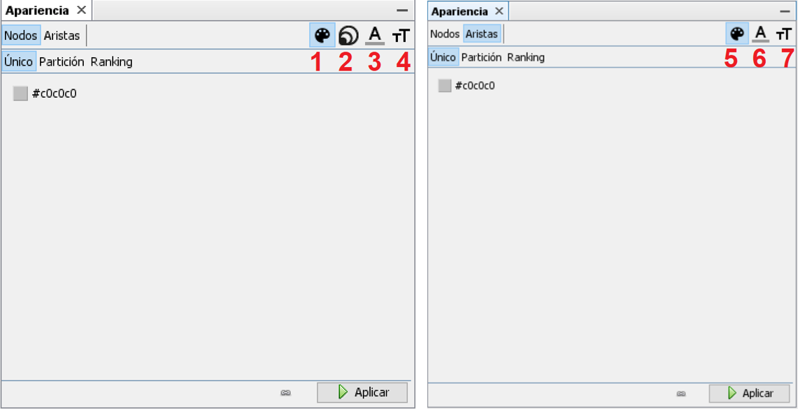
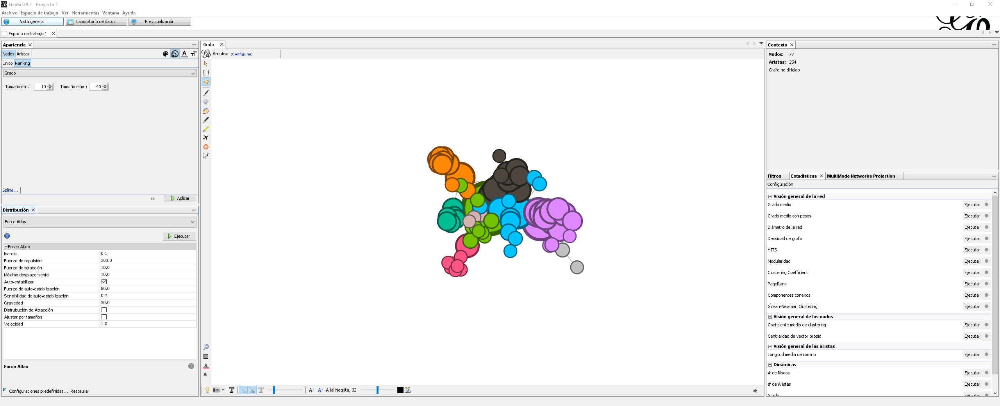
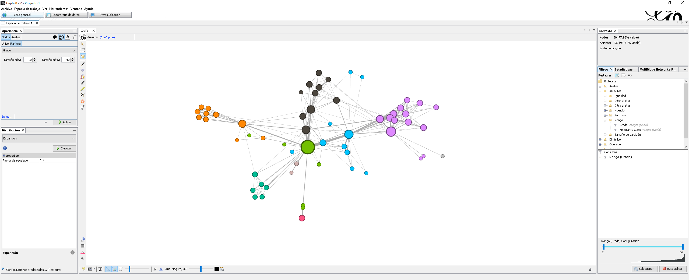
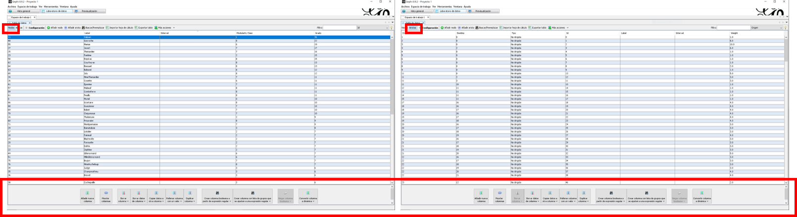
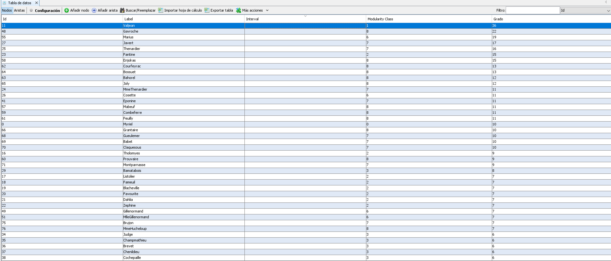
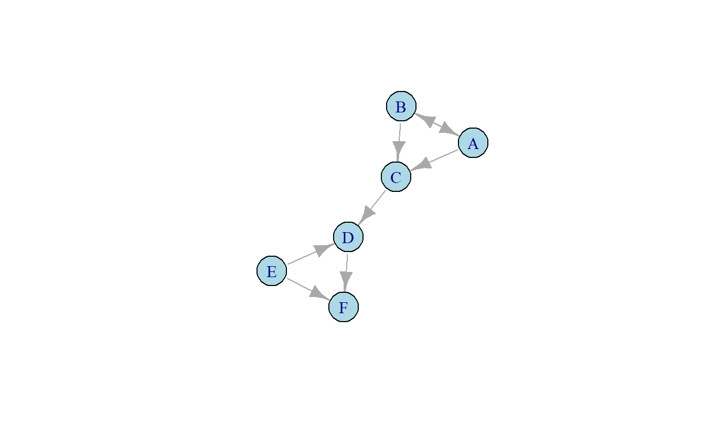

# (PART) ARSo: Tecnicas {-}

# Trabajando con Gephi


## Introducción

> [El ARSo] es una colección de teorías y métodos que suponen que el comportamiento de los actores (por ejemplo, individuos, grupos u organizaciones) se ve profundamente afectado por sus vínculos con otros y las redes en las que están incrustados -- [@Everton2012]

Como puede ver en el pasaje y los capítulos previos, ARSo se basa en algoritmos gráficos y matemáticos complejos. Esto no quiere decir “software”, si bien las semillas de este campo de estudio empezaron a madurar mucho antes del desarrolló de computadoras modernas.

Hoy en día existen múltiples paquetes de software desarrollados para asistir al analistas de ARSo en sus iniciativas laborales o académicas. Por consiguiente, sería ilógico presentarle métodos para trabajar con datos de redes sociales “a mano”. Sin embargo, el enfoque de este documento no es darle una presentación completa de las herramientas de software disponibles en este campo, para ello consulte [CITA] o [CITA]. Nuestro objetivo es mucho más limitado, presentarle métodos para grabar, manipular y visualizar datos de redes y asimismo presentarle la aplicación de estas técnicas y métodos en la plataforma de software Gephi.


## Gephi

De acuerdo con los autores de Gephi, la plataforma es “una herramienta para analistas de datos y científicos interesados en explorar y comprender gráficos. Como Photoshop ™, pero para los datos de grafo, el usuario interactúa con la representación, manipula las estructuras, formas y colores para revelar patrones ocultos. El objetivo es ayudar a los analistas de datos a hacer hipótesis, descubrir patrones intuitivamente, aislar singularidades o fallas de estructura durante la recopilación de datos” [@gephi]. Para nuestros propósitos utilizaremos esta interfaz para complementar el material y facilitar nuestro un análisis exploratorio. Antes de comenzar los siguientes capítulos, descargue gratuitamente la herramienta desde [el sitio web de Gephi.](https://gephi.org/)

Como todas las herramientas de software, esta tiene ventajas y desventajas. Es importante el explicar por qué hemos elegido esta herramienta sobre algunas de las demás. Nos gustaría recalcar cuatro:
  
  1. Es una [herramienta de fuente abierta](https://github.com/gephi/gephi), por consiguiente, podemos descargar y utilizarla libre de costo. 
  2. Incluye una gran variedad de herramientas de visualización, algoritmos gráficos y matemáticos complejos, capacidades para ingerir y manipular varios formatos de datos y es extensible utilizando docenas de complementos creados por la comunidad abierta de usuarios que amplían las funcionalidades del software. 
  3. Existe una gran comunidad de usuarios y desarrolladores quienes activamente contribuyen al [crecimiento de la plataforma](https://github.com/gephi/gephi/issues), [manuales de usuario](https://gephi.org/users/), [tutoriales](https://www.youtube.com/watch?v=2FqM4gKeNO4) y publican artículos utilizando esta herramienta (por ejemplo, @chaudhary).  
  4. Este manual está diseñado para hispanohablantes, la interfaz de Gephi se puede configurar en español.

En las siguientes secciones continuaremos introduciendo este programa, sus interfaces, características, capacidades de visualización, fortalezas, debilidades, etc. 

## Gephi 101

Las siguientes subsecciones le brindaran una breve introducción a la plataforma Gephi y sus tres secciones principales. Esta no es la única vez que cubriremos algunos de los conceptos básicos de Gephi; como tal, esta sección está diseñada para ser una descripción general de alto nivel.

### Antes de Empezar

Primero, descargue e instale el software en su computadora. Como se había mencionado previamente el software es gratuito y [distribuido abiertamente](https://gephi.org/users/download/). Gephi es una aplicación multiplataforma desarrollada en Java, por lo que requiere una instalación previa de Java versión o posterior, la cual puede obtener libremente [en línea](https://www.java.com/en/download/). Para computadoras Mac OS X, Java se incluye con la aplicación, por lo que no es necesario instalarlo por separado. En Windows y Linus, el sistema debe estar equipado con Java.

Si bien no hay requisitos mínimos de hardware, el rendimiento es una función de la memoria. Además, se requiere una tarjeta gráfica compatible para ejecutar Gephi.

### Inicie Gephi

Empiece por localizar y abrir el programa. Lo primero que vera es una ventanilla de Bienvenida, vea la Figura \@ref(fig:bienvenida). 

<div class="figure" style="text-align: center">

<p class="caption">(\#fig:bienvenida)Menú de Bienvenida en Gephi</p>
</div>

Para esta breve instrucción al software, vamos a usar uno de los conjuntos de datos proporcionados por el software, `Les Misrables.gexf` [@Knuth1993]. Localice este con que puedo localizar en la parte inferior derecha de la ventanilla de bienvenida. Al seleccionar esta opción aparecerá una nueva ventanilla, en el futuro explicaremos más acerca de la opción en este espacio, por ahora seleccione el botón *Aceptar*. ¡Listo! Con el conjunto de datos cargado (Figura Figura \@ref(fig:les-mis)), podemos empezar a explorar Gephi.

<div class="figure" style="text-align: center">

<p class="caption">(\#fig:les-mis)Datos Les Misrables Cargados</p>
</div>

### Vista General

Esta es la ventana que utilizará más a menudo, ver Figura \@ref(fig:overview). Aquí podrá tomar diferentes acciones para manipular la aparencia sus gráficos, filtrar información y calcular medidas de red, arista, o nodo.

<div class="figure" style="text-align: center">

<p class="caption">(\#fig:overview)Gephi: Vista General</p>
</div>

La característica más obvia de esta ventana es el gráfico prominente en el centro; sin embargo, hay varias ventanillas relevantes; aquí, las cubriremos en orden alfabético.

#### Apariencia

El cuadro de apariencia le permite cambiar las características visuales de los nodos, aristas y etiquetas [@kateto2016]. Las opciones se bifurcan para trabajar en la apariencia de nodos aristas, accesibles a través de las pestañas correspondientes (*Nodos* y *Aristas*). Para editar nodos o aristas se le presenta una serie de opcionesen el lado derecho de este cuadro, divididas de tal manera (ver Figura \@ref(fig:apariencia)):

  - *Nodos*:
    - *Color* (1): Modificar el color de los nodos
    - *Tamaño* (2): Modificar el tamaño de cada nodo
    - *Color de etiqueta* (3): Modificar el color de las etiquetas de los nodos
    - *Tamaño de etiqueta* (4): Modificar el color de las etiquetas de los nodos
  
  - *Aristas*:
    - *Color* (5): Modificar el color de los nodo
    - *Color de etiqueta* (6): Modificar el color de las etiquetas de los aristas
    - *Tamaño de etiqueta* (7): Modificar el tamaño de las etiquetas de los aristas

<div class="figure" style="text-align: center">

<p class="caption">(\#fig:apariencia)Gephi: Apariencia</p>
</div>

Cada sección contendrá de dos a tres pestañas: *Único*, *Partición* y *Ranking*. Veamos como funcionan con utilizando el software:

::::{.row}
::::{.lcolumn-20}
*Nodos > Color > Único > Clic sostenido sobre el cuadro de color > Seleccionar color > Aplicar*

*Aristas > Color > Único > Clic sostenido sobre el cuadro de color > Seleccionar color > Aplicar*
::::
::::{.rcolumn-80}
 *Único* cambia los elementos de manera uniforme por color o tamaño seleccionado. Por consiguiente, para modificar el tamaño color de los nodos en gráfico, proceda a seleccionar *Nodos > Color > Único > Clic sostenido sobre el cuadro de color > Seleccionar color > Aplicar*. Si desea modificar el color de las aristas para que reflejen un valor único, seleccione *Nodos > Color > Único > Clic sostenido sobre el cuadro de color > Seleccionar color > Aplicar*. En la Figura \@ref(fig:color-unique) los nodos han sido coloreados de negro (`#000000`) y las aristas de gris (`#adadad`), que Gephi define colores utilizando una combinación hexademicial de números y letras definida por su mezcla de rojo, verde y azul.
::::
::::

<div class="figure" style="text-align: center">

<p class="caption">(\#fig:color-unique)Nodos y Aristas con Colores Únicos</p>
</div>

::::{.row}
::::{.lcolumn-20}
*Nodos > Tamaño > Único > 20 > Aplicar*
::::
::::{.rcolumn-80}
Para modificar el tamaño de los nodos, igualmente usaremos la opción Único. Sin embargo, en esta secuencia modificaremos la característica a cambiar de la siguiente manera: *Nodos > Tamaño > Único > 20 > Aplicar*. Como vera en la Figura \@ref(fig:size-unique) todos los nodos en el grafico aparecen con el mismo tamaño. 
::::
::::

<div class="figure" style="text-align: center">

<p class="caption">(\#fig:size-unique)Nodos con Tamaño Único</p>
</div>


::::{.row}
::::{.lcolumn-20}
*Nodos > Color > Partición > --Escoge un atributo > Modularity Class > Aplicar*
::::
::::{.rcolumn-80}
La *Partición* cambia todos los elementos visibles utilizando valores de atributos categóricos. Por ejemplo, el conjunto de datos que seleccionamos tiene un atributo categórico, `modularidad`, que representa el subgrupo al que pertenece cada nodo. Usando ese atributo podemos cambiar el color de los nodos seleccionando *Nodos > Color > Partición > --Escoge un atributo > Modularity Class > Aplicar*. Una vez aplicado, los colores de los nodos deberían permitirle entender qué nodos pertenecen a las misma comunidades. De manera similar, podríamos intentar cambiar los colores de las aristas basándonos en un atributo categórico; sin embargo, el conjunto de datos de ejemplo no incluye dicho tipo de variable.
::::
::::

<div class="figure" style="text-align: center">

<p class="caption">(\#fig:color-partition)Nodos Coloreados por Atributos Categoriales.</p>
</div>

::::{.row}
::::{.lcolumn-20}
*Nodos > Tamaño > Ranking > --Escoge un atributo > Grado > Aplicar*
::::
::::{.rcolumn-80}
El *Ranking* cambia todos los elementos visibles utilizando valores de atributos continuos. Por ejemplo, el conjunto de datos que seleccionamos tiene un atributo continuo, `grado`, que representa el numero de enlaces que tiene cada nodo. Usando ese atributo podemos cambiar el tamaño de los nodos seleccionando *Nodos > Tamaño > Ranking > --Escoge un atributo > Grado > Aplicar*. Ahora deberá ver que algunos nodos aparecen mucho más grandes que otros, esto se debe a que algunos tienen más conexiones. Más adelante en el libro ampliaremos el significado de esta medida y presentaremos otras. Quizás se este preguntando, ¿es posible cambiar el grosor de las aristas en función de una variable continua? La respuesta es sí, pero hacerlo requiere un menú diferente, por lo que abordaremos esto más adelante.
::::
::::

<div class="figure" style="text-align: center">

<p class="caption">(\#fig:size-ranking)Nodos Dimensionados por Variable Continua.</p>
</div>


#### Contexto

Esta sección proporciona información sobre las propiedades básicas del gráfico; específicamente, el número de nodos y aristas y si el gráfico es dirigido o no.

#### Distribuición

ARSo depende en gran medida de la exploración de datos a través de buena visualización. Esta es una de las características clave de Gephi, contiene una buena cantidad de algoritmos de diseño de gráficos y los ejecuta bastante rápido (todo dependiendo de la potencia de su procesador). La ventana *Distribuición* le permite al usuario seleccionar entre una serie de algoritmos de diseño de gráficos y modificar los parámetros preestablecidos según sea necesario. En esta sección exploraremos algunos de los algoritmos gráficos más notables incluidos con la instalación base de Gephi.


::::{.row}
::::{.lcolumn-20}
*Elije una distribuición > Force Atlas > Ejecutar*
::::
::::{.rcolumn-80}
*Force Atlas* y *Force Atlas 2* son algoritmos de diseño dirigidos por fuerza, producido por los desarrolladores de Gephi, que permite visualizar efectivamente gráficos de tamaño pequeño a mediano [@Jacomy2011]. Estos son algoritmos continuos, es decir que el permiten que el analista edite al gráfico mientras el algoritmo dibuja; asimismo, significa que además de *Ejecutar* el algoritmo hay que seleccionar *Parar* cuando uno este satisfecho con el diseño. Veamos como funciona este algoritmo, para ello en la sección de Distribución seleccione *Elije una distribuición > Force Atlas > Ejecutar*. Después de un par de minutos, recuerde en dar clic sobre el botón *Parar*. Como puede ver, el algoritmo a contraído los nodos. Esta es una característica de los algoritmos dirigidos por fuerza donde los nodos vinculados se atraen entre si y los nodos no vinculados se repelen.
::::
::::

<div class="figure" style="text-align: center">

<p class="caption">(\#fig:force-atlas)Gráfico dibujado con Force Atlas</p>
</div>


::::{.row}
::::{.lcolumn-20}
*Elije una distribuición > Expansión  > Ejecutar*

*Elije una distribuición > Contracción  > Ejecutar*
::::
::::{.rcolumn-80}
Uno de los algoritmos de diseño más útiles es *Expansión*, el cual aumenta el tamaño de la red pero mantiene la ubicación relativa de los nodos constante. Tenga en cuenta que la opción Contracción que nos permitirá volver a introducir una red si se expande demasiado. El polo opuesto de esta opción es *Contracción*, que permite compactar la red manteniendo la ubicación relativa de los nodos. Ambas opciones so ejecutadas de manera instantánea, por consiguiente, no hay que detener el algoritmo.

Por ejemplo, la Figura \@ref(fig:expansion) es una versión expandida de a Figura \@ref(fig:force-atlas). Sin embargo, podría decirse que es más fácil observar los patrones en este gráfico editado. Para expandir el gráfico seleccione *Elije una distribuición > Expansión  > Ejecutar*. De clic en *Ejecutar* un par de veces, si sobrepasa el punto deseado seleccione *Elije una distribuición > Contracción  > Ejecutar* para contraer el gráfico. 
::::
::::

<div class="figure" style="text-align: center">

<p class="caption">(\#fig:expansion)Gráfico dibujado con Force Atlas y Expandido</p>
</div>

Por ahora, solo cubriremos estas tres opciones de diseño. Más adelante utilizaremos algoritmos de diseño de manera orgánica. Sin embargo, le recomendamos que juegue con otras opciones, eche un vistazo a cómo se ven los gráficos resultantes, pero tenga en cuenta que algunos algoritmos no se detendrán por sí mismos, por lo que es posible que deba detenerlos manualmente.

#### Estadísticas

Además de utilizar visualizaciones, los analistas de ARSo depende a menudo de medidas estadísticas utilizadas para comprender las características estructurales de la red a fondo. Gephi proporciona una cantidad limitada, pero suficiente de medidas estadísticas al descargar el software. La pestaña de *Estadísticas* es la ubicación principal en Gephi para encontrar dichas medidas. Localícela a mano derecha del *Grafo*, es posible que tenga que seleccionar la pestaña puesto que comparte el mismo espacio con *Filtros*.


::::{.row}
::::{.lcolumn-20}
*Visión general de la red > Grado medio > Ejecutar*
::::
::::{.rcolumn-80}
Para ejecutar una medida, seleccione el botón *Ejecutar* a un lado de dicha medida. En capítulos futuros explicaremos la gran mayoría de las medidas presentes, por ahora, revisitemos la medida de grado. Esta se refiere al número de aristas adjuntas al nodo. Para calcular esta medida, seleccione *Visión general de la red > Grado medio > Ejecutar*.

Esta selección debe generar un informe HTML que muestre la distribución de grados del gráfico, consulte la Figura \@ref(fig:degree). Además de este reporte, esta acción agregara valores de centralidad de grado a cada nodo en la tabla de aristas situada en el *Laboratorio de Datos*. Proceda a cerrar este cuadro de diálogo, si desea volver a abrirlo repita los pasos presentados previamente. 
::::
::::

<div class="figure" style="text-align: center">

<p class="caption">(\#fig:degree)Ejecutando Estadística de Grado</p>
</div>

#### Filtros

A menudo tendremos que modificar nuestros datos en Gephi, dentro de la Vista General encontrara la pestaña de *Filtros*. Esta contiene una variedad de parámetros para filtrar los datos presentados con base a características (variables continuas o categóricas) de los nodos o las aristas. Puede aplicar uno o varios filtros a un gráfico para descubrir características ocultas o refinar la cantidad de información que se muestra en un gráfico.


::::{.row}
::::{.lcolumn-20}
*Arrastrar a Consultas > Rango (Grado) Configuración = 2-36 > Filtrar*
::::
::::{.rcolumn-80}
Para filtrar grafo en base a el numero de enlaces, por ejemplo, remover los nodos pendientes, en *Biblioteca* de filtros localice *Atributos > Rango > Grado*, arrastre el filtro de rango a la parte inferior de este cuadro, específicamente la sección de *Consultas*. Al agregar el filtro en *Consultas* notará que en la parte inferior del cuadro aparecerá un rango de `1` a `36`. Modifique el rango para que el mínimo numero de enlaces sea 2 y su rango lea de `2` a `36`. Otra manera de decir esto es filtraremos los nodos de manera que solo aquellos con 2 o más enlaces permanezcan en la red. Por último, de clic en el botón *Filtrar*. Note los cambios en las ventanillas de *Grafo* y *Contexto*, deberá ver un menor numero de nodos y aristas.

Si desea remover el filtro, presione el botón *Auto aplicar* en la parte inferior derecha (que solía leer *Filtrar*). Al hacer esto, sus datos deben volver a aparecer. 
::::
::::

<div class="figure" style="text-align: center">

<p class="caption">(\#fig:filter)Filtrando por Grado</p>
</div>

#### Grafo

La última sección que cubriremos en esta esta introducción a la *Vista General* es el *Grafo* y algunas de las funciones asociadas con esta ventanilla. En el lado derecho e inferior del panel, encontrará las herramientas básicas para interactuar manualmente con el gráfico y editar algunos de los atributos visuales de su gráfico. En esta breve introducción, los definiremos con fines de conciencia general, pero no entraremos en demasiados detalles, ya que los usaremos más adelante en el libro según sea necesario.


<div class="figure" style="text-align: center">

<p class="caption">(\#fig:grafo)Ventanilla de Grafo</p>
</div>


Lo que sigue es una lista de nombres de comandos y funciones en orden secuencial, ver Figura \@ref(fig:grafo):

 1.	*Selección directa* – elegir un nodo a la vez
 2.	*Selección rectangular* – elegir uno o múltiples nodos en un área rectangular
 3.	*Desplazar* – moverse sin seleccionar
 4.	*Pincel* – colorea los nodos presionando el botón derecho del ratón
 5.	*Dar tamaño* – cambia el tamaño de los nodos presionando con el boto derecho y arrastrando el ratón  verticalmente
 6.	*Brocha* – como el pincel, da color a los nodos, pero da la opción de difundir el color a los vecinos,  vecinos de vecinos, predecesores y sucesores.
 7.	*Lápiz de nodos* – añade un nuevo nodo al grafo
 8.	*Lápiz de aristas* – añade una nueva arista al grafo
 9.	*Camino más corto* – muestra el camino más corto entre dos nodos seleccionados
 10.	*Mapa de calor* – establece la intensidad del color el base a distancia de vecinos
 11.	*Editor* – editar atributos del nodo
 12.	*Centrar el grafo* – retorna el grafo al centro
 13.	*Reestablecer colores* - devolver los colores a la configuración predeterminada
 14.	*Reestablecer colores de etiquetas* - devolver el color de las etiquetas a la configuración  predeterminada
 15.	*Reestablecer visibilidad de las etiquetas* 
 16.	*Color de fondo* – cambiar el color de fondo
 17.	*Captura de pantalla* – capturar y guardar el grafico en pantalla
 18.	*Mostar etiquetas de los nodos* – mostrar las etiquetas correspondientes de a cada nodo
 19.	*Mostrar aristas* – encender o apagar las aristas 
 20.	*Las aristas tienen el color del nodo origen*
 21.	*Mostar etiquetas de las aristas*
 22.	*Escala del peso de las aristas* – incrementar o disminuir el grosor de las aristas
 23.  *Modo de tamaño* – seleccionar modo de tamaño para las etiquetas
 24.	*Modo de color* – seleccionar modo de color para las etiquetas
 25.	*Fuente* – seleccionar fuente para las etiquetas
 26.	*Escala de la fuente* – incrementar o reducir el tamaño de las etiquetas
 27.	*Color por defecto* – elegir el color de las etiquetas
 28.	*Atributos* – configurar los atributos de las etiquetas para nodos o aristas
 29.	*Expandir* – añadir opciones para editar la apariencia *Global*, de *Aristas*, o *Etiquetas*.
 

### Laboratorio de Datos

El *Laboratorio de datos* contiene tablas de los datos de nodos (Figura \@ref(fig:data-lab) izquireda) y aristas (Figura \@ref(fig:data-lab) derecha). Estas tablas permiten a los analistas interactuar con la información y editar valores directamente o mediante la serie de comandos en la parte inferior de la pantalla (Figura \@ref(fig:data-lab) abajo). Esta es una descripción muy simplificada de las capacidades de esta sección. Sin embargo, nos centraremos en estas características clave en esta introducción de alto nivel.

<div class="figure" style="text-align: center">

<p class="caption">(\#fig:data-lab)Laboratorio de datos, a la izquierda la Tabla de Nodos y a la derecha la Tabla de Aristas</p>
</div>

#### Tabla de Datos: Nodos

La tabla de nodos contiene un identificador único para cada nodo en el gráfico (generalmente ubicado en la columna más a la izquierda como `Id`). Además, note la columna `Label` directamente a la derecha, esta es digna de mención ya que sirve como receptáculo para las etiquetas de los nodos, es decir, los valores en esta columna aparecerán una etiqueta de nodos en el gráfico cuando se especifique. 

<div class="figure" style="text-align: center">

<p class="caption">(\#fig:nodes-table)Laboratorio de datos, Tabla de Nodos</p>
</div>

A medida que se agregan atributos de nodo al gráfico, en esta tabla deberán aparecer nuevas columnas con estos valores. De manera similar, dentro de Gephi, los analistas a menudo ejecutan diferentes métricas a nivel nodo, estos valores se agregarán a cada registro (fila) en una nueva variable (columna).

#### Tabla de Datos: Aristas

Al igual que la tabla de nodos, la tabla de bordes incluye información clave en el gráfico de red; específicamente, los datos relacionales. Esta información está codificada en siete columnas. Lo que sigue es una breve explicación de estas columnas:

  - `Origen` y `Destino` -  Todas las relaciones en ARSo vinculan un nodo inicial y un nodo final. Por ejemplo, si el nodo A está vinculado al nodo B, tendríamos que dibujar un vínculo del nodo A o B al nodo complementario. Gephi codifica esto en dos columnas `Origen` y `Destino`, por lo que para el mismo ejemplo, si A y B están conectados, podríamos poner A en la columna `Origen` y B en la columna `Destino` o viceversa.
  -` Tipo` - Denota el tipo de relación entre los nodos en las columnas `Origen` y `Destino`. Los valores pueden ser `Dirigida` o` No dirigida`. Si el tipo es `Dirigida` la relación es un arco o arista, de lo contrario, si es tipo `No Dirigida` el vínculo es un borde.
  - `Id` - Un identificador único para el vínculo. Usualmente asignado por Gephi al importar datos.
  - `Label` - Etiqueta del vínculo. 
  - `Interval` - Para vínculos en una secuencia, esta es la columna donde encontrara los valores de tiempo.  
  - `Weight` - Denota el peso para vínculos ponderados. 

<div class="figure" style="text-align: center">

<p class="caption">(\#fig:edges-table)Laboratorio de datos, Tabla de Aristas</p>
</div>

#### Menu Inferior

Esta última sección permite a los usuarios agregar, borrar o eliminar columnas, fusionar valores de varias columnas, copiar datos de una columna a otra, entre otras opciones. A lo largo de este libro, ampliaremos el uso de estos comandos según sea necesario.

<div class="figure" style="text-align: center">

<p class="caption">(\#fig:lower-bar)Laboratorio de datos, Opciones</p>
</div>

### Previsualización

*Previsualización* es donde se pule la visualización para fines de exportación. Esta sección es diferente de la *Vista General* en que uno no puede interactuar dinámicamente con los datos a través de filtros, colores o diseño. El valor agregado de esta sección es enfocar la atención del analista en generar gráficos de calidad de publicación y para ello las opciones (en el lado izquierdo) serán mucho más limitadas.

Aquí nos centraremos en 4 secciones clave (indicadas en la Figura \@ref(fig:preview)):

  -	Configuración de Previsualización (1) - Proporciona un conjunto de configuraciones de gráficos preestablecidos y permite al usuario guardar los ajustes preestablecidos para uso futuro.
  -	Parámetros (2) – Ajuste la configuración de visualización como:
    - Color de nodo, ancho, bordes, etiquetas, etc.
    - Muestra los bordes, ajusta el ancho, el color, la curvatura, las etiquetas, las flechas, etc.
  -	Opciones Adicionales (3) – Ajuste las propiedades para la previsualización, exporte el gráfico y aplique las ediciones de la sección *Parámetros*.
  -	Ventanilla de Previsualización (4) – Proporciona una vista del gráfico terminado.

<div class="figure" style="text-align: center">

<p class="caption">(\#fig:preview)Previsualización</p>
</div>

### Errores Comunes

Es normal que los usuarios de software se encuentren con problemas conocidos. Esta sección incluye una lista breve (y creciente) de problemas notificados que pueden crear un poco de confusión. Sin embargo, Gephi es un software de código abierto, por lo que puede encontrar errores desconocidos. Cuando esto suceda, [infórmelo a los desarrolladores](https://github.com/gephi/gephi/issues/new) después de leer las reglas de la comunidad e [investigar el problema](http://forum-gephi.org/).

  - Intenta abrir Gephi pero se encuentra con el siguiente error: "Error: Cannot fing Java 1.8 or higher": 
    1. Primero cheque que ha instalado Java 1.8 o posterior. Si no lo ha hecho, ese es el primer problema.
    2. Si ha instalado Java, es probable (pero no necesario) que este viendo el error en una computadora con Windows. Vaya a la carpeta de Gephi (en Windows cheque `C:\Program Files (x86)\Gephi-0.9.1\bin\`). En teoría vera dos versiones de Gephi en esta carpeta, probablemente tituladas `gephi.exe` y `gephi64.exe`. Intente abrir una a la vez. Una deberá funcionar, cree un atajo a este archivo. 
    
  - Ha desaparecido el gráfico/ventanilla/pestaña: En Gephi hay una gran cantidad de pequeñas ventanas y pestañas y todo se puede mover, minimizar y cerrar. Esto puede dar como resultado algunas situaciones en las que lo estropea todo y ya no puede encontrar las ventanas que necesita. Si eso sucede en el menú Ventana, hay una opción para Restablecer ventanas que establecerá todas las pestañas y demás a los valores predeterminados. Por ello es posible que en algunas situaciones usted accidentalmente modifique, minimice o cierre alguna ventana que necesita. Si esto sucede, no se frustre, localice el menú *Ventana* en la parte superior, allí podrá restablecer todas las ventanas a la configuración inicial (*Restablecer Ventanas*) o si lo desea activar una ventanilla a la vez. 


# Tipos de Datos de Redes Sociales

Tradicionalmente los analistas de redes sociales trabajan con tres tipos de datos: modo-uno, modo-dos, y atributos [@Everton2012]. En esta sección exploraremos estos tipos de datos en más detalle. El objetivo es definir y compararlos antes de empezar a recopilar y manipular estos datos.

## Datos de Modo-Uno

Estos son aquellos que consisten en un solo conjunto de actores o nodos. Por ejemplo, en una red de amistad las personas están unidas a través de lazos de amistad, una red de negocios une diferentes empresas por medio de transacciones financieras, o una red diplomática une naciones con base a lazos diplomáticos. Los tres ejemplos propuestos representan relaciones de modo-uno puesto que los actores que forman parte de estas relaciones constan de un conjunto único de actores. 

Sin embargo, no todas las relaciones de modo-uno son equivalentes. En las siguientes secciones diferenciaremos entre tipos de relaciones modo-uno con base a la simetría o asimetría de la relación. 

### Modo-uno: Simétricos

Las **relaciones simétricas de modo-uno** son aquellas que constan de un solo tipo de actor y donde no tomamos en cuenta la dirección de los enlaces. Por ejemplo, asumamos que la Figura \@ref(fig:undirected) representa relaciones familiares entre miembros de esta red. En este caso, la mutualidad entre actores es asumida y por consiguiente vemos un solo borde enlazando los nodos. Es decir, si asumimos que la persona A es familiar de la persona B, seria imposible que la persona B no sea familiar de la persona A.

<div class="figure" style="text-align: center">

<p class="caption">(\#fig:undirected)Gráfico no dirigido</p>
</div>

@Everton2012 nos presenta ejemplos de vínculos modo-uno simétricos utilizados para mapear la red terrorista Jemaah Islamiyah en el primer apéndice de *Disrupting Dark Network*: 

| Vínculo | Tipo de Actor | Definición |
|---------|---------------|------------|
| Amistad | Persona | Definido como vínculos estrechos a través del afecto de la estima entre dos personas. Los lazos de amistad no son únicamente basados en reuniones y/o vínculos escolares. | 
| Compañeros de clase | Persona | Definido como individuos que reciben educación formal, sirven como empleados (maestro, miembro administrativo, etc.) y/o participan en instrucción educativa [...] simultáneamente en la misma institución. |
| Parentesco familiar | Persona | Definido como cualquier conexión familiar, como un hermano, un cuñado, un sobrino, etc. El parentesco incluye matrimonios actuales y matrimonios pasados debido a divorcios y/o muertes. |

:::: {.infobox .note data-latex="note"}
Los vínculos modo-uno simétricos se utilizan a menudo cuando es difícil o imposible determinar qué actor inició o envió el enlace y quién lo recibió [@Cunningham2016]. En los tres ejemplos previos podemos asumir mutualidad entre actores.
::::

Ya que hemos definido este tipo de datos, es tiempo de ver como codificarlos. Los datos de modo-uno se pueden representar en un tipo de sociomatriz llamada matriz de adyacencia. La matiz \@ref(eq:symmatrix) es una reprecentación de los vínculos familiares de la Figura \@ref(fig:undirected). El primer paso en generar una matriz de adyacencia es listar todos los nodos relevantes, {A, B, C, D, E, F}, como filas y columnas en la matriz. Representamos la presencia o ausencia de un vínculo con un valor, aquí se usan 0's y 1's para indicar que un nodo tiene una relación con otro. De lo contrario, se coloca un 0. Además, eliminamos la diagonal, ya que no es relevante que un nodo tenga un vínculo simétrico consigo mismo.

$$
\begin{matrix}
  & A & B & C & D & E & F \\
A & - & 1 & 1 & 0 & 0 & 0 \\
B & 1 & - & 1 & 0 & 0 & 0 \\
C & 1 & 1 & - & 1 & 0 & 0 \\
D & 0 & 0 & 1 & - & 1 & 1 \\
E & 0 & 0 & 0 & 1 & - & 1 \\
F & 0 & 0 & 0 & 1 & 1 & - \\
(\#eq:symmatrix)
\end{matrix}
$$

Se estará preguntando, ¿cómo leemos la matriz? Centrémonos en un nodo a la vez. Por ejemplo, el nodo A, la primera letra de la columna más a la izquierda, está conectado con los nodos B y C, pero no con los demas {D, E, F}. Recuerde que la relación en cuestión es simétrica. Como tal, los dos lados de la matriz se reflejarán entre sí. En términos prácticos, significa que B y C también están vinculados a A.


### Modo-uno: Asimétricos

También son relaciones entre un solo conjunto de actores; sin embargo, las **redes asimétricas de modo-uno** generalmente se refieren a bordes que van de un nodo a otro, pero que no siempre son recíprocos [@Borgatti2018; @Everton2012]. Por ejemplo, considere la Figura \@ref(fig:directed). Inicialmente notará que los vínculos tienen dirección, representada por una flecha. Observe que algunos de los vínculos no son recíprocos (por ejemplo, A envía un enlace no reciproco a C), mientras que otros son correspondidos (por ejemplo, A envía un enlace a B y este lo retorna).

<div class="figure" style="text-align: center">

<p class="caption">(\#fig:directed)Gráfico dirigido</p>
</div>

@Cunningham2016 sugieren que en situaciones donde es posible distinguir la dirección de el enlace, es preferible construir matrices asimétricas de modo uno. Por ejemplo, la matriz \@ref(eq:asymmatrix) representa los datos de la Figura \@ref(fig:directed). Como con toda sociomatriz, comenzamos por listar todos los nodos posibles como filas y columnas {A, B, C, D, E, F}. Igualmente, matriz la leemos de izquierda a derecha. Por ejemplo, comenzando con el nodo A, vemos que este envía lazos a los actores C y B, pero no a los demás {D, E, F}. En este caso, el actor a recibe un enlace de B pero no de C. Ahora, fíjese que ambos lados de la diagonal no so recíprocos, es decir contienen diferentes valores. Mas aun, algunos nodos no envían ningún en enlace (por ejemplo, actor D), solo recibe.

$$
\begin{matrix}
  & A & B & C & D & E & F \\
A & - & 1 & 1 & 0 & 0 & 0 \\
B & 1 & - & 1 & 0 & 0 & 0 \\
C & 0 & 0 & - & 1 & 0 & 0 \\
D & 0 & 0 & 0 & - & 0 & 1 \\
E & 0 & 0 & 0 & 1 & - & 1 \\
F & 0 & 0 & 0 & 0 & 0 & - \\
(\#eq:asymmatrix)
\end{matrix}
$$

Para ver ejemplos de datos de red asimétricos de un modo, podemos volver a @Everton2012 y algunos de los ejemplos proporcionados en *Disrupting Dark Network* utilizados para mapear la red terrorista Jemaah Islamiyah: 

| Vínculo | Tipo de Actor | Definición |
|---------|---------------|------------|
|  | Persona |  | 

## Datos de Modo-Dos

Las relaciones **modo-dos** son aquellas, que a diferencia de las modo-uno, consisten en vínculos en entre dos clases de actores. Para entender datos de modo-dos, utilicemos la premisa de uno de los conjuntos de datos modo-dos más populares, Davis’s Southern Women [@Davis1941]. En este ejemplo tenemos dos conjuntos de actores. El primero representa personas {A, B, C, D, E, F}, el segundo representa eventos (E) sociales {E1, E2, E3}. En este ejemplo, no tenemos vínculos entre personas sino vínculos de asistencia entre una persona y un evento. Podemos codificar estos datos utilizando una sociomatriz, listando todos los nodos {A, B, C, D, E, F, E1, E2, E3, E4} en las filas y columnas, ver figura \@ref(eq:bip). La asistencia se representa de manera binaria con un 1, mientras que la ausencia con un 0.

$$
\begin{matrix}
   & A & B & C & D & E & F & E1 & E2 & E3 & E4 \\
A  & - & 0 & 0 & 0 & 0 & 0 & 1  & 0  & 0  & 0  \\
B  & 0 & - & 0 & 0 & 0 & 0 & 1  & 0  & 0  & 0  \\
C  & 0 & 0 & - & 0 & 0 & 0 & 1  & 1  & 0  & 0  \\
D  & 0 & 0 & 0 & - & 0 & 0 & 0  & 1  & 1  & 1  \\
E  & 0 & 0 & 0 & 0 & - & 0 & 0  & 0  & 1  & 0  \\
F  & 0 & 0 & 0 & 0 & 0 & - & 0  & 0  & 0  & 1  \\
E1 & 1 & 1 & 1 & 0 & 0 & 0 & -  & 0  & 0  & 0  \\
E2 & 0 & 0 & 1 & 1 & 0 & 0 & 0  & -  & 0  & 0  \\
E3 & 0 & 0 & 0 & 1 & 1 & 0 & 0  & 0  & -  & 0  \\
E4 & 0 & 0 & 0 & 1 & 0 & 1 & 0  & 0  & 0  & -  \\
\end{matrix}
(\#eq:bip)
$$

¿Qué patrones puede ver en la matriz previa \@ref(eq:bip)? Primero, note la simetría de la matriz, es decir que los datos son simétricos.  Al sumar las filas o columnas, notamos que el evento mas asistido es el primer evento (E1) con tres personas. Adicionalmente, la persona con mayor asistencia a eventos es el actor D (3 eventos). La Figura \@ref(fig:bip) es un sociograma de estos datos, en este las personas y eventos han sido dibujados con dos diferentes tipos de iconos para diferenciar entre las clases de nodos, sin embargo, esta diferenciación es puramente cosmetica.

<div class="figure" style="text-align: center">

<p class="caption">(\#fig:bip)Gráfico Bipartita</p>
</div>

Probablemente el patrón mas importante que podemos observar en la matriz y el sociograma de modo-dos es que los nodos solo están conectados *entre* clases. En este ejemplo, las personas solo pueden estar vinculadas con eventos y viceversa. Esta es la regla mas importante de las redes modo-dos, solo se permiten conexiones entre nodos de diferentes conjuntos o particiones. Es por ello, que a menudo verán el termino **bipartita** que refiere a redes modo-dos.

Una suposición clave que subyace al uso de redes de modo-dos es que las personas tienden a unirse o participar en una organización común y/o eventos a menudo tienen una razón compartida para hacerlo, por ejemplo, ideología, interés, etc [@Everton2012]. Como tal, es más probable que dos miembros de un grupo interactúen entre sí y compartan una conexión que dos personas al azar en una población. Mas adelante generaremos datos modo-uno empezando con modo-dos. Por el momento, es importante entender por qué utilizamos este tipo de información en nuestro análisis.

Una vez más, veamos algunos ejemplos de redes modo-dos utilizadas para mapear Jemaah Islamiyah en @Everton2012:

| Vínculo | Tipo(s) de Actor(es) | Definición |
|---------|----------------------|------------|
| Afiliación educativa | Persona y Organización | Las relaciones educativas se definen como escuelas donde las personas reciben educación formal, sirven como empleados (maestro, miembro administrativo, etc.) o participan en instrucción educativa o religiosa adicional en la institución. |
| Afiliación Organizacional  | Persona y Evento | Una organización terrorista / insurgente se define como un sistema administrativo y funcional, cuyo principal objetivo común es la conducta operativa de actividades terroristas / insurgentes, que consiste en miembros reclamantes voluntariamente afiliados.  | 
| Eventos de Formación | Persona y Evento | Participación en cualquier actividad específicamente designada que enseñe el conocimiento, las habilidades y las competencias del terrorismo y la insurgencia. La capacitación no incluye la participación en un acto patrocinado por terroristas [...]. |

## Datos de Atributos

Aunque no son el enfoque principal de ARSo, los datos de atributo se utilizan a menudo para acompañar el análisis de la red. Como se discutió anteriormente, a nivel de nodo, los atributos son características no relacionales de los nodos en un gráfico [@Cunningham2016]. Estos se recopilan por separado de las relaciones. Por ejemplo, considere las dos matrices siguientes \@ref(eq:small-matrix) \@ref(eq:attribute-matrix).

:::: {.lcolumn-50}

\begin{matrix}
  & A & B & C & D & E & F \\
A & - & 1 & 1 & 0 & 0 & 0 \\
B & 1 & - & 1 & 0 & 0 & 0 \\
C & 1 & 1 & - & 1 & 0 & 0 \\
D & 0 & 0 & 1 & - & 1 & 1 \\
E & 0 & 0 & 0 & 1 & - & 1 \\
F & 0 & 0 & 0 & 1 & 1 & - \\
(\#eq:small-matrix)
\end{matrix}

::::

:::: {.rcolumn-50}
\begin{matrix}
  & Género    & Edad \\
A & Masculino & 20 \\
B & Femenino  & 20 \\
C & Femenino  & 20 \\
D & Masculino & 29 \\
E & Masculino & 20 \\
F & Masculino & 25 \\
(\#eq:attribute-matrix)
\end{matrix}
::::

La matriz de la izquierda es una sociomatriz simétrica de modo-uno, que contiene todas las relaciones entre el conjunto de nodos {A, B, C, D, E, F}. La matriz de la derecha contiene los atributos para el conjunto de nodos, específicamente, género y edad. La Figura \@ref(fig:attrs) combina estos datos, donde los nodos están coloreados por el atributo categórico (género) y dimensionados por las variables continuas (edad).

<div class="figure" style="text-align: center">

<p class="caption">(\#fig:attrs)Gráfico no dirigido, con atributos</p>
</div>

:::: {.infobox .note data-latex="note"}
Al recopilar atributos, solo es necesario tener una entrada por nodo. Además, si se trabaja con redes multimodales (por ejemplo, bipartitas), se pueden recopilar atributos para todas las categorías de nodos.
::::


# Grabación y Recopilación 

## Matrices

(agregar texto aquí)

## Lista de Aristas

(agregar texto aquí)

## Lista de Nodos

(agregar texto aquí)

## Ejercicio Práctico

Este ejercicio tiene dos propósitos: 

  1. Proporcionarle práctica en recopilar datos
  2. Importar y manipular datos de modo-uno a Gephi
  
Las redes de modo-uno consisten de un conjunto único de actores, estos pueden ser personas, grupos, organizaciones, corporaciones, naciones, etc. Los lazos entre estos pueden ser lazos de amistad o parentesco, transacciones materiales (por ejemplo, transacciones comerciales), redes de comunicación (por ejemplo, él envió o la recepción de mensajes), etc. Para este ejercicio utilizaremos los datos recopilados por Stuart Koschade de la célula terrorista Jemaah Islamiyah (JI) responsable del atentado en Bali en el 2002. 

En esta actividad nos centraremos en las visualizaciones de red. Estas son importantes porque pueden ayudarnos a rastrear y detectar patrones de relaciones en una red social determinada. Sin embargo, puesto que el ojo humano puede ser engañado fácilmente, los analistas de redes sociales confían en algoritmos de dibujo de gráficos que colocan sistemáticamente a los actores en el “espacio social”. 

### Preparar y Visualizar Redes de Modo-Uno en Gephi

  1. Primero, localice el artículo de Stuart Koschade. La única versión disponible es en inglés, por consiguiente, no es requerido que lea el texto. Utilizando Excel (u otro programa con hojas de cálculo) registre los datos de redes sociales que figuran en la Tabla 2 en el artículo de Koschade. Su matriz debe ser similar a la Figura ## a continuación. 
  
<div class="figure" style="text-align: center">

<p class="caption">(\#fig:unnamed-chunk-1)Hoja de cálculo de Excel que muestra la matriz de datos en Koschade</p>
</div>

  2. Abra Gephi y seleccione la opción *Nuevo proyecto* en la pantalla de “Bienvenido a Gephi” (no se muestra en este documento). Asegúrese de estar en la ventana “Vista general” en la esquina superior izquierda de la interfaz (consulte la Figura ##). Una vez allí, su interfaz deberá parecerse a la Figura ##. 

<div class="figure" style="text-align: center">

<p class="caption">(\#fig:unnamed-chunk-2)Ventana 'Vista general' en Gephi</p>
</div>

  3. Primero debemos importar los datos de recopilados en el primer paso a Gephi. Para hacer esto, use el comando *Archivo>Abrir…* Esto abrirá un cuadro de dialogo (no mostrado) desde el cual puede ubicar y seleccionar el archivo de Excel que creo anteriormente. Una vez que haya hecho esto, haga clic en *Abrir* y aparecerá un nuevo cuadro de dialogo, similar a la Figura ##. Tenga en cuenta que, en la esquina superior derecha, tiene la opción de importa la hoja de cálculo en varios formatos. Como registramos los datos en matriz, utilizaremos la opción *Matriz*. Haga clic en *Siguiente*, en el siguiente cuadro de dialogo, haga clic en *Terminar* (puesto que no tenemos información de tiempo asociada con estos datos).
  
<div class="figure" style="text-align: center">

<p class="caption">(\#fig:unnamed-chunk-3)Ventana de Importación en Gephi</p>
</div>

  4. Gephi produce un *Informe de importación* (ver Figura ##), que proporciona varios tipos de información, por ejemplo, si ocurrió algún error durante la importación, numero de nodos (actores) en la red, la cantidad de bordes (aristas), y así sucesivamente. Ahora, necesitamos decirle a Gephi que esta es una red no dirigida utilizando el menú desplegable *Tipo de grafico* (el tipo predeterminado es *Mixto*). A continuación, haga clic en el enlace *Mas opciones…*, y luego en el menú desplegable *Estrategia para combinar aristas* seleccione *Mínimo*. Este último paso asegura que los pesos de los bordes no se dupliquen. Ahora, haga clic en *Aceptar*.
  
<div class="figure" style="text-align: center">

<p class="caption">(\#fig:unnamed-chunk-4)Reporte de Importación Gephi</p>
</div>

  5. Su red ahora deberá estar cargada, pero probablemente no se vea bien. Comencemos cambiando el color de los nodos. En la esquina superior izquierda de la interfaz vera un pestana *Apariencia* (consulte la Figura ##). Allí, seleccione la pestaña *Nodos* y el icono de paleta de color (que es el icono más a la izquierda). Debajo de la pestaña *Nodos* vera un rango de opciones, si no está seleccionada la pestaña *Único*, haga clic en esta. Debajo de esta opción, note un cuadro gris (a la izquierda de `#c0c0c0`); clic manténgalo presionado para seleccionar un nuevo color, luego seleccione *Aplicar*). 
  

```
[1] "DO NOT FORGET TO ADD FIGURE HERE"
```

  6. Justo debajo de la pestaña *Apariencia* encontraraá otra de nombre *Distribución* (consulte la Figura ##). Gephi ofrece varias opciones de distribución de nodos, sobre las cuales poder aprender en la página de tutoriales de [Gephi](https://gephi.org/users/tutorial-layouts/).  En esta actividad solo exploraremos unos pocos. Utilizando el menú desplegable, primero seleccione el algoritmo de nombre *Fruchterman Reigold* y haga clic en el botón *Ejecutar*.   Dependiendo de la red, es posible que este algoritmo no sea el adecuado. Pruebe otros, por ejemplo *Force Atlas*. Al principio parecerá que los nodos han colapsado unos sobre otros, pero esto es engañoso. Para ver porque, elija la opción *Expansion* y haga clic repetidamente en el botón *Ejecutar* hasta que el grafico sea los suficientemente grande para poder distinguir las conexiones entre nodos. Finalmente. Pruebe el algoritmo *Yifan Hu*, el cual, al menos con la red de Koschade, produce el grafico más adecuado. Es decir, los subgrupos son fáciles de detectar y los nodos no se encuentran apilados unos sobre los otros. 

<div class="figure" style="text-align: center">

<p class="caption">(\#fig:unnamed-chunk-6)Pestaña de Diseño</p>
</div>

  7. Estas manipulaciones deben crear un gráfico similar a la Figura ## (similar pues usted ha elegido el color de los nodos). Ahora, note lo diferentes botones al costado de la ventana del *Grafo* (ver Figura ##), estos nos permiten hacer algunos ajustes rápidos al grafo. Por ejemplo, el botón 1 centra el grafico, el 2 activa y desactiva las etiquetas, o puede controlar el tamaño de las etiquetas con la barra deslizante demarcada con el número 5. El botón 3 alterna el color de los nodos. Por último, note la flecha pequeña en la esquina inferior derecha (numero 6), en el siguiente paso y otros laboratorios utilizaremos esta opción.
  

```
[1] "DO NOT FORGET TO ADD FIGURE HERE"
```

  8.	Al darle clic a la pequeña flecha (número 6 en la Figura ##), se debe levantar un panel con controles adicionales para manipular la red. El menú que debe es el de controles *Globales* (Figura ##). En este, quizás el control más útil es la barra deslizante de zoom (etiqueta 2), que controla el tamaño del gráfico. En la imagen de abajo he aumentado el tamaño de la red y he centrado la imagen presionando el botón derecho del ratón y arrastrando el gráfico hacia el centro de la ventana. Además de modificar la dimensión del gráfico, puede cambiar el fondo dando clic en el cuadro en la esquina inferior izquierda (etiqueta 1).
  

```
[1] "DO NOT FORGET TO ADD FIGURE HERE"
```


```
[1] "DO NOT FORGET TO ADD FIGURE HERE"
```

  9.	En la Figura ## he seleccionado el panel de control de aristas, proceda haciendo lo mismo. Ahora, cambie el color de las aristas a gris (vea etiqueta 1 en la Figura ##) y use la barra deslizante (etiqueta 2) para reducir el ancho de cada línea. Finalmente, en la Figura 10 a continuación, seleccione la pestaña de etiquetas en el panel de control. Aquí, haga clic en el cuadro a un lado de *Nodos* (etiqueta 1 en la Figura 10) para activar las etiquetas de los nodos en el gráfico. Como verá estas serán inicialmente un poco grandes. Para ajustar estas cambie el tamaño estas utilizando la barra deslizante (etiqueta 3 en Figura 10). En Gephi siempre hay un par de maneras de hacer lo mismo. Por ejemplo, si selecciona el botón a un lado de “Fuentes” (etiqueta 2) note que puede cambiar múltiples propiedades de las etiquetas de cada nodo. El análisis de redes depende de gráficos claros y concisos. Tomo un par de minutos para modificar estas etiquetas a su gusto y cuando termine cierre el panel dando clic a la flecha (etiqueta 4) a mano derecha (ahora apuntando hacia abajo). 


```
[1] "DO NOT FORGET TO ADD FIGURE HERE"
```

  10.	Limpiemos el gráfico. Para esto, seleccione la pestaña de *Distribución* y seleccione la opción *Ajuste de etiquetas* y haga clic en *Ejecutar*. Este algoritmo de diseño moverá los nodos ligeramente para que las etiquetas no se superpongan. Ahora, seleccione la opción *Noverlap*, y nuevamente de clic en *Ejecutar*. Vera que nuevamente los nodos deberán moverse, creando una distancia entre ellos para que sean más fáciles de discernir. Ahora, observe el grafo. **¿Surge patrones? ¿Hay algún grupo distinto? Si es así, ¿alguna persona actúa como intermediario entre los distintos grupos? ¿Alguno de los individuos parece estas más aislado socialmente que otros? ¿Cómo se comparan los dibujos con la Figura 1 en el artículo de Koschade?**
  
  11.	Ahora, desplace el cursor sobre uno de los nodos, al hacer esto Gephi debe resaltar un nodo a la vez y los enlaces a otros nodos. En la Figura 10, presentamos el nodo de Patek resaltado, este tiene vínculos con varias personas dentro de su propia esfera de influencia, además algunos de estos nodos vecinos están conectados entre ellos. Sin embargo, note que los vecinos de Patek no están enlazados con Samudra. Utilizando esta herramienta (resaltar nodos) en su propio gráfico, **¿saltan patrones que no haya notado antes?** Finalmente, tome una captura de pantalla de su grafico dando clic en el icono de la cámara en la esquina inferior de la ventanilla del gráfico.
  
<div class="figure" style="text-align: center">

<p class="caption">(\#fig:unnamed-chunk-11)Red con Patek Resaltado</p>
</div>


  12.	Echemos un vistazo a los datos de la red. Para esto, seleccione el botón *Laboratorio de datos*. Notará que en la esquina superior izquierda hay una pestaña *Tabla de datos* con dos subpestañas , *Nodos* y *Aristas*. Haga clic primero en la pestaña *Nodos* y deberá ver una lista de los identificadores (`Id`) y etiquetas de los nodos (actores) en la red.
  
<div class="figure" style="text-align: center">

<p class="caption">(\#fig:unnamed-chunk-12)Lista de Aristas en la Table de Datos</p>
</div>

  13.	Ahora, haga clic en la pestaña *Aristas* y obtendrá una lista de todos los vínculos entre todos los actores (Figura ##). Tenga en cuenta que esta información no se presenta en formato de matriz. En cambio, este formato llamaremos lista de bordes o lista de aristas. Estas enumeran un nodo de `Origen` (actor) y un nodo de `Destino` (actor), independientemente de si el enlace es dirigido o no. 


### Guardar Gráfico de Red en Gephi

  1. Ahora, veamos como guardar nuestro grafico de red. Para esto haga clic en el botón *Previsualización* para cambiar de espacio en Gephi. Al principio no ha de ver nada relevante, así que haga clic en el botón *Refrescar* en la parte inferior de la ventana. Esto resultara en un gráfico de red similar a la Figura ##.


```
[1] "DO NOT FORGET TO ADD FIGURE HERE"
```

  2. Definitivamente debemos hacer algunos ajustes en el panel izquierdo de la ventana. Comencemos seleccionando primero la opción *Mostrar etiquetas* y deseleccionar la opción *Tamaño proporcional* (esta reducirá el tamaño de las etiquetas) en la subsección “Etiquetas de nodo”. Una vez más haga clic en *Refrescar* para ver el efecto de los cambios. Si cree que las etiquetas siguen siendo demasiado grandes, haga clic en la opción *Fuente* (en la misma subsección) y podrá reducir el tamaño de la fuente. Nuevamente, deberá hacer clic en *Refrescar* para ver el efecto de los cambios.  

  3. Ahora cambiemos las propiedades de las aristas. Haga clic en la opción *Mostrar aristas* (si no está autoseleccionada) en la subsección de *Aristas*. Además, seleccione la opción *Reescalar pesos*, esto reducirá el grosor de los enlaces. Tenga en cuenta que justo debajo de la opción *Reescalar pesos* están los valores predeterminado para la escalación de pesos. Si desea, puede modificar estos valores para el mínimo sea 0.2 y el máximo 2.0. Una vez más, seleccione *Refrescar*.
  
  4.	Por último, haga clic en el cuadro de opción de *Color* en la subsección de *Aristas*. Esto abrirá un cuadro de dialogo que permite elegir el color de los bordes. Elija la opción de color *Especifico* que abierta una paleta de colores de la cual usted puede elegir su propio color al gusto. Una vez que haya seleccionado un color, no olvide darle clic a *Refrescar*. 


```
[1] "DO NOT FORGET TO ADD FIGURE HERE"
```

  5. Ahora, guardemos nuestro gráfico. Gephi ofrece tres opciones de formato: SVG, PDF, y PNG. En la ventana de *Previsualización* de clic en el botón *SVG/PDF/PNG* a un lado de la etiqueta *Exportar* en la parte inferior izquierda de la ventana. Por ahora, exporte su grafico en `PNG`. Para hacer esto, elija *Archivos PNG (*.png)* en el menú desplegable. Adicionalmente, haga clic en el botón de “Opciones” en la parte inferior derecha. Esta opción abre otro cuadro de dialogo que permite aumentar el número de pixeles y la calidad de la imagen en el archivo producido. Seleccione *OK* sin cambiar las dimensiones de la imagen, cambie el nombre el archivo a producir, y guárdelo en su escritorio. Antes de pasar al siguiente paso guarde su trabajo con el comando *Archivo > Guardar como*.


### Importación de Listas de Aristas Modo-Uno

  1. Ahora, veamos como importar una lista de aristas. Hemos preparado una para este ejercicio (**PLEASE PUT LINK TO DATA HERE**). Ábrala en Excel y examínela. Para importar vamos a repetir algunos pasos anteriores, use el comando **Archivo>Abrir** para abrir un cuadro de dialogo desde el cual puede importar el archivo de csv. Haga clic en *Abrir* y aparecerá un nuevo cuadro de dialogo, similar a la Figura ##. Tenga en cuenta que, una vez más, tenemos la opción de importar varias estructuras de datos, pero Gephi ha auto detectado que el archivo es una lista de aristas, de clic en *Siguiente*. En la siguiente venta, Gephi ofrece opciones para indicar que tipo de datos se incluirán, por ejemplo, la columna `Peso`. Ya que los valores predeterminados son adecuados, haga clic en *Finalizar*.
  

```
[1] "DO NOT FORGET TO ADD FIGURE HERE"
```
  
  2.	Ahora, deberá ver un cuadro de informe de importación de Gephi (parecido a la Figura 4). Dígale a Gephi que la red no es dirigida, seleccione la estrategia *Mínima* de combinación de aristas y haga clic en *Aceptar*. Ahora que hemos terminado de importar, cambie la ventana a *Laboratorio de datos* y haga clic en *Tabla de datos>Nodos*. Tenga en cuenta que no hasta ahora no hay etiquetas adjuntas a los nodos, solo identificadores (`Id`). 
  
  3.	Para agregar etiquetas a estos nodos vamos a copiar los identificadores de cada nodo a la columna de etiquetas (`Label`). Seleccione la función *Copiar datos a otra columna* (botón ubicado en la parte inferior de la ventana) y seleccione `Id`. En el cuadro de dialogo que aparecerá, seleccione `Label` y haga clic en *Ok*. 
  
  4.	Ahora, importemos los datos de atributos, específicamente `roles`. Seleccione el comando *Archivo>Abrir* y localice el archivo (**PLEASE PUT LINK TO DATA HERE**). En el cuadro de dialogo, indique que es una *Tabla de nodos* en la opción *Importar como:* y de clic en *Siguiente*. Acepte los valores predeterminados de Gephi y de clic en *Finalizar*. Acepte los valores predeterminados, excepto que esta vez en *Informe de importación* cambie la opción de *Nuevo espacio de trabajo* a *Anadir al espacio de trabajo existente* y de clic en *Aceptar*.
  
  5.	Los nuevos atributos deben aparecer en la bajo la pestaña de *Nodos* en el *Laboratorio de datos*. Allí deberá ver una nueva columna de `Role`, que contiene una serie de números indicativos de los diferentes roles de los actores en la red: 
  
  -	1 = Equipo de Comando
  -	2 = Fabricantes de Bombas
  -	3 = Asistente Operacionales
  -	4 = Equipo Lima
  -	5 = Bombarderos Suicidas

  6.	Cambie a la ventana de *Vista general* y modifique el grafico como lo hizo anteriormente. Esta vez coloree los nodos según los nodos de los actores. Para hacer esto, primero seleccione *Nodos>Partición>Color* en la ventanilla de *Apariencia*. Utilizando el menú desplegable *Elija un atributo*, seleccione `rol` y haga clic en *Aplicar* (consulte la Figura ##). De forma predeterminada, el color de los arcos reflejara el color del actor de origen. Noten que puede cambiar el color de todas las aristas en el menú de *Aristas* a un lado de *Nodos*.
  
  7.	Antes de pasar a la última parte de este ejercicio, guarde su trabajo utilizando los comandos *Archivo>Guardar como…*, y luego expórtelo como un archivo Pajek con *Archivo>Exportar>Archivo de grafo…* (en la siguiente ventana asegúrese de guardar el archivo como tipo *Archivos NET (Pajek) (.net)*). En esta clase no vamos a utilizar el software Pajek, pero el formato `.net` es un estándar en ARSo y es comúnmente utilizado por diferentes herramientas de software. Por esto, utilizaremos este tipo de archivo como un método conveniente para mover datos entre programas. 


```
[1] "DO NOT FORGET TO ADD FIGURE HERE"
```

# Derivando Datos Modo-Uno de Modo-Dos

(agregar texto aquí)

## Ejercicio Práctico

En este ejercicio exploraremos algunas de las propiedades de redes modo dos. Estas se diferencian de las redes de modo uno  puesto que consisten en dos conjuntos de actores, por ejemplo, un conjunto de personas y otro de eventos. A veces se les conoce como redes de afiliación, redes de membresía o incidencia.

Los datos que usaremos en este ejercicio se les conoce como los datos de Davis: Southern Club Women. Davis y sus colegas registraron la asistencia de 18 mujeres a 14 eventos sociales diferentes. El resultado es una matriz de persona por evento, por lo tanto, cada celda (*xij*) es igual a `1` si la persona (*i*) asistió al evento social (*j*), y `0` en el caso contrario.


### Antes de empezar

  1.	Para este laboratorio requerirá el módulo (plugin) complementario para procesar datos: *MultimodeNetworks Transformation*. Para comprobar si lo ha instalado previamente, cheque utilizando los comandos *Herramientas>Plugins* que abrirá un cuadro de diálogo (Figura ##). Allí, haga clic en la pestaña *Instalados*, y si ve el módulo en esta lista, puede dar clic en *Cerrar*.
  

```
[1] "DO NOT FORGET TO ADD FIGURE HERE"
```

  2.	Si no lo ha instalado previamente, haga clic en la pestaña *Plugins disponibles*, desplácese hacia abajo y localice el módulo requerido (Figura ##). Marque la casilla a la izquierda de la opción y haga clic en *Instalar*. Siga las instrucciones. Para que estos cambios tomen efecto deberá reiniciar Gephi.


```
[1] "DO NOT FORGET TO ADD FIGURE HERE"
```

  3.	Después de reiniciar Gephi, asegúrese que el nuevo módulo está instalado correctamente. Para activarlo, use los comandos *Ventana>Multimode Projections*. Esta acción abrirá una nueva ventanilla (Figura ##). Ahora está listo para comenzar con el resto del ejercicio.

### Importar Redes de Modo-dos en Gephi Utilizando Listas de Aristas

  1. Para importar datos de red modo-dos en formato de lista de bordes (o lista de aristas), usaremos dos conjuntos de datos. El primero, una lista de nodos que contiene una columna con la identificación del nodo (columna are requerida, `ID`), etiqueta y tipo de nodo. El segundo conjunto es una lista de aristas que contiene los vínculos entre nodos. Antes de importar los datos, eche un descargue a estos archivos (**PLEASE PUT LINK TO DATA HERE** and **PLEASE PUT LINK TO DATA HERE**).
  

```
[1] "DO NOT FORGET TO ADD FIGURE HERE"
```
  
  2. Primero debemos importar la lista de nodos. Utilice los comandos *Archivo>Abrir* y luego localice y abra `davisnode.csv`. En el cuadro de diálogo (Figura ##) dígale a Gephi que el archivo es una tabla de nodos y asegure que el separador entre valores sea una coma. Haga clic en *Siguiente* y luego en el siguiente cuadro de diálogo seleccione *Terminar*. Como siempre, esto abrirá el informe de importación (Figura ##). Por favor indique que el tipo de grafo es *No dirigido*, la estrategia para combinar las aristas es *Mínimo*,  y que desea agregar estos datos en un nuevo espacio de trabajo. Ahora, haga clic en *Aceptar*. 
  

```
[1] "DO NOT FORGET TO ADD FIGURE HERE"
```

  3. Observe los datos que ha importado en la tabla de nodos en la ventana *Laboratorio de datos*. Si cambia a la ventana *Vista general* verá nodos, pero no aristas (lo cual es correcto puesto que no hemos importado los enlaces).

  4. Ahora, importe la lista de aristas (`davisedge.csv`) utilizando los comandos *Archivo > Abrir*. Esta vez, importe la lista de aristas, asegurándose que Gephi sepa que se está importando este tipo de archivo (*Tabla de Aristas*). Luego haga clic en *Siguiente* y en el siguiente cuadro de diálogo seleccione *Terminar*. En el informe de importación indique que el tipo de grafo es *No dirigido*, la estrategia para combinar las aristas es *Mínimo*,  y que desea añadir al espacio de trabajo existente. Finalice dando clic en *Aceptar* (Figura ##).
  

```
[1] "DO NOT FORGET TO ADD FIGURE HERE"
```

  5.	Puesto que la tabla de nodos incluye un atributo (`type`) que indica si un nodo es `persona` o `evento`, no necesitamos la herramienta *MultiMode Networks Projection* que descargamos para diferenciar entre clases de nodos.  


```
[1] "DO NOT FORGET TO ADD FIGURE HERE"
```

  6.	Cambie a la ventana *Vista general* y, en la pestaña *Apariencia*, seleccione *Nodos > Color > Partición* y, a continuación, con el menú desplegable *--Elija un atributo*, seleccione *type*. Antes de presionar *Aplicar*, haga clic en el enlace *Paleta…* justo arriba del botón *Aplicar* y elija la paleta roja / azul. Ahora presione *Aplicar*. Una vez que haya terminado, guarde sus datos, pero no cierre Gephi. En la siguiente parte, exploraremos cómo "plegar" una red de modo-dos para crear dos redes de modo-uno.

### Plegar Redes de Modo-dos en Gephi

  1.	En la ventana *Descripción general*, seleccione la pestaña *MultiMode Networks Projection* que utilizamos en la segunda sección de este laboratorio. De clic en el botón  *Load attributes* que cargara los atributos de los nodos. Ahora, en el menú desplegable *Attribute type* seleccione la opción *type*. Al plegar queremos crear dos redes de modo-uno, la primera entre personas y la segunda entre eventos.
  
  2.	Comencemos creando la red “persona a persona” (mujeres conectadas solo a mujeres). Para hacer esto, modifique los menús desplegables *Left matrix* y *Right matrix* de la siguiente manera, luego de clic en *Run*.

<!--html_preserve--><div id="htmlwidget-ac96cb3ee4656e2e9ec3" style="width:100%;height:auto;" class="datatables html-widget"></div>
<script type="application/json" data-for="htmlwidget-ac96cb3ee4656e2e9ec3">{"x":{"filter":"none","data":[["Left Matrix","Right Matrix"],["Person - Event","Event - Person"]],"container":"<table class=\"cell-border stripe\">\n  <thead>\n    <tr>\n      <th> <\/th>\n      <th><\/th>\n    <\/tr>\n  <\/thead>\n<\/table>","options":{"dom":"t","ordering":false,"order":[],"autoWidth":false,"orderClasses":false,"columnDefs":[{"orderable":false,"targets":0}]}},"evals":[],"jsHooks":[]}</script><!--/html_preserve-->

  3. Ahora agregaremos un filtro para extraer las relaciones de entre los nodos `person`. Seleccione la pestaña *Filtros*, abra la carpeta *Atributos* y localice la opción *type* dentro de la carpeta de *Partición*. Arrastre el filtro de *type* a la sección de *Consultas* (Figura ##). En respuesta a esta acción vera una nueva ventanilla al fondo de este panel (titulada *Partición (type) Configuración*), seleccione la opción *Person* y de clic en el botón *Fitrar* (Figura ##). Ahora exporte este grafico (y los datos filtrados) a un nuevo espacio de trabajo dando clic en el botón *Exportar el grafo filtrado en un nuevo espacio de trabajo* (el botón resaltado por una caja roja en la Figura ##).
  

```
[1] "DO NOT FORGET TO ADD FIGURE HERE"
```

  4. En el espacio de trabajo recién creado, modifique la visualización de la red usando las herramientas de diseño en Gephi. La Figura ## es un ejemplo (diseño, etiquetas y el tamaño de nodos editados). Observando esta esta red conteste las siguientes interrogantes. **¿Qué mujeres parecen estar socialmente cerca entre sí? ¿Algunas son más centrales? ¿Qué mujeres parecen ser las más distantes del grupo?**
  

```
[1] "DO NOT FORGET TO ADD FIGURE HERE"
```

  5. Regrese al espacio previo de trabajo donde generó la red de modo-uno. En la ventanilla de *Filtros* seleccione *Auto aplicar* (al hacer esto el botón cambiará y dirá *Fitrar*). Regrese a la pestaña *MultiMode Networks Projection*, modifique los menús desplegables *Left matrix* y *Right matrix* de la siguiente manera, luego de clic en *Run*.

<!--html_preserve--><div id="htmlwidget-e5c8c404fe174e4c81bd" style="width:100%;height:auto;" class="datatables html-widget"></div>
<script type="application/json" data-for="htmlwidget-e5c8c404fe174e4c81bd">{"x":{"filter":"none","data":[["Left Matrix","Right Matrix"],["Event - Person","Person - Event"]],"container":"<table class=\"cell-border stripe\">\n  <thead>\n    <tr>\n      <th> <\/th>\n      <th><\/th>\n    <\/tr>\n  <\/thead>\n<\/table>","options":{"dom":"t","ordering":false,"order":[],"autoWidth":false,"orderClasses":false,"columnDefs":[{"orderable":false,"targets":0}]}},"evals":[],"jsHooks":[]}</script><!--/html_preserve-->

  6.	Una vez más vera nuevos enlaces en el gráfico. Ahora agregaremos un filtro para extraer las relaciones de entre los nodos “Eventos”. Seleccione la pestaña “Filtros”, abra la carpeta “Atributos” y localice la opción “type” dentro de la carpeta de “Partición”. Arrastre el filtro de “type” a la sección de “Consultas”. En respuesta a esta acción vera una nueva ventanilla al fondo de este panel (titulada “Partición (type) Configuración”), selecciones la opción “Event” y de clic en el botón “Fitrar”. Ahora exporte este gráfico (y los datos filtrados) a un nuevo espacio de trabajo dando clic en el botón “Exportar el grafo filtrado en un nevo espacio de trabajo”.

  7.	En el nuevo espacio de trabajo vera una red de modo uno que contiene relaciones de evento-a-evento. Como hicimos con la red de persona-a-persona modifique el gráfico con las herramientas de diseño en Gephi (Figura 20). Mirando esta red, ¿qué eventos parecen socialmente cercanos entre sí? ¿Alguno parece más central, más popular que los demás? ¿Alguno parece ser menos popular?
  

```
[1] "DO NOT FORGET TO ADD FIGURE HERE"
```


# Combinar y Agregar Redes

(agregar texto aquí)

# Extraer y Simplificar Redes

(agregar texto aquí)
